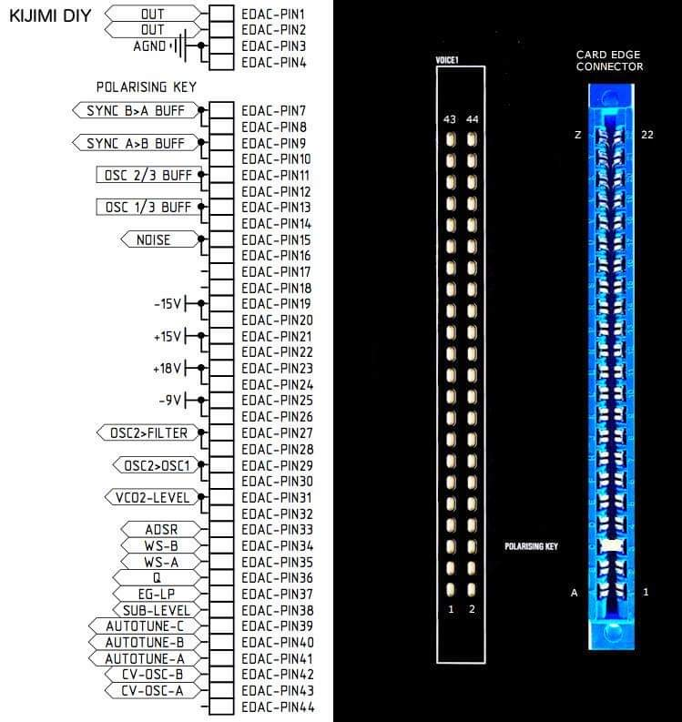

# Schematics

The schematics are not public atm. because of the big B company from China.

(to avoid copying)

but few of the pro diy builders own the schematics for the voices and can help you.

feel free to join the Facebook build group in case of any question or ask on modwiggler, we are there too.

