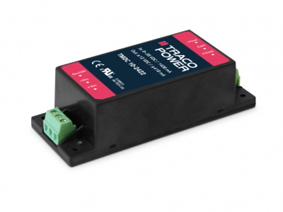
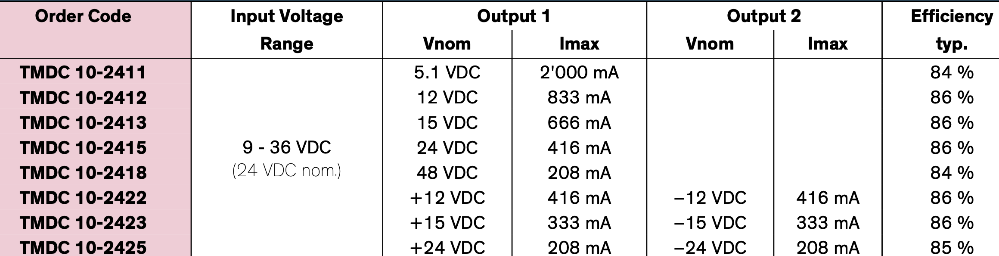

# Powersupply Solutions traco

# Switched DC-DC:

## Ressources:

**Traco Power**

TMDC 10-2422 → 12/-12V closed box with connectors 

TMM-40215. AC-DC dual 15/-15V

[https://www.mouser.de/datasheet/2/687/tmm40\_datasheet-3049827.pdf](https://www.mouser.de/datasheet/2/687/tmm40_datasheet-3049827.pdf)
