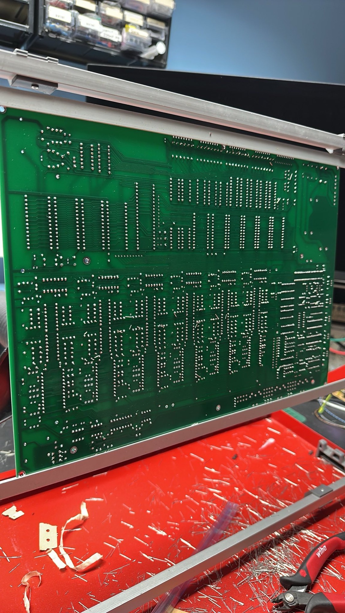

# Soldering frame

- **PCB Soldering Frame**: Designed for holding printed circuit boards securely during soldering.

preferred models: [https://www.google.com/url?sa=i&url=https%3A%2F%2Fshop.wetec.de%2Fen%2Fproducts%2Fproductioninspection%2Fplacement-frames%2Fframe%2F19335%2Fwetec-equipping-and-soldering-frame-pcsa&psig=AOvVaw0kYsI7SbauA68gQ0e8JW19&ust=1738678725998000&source=images&cd=vfe&opi=89978449&ved=0CBQQjRxqFwoTCNj4y5LZp4sDFQAAAAAdAAAAABAE](https://www.google.com/url?sa=i&url=https%3A%2F%2Fshop.wetec.de%2Fen%2Fproducts%2Fproductioninspection%2Fplacement-frames%2Fframe%2F19335%2Fwetec-equipping-and-soldering-frame-pcsa&psig=AOvVaw0kYsI7SbauA68gQ0e8JW19&ust=1738678725998000&source=images&cd=vfe&opi=89978449&ved=0CBQQjRxqFwoTCNj4y5LZp4sDFQAAAAAdAAAAABAE)

- **Soldering Iron Stand**: A frame that holds the soldering iron when not in use, often with a sponge for cleaning the tip.
- **Soldering Jig**: A custom frame used to hold components in place while soldering, ensuring precision and stability.
- **Heat Sink Frame**: A frame that helps dissipate heat from sensitive components during soldering to prevent damage.
- **Magnifying Soldering Frame**: Equipped with a magnifying glass to assist in seeing small components clearly while soldering.
- **Adjustable Soldering Frame**: A versatile frame that can be adjusted to hold various sizes and shapes of components securely.
- **Third Hand Soldering Frame**: A frame with adjustable arms and clips to hold wires or components in place, freeing up both hands for soldering.
