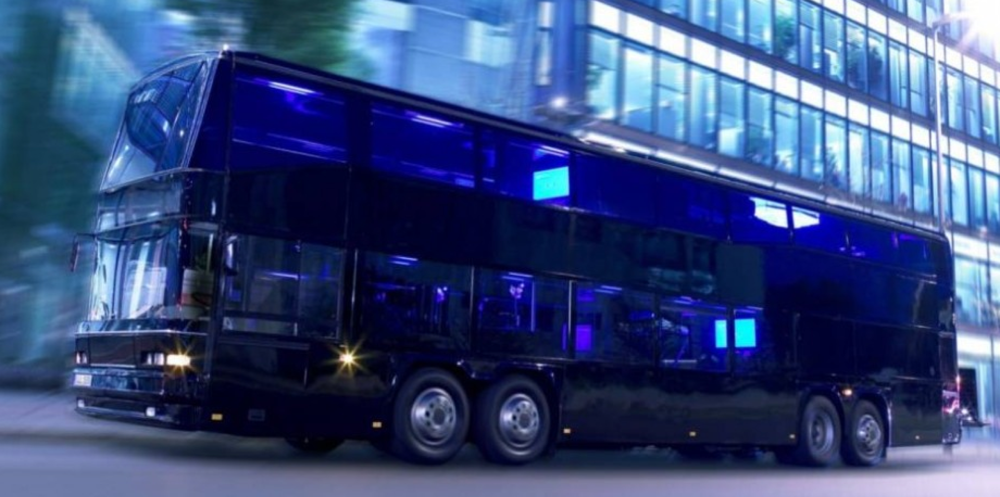
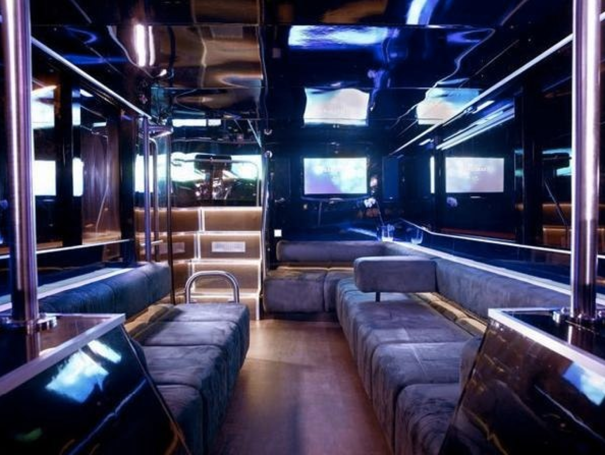
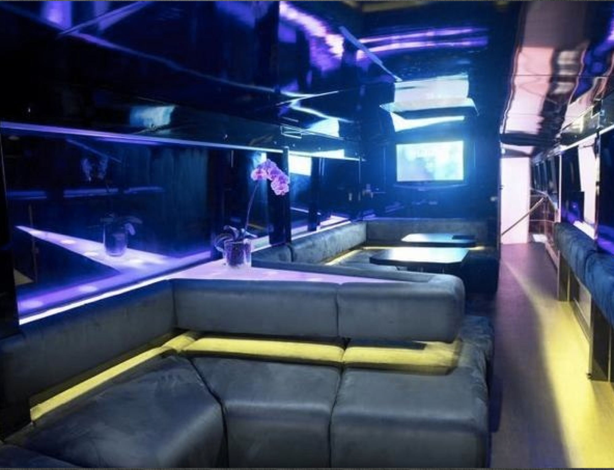
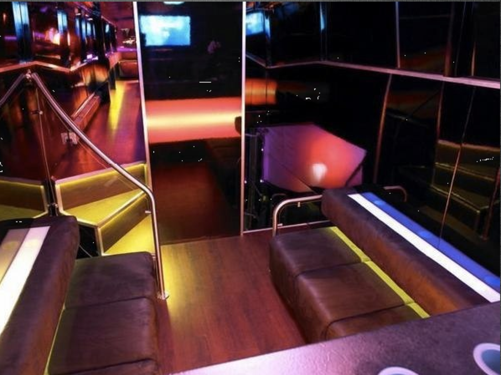
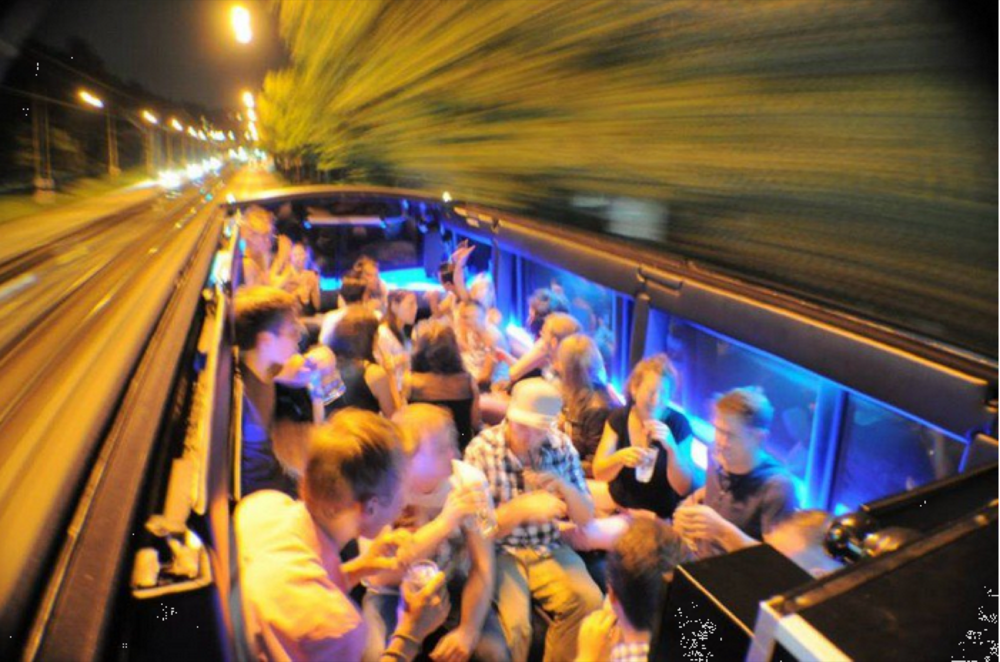
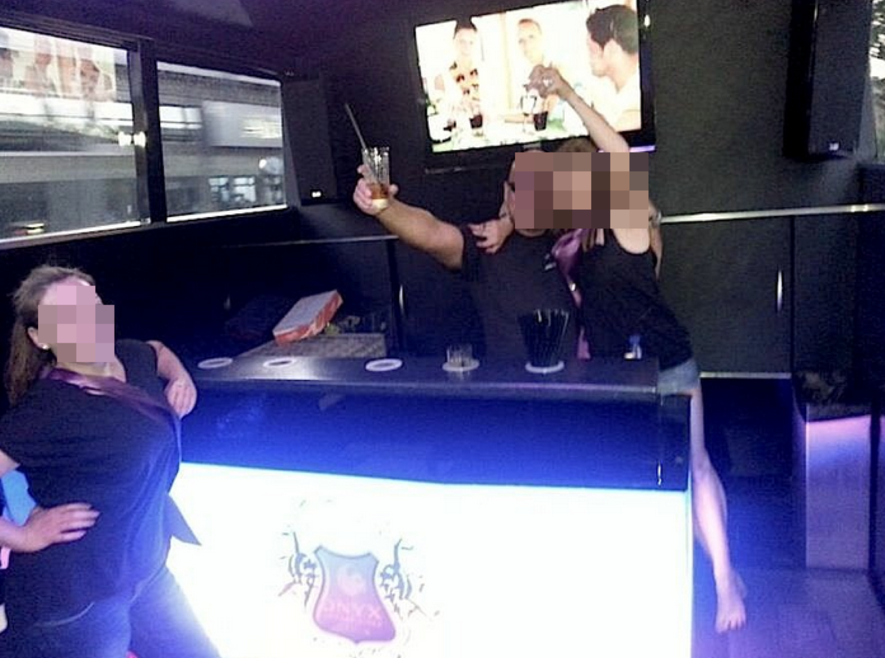
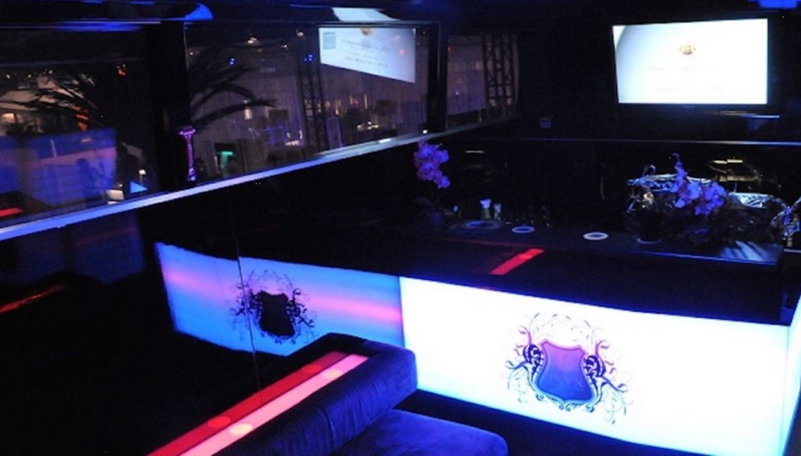
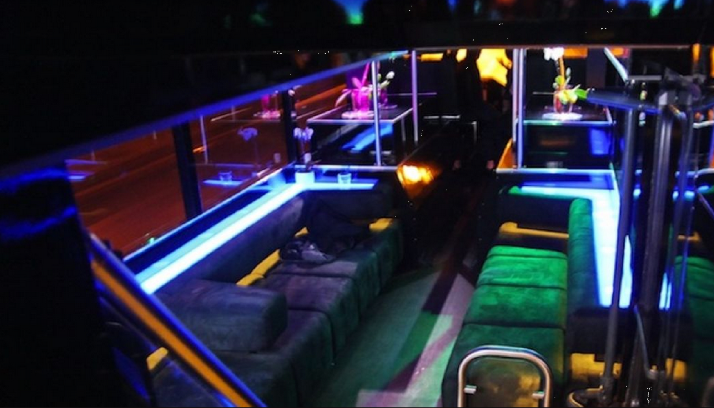
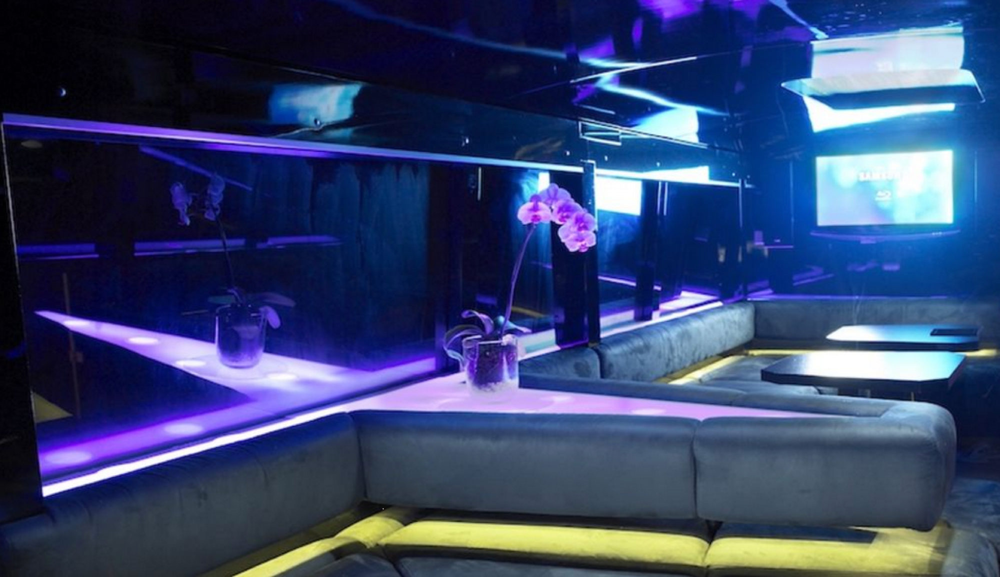

# Bus Project

in 2007-2008 i organized the technical project management and hardware integration for a client in Berlin

**project target:**

- modern LED lighting ( 24V RGB Osram LEDs with custom PC based Controller)
- on 3 Stages (the bus has 3 floors)
- HD-Sound 7.2 (Samsung)
- a lot of Full-HD TVs
- DJ desk

**3D Demo:**

[https://youtu.be/GykyE67fmGI](https://youtu.be/GykyE67fmGI)

[youtu.be](http://youtu.be)

**results:**

 

