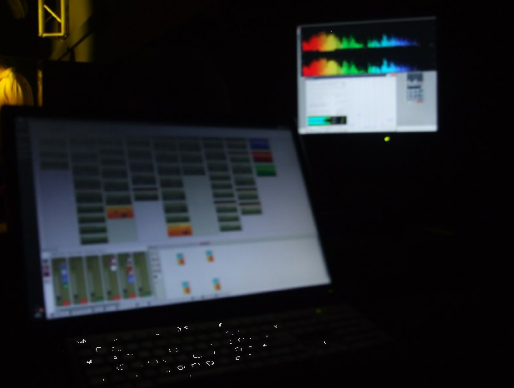
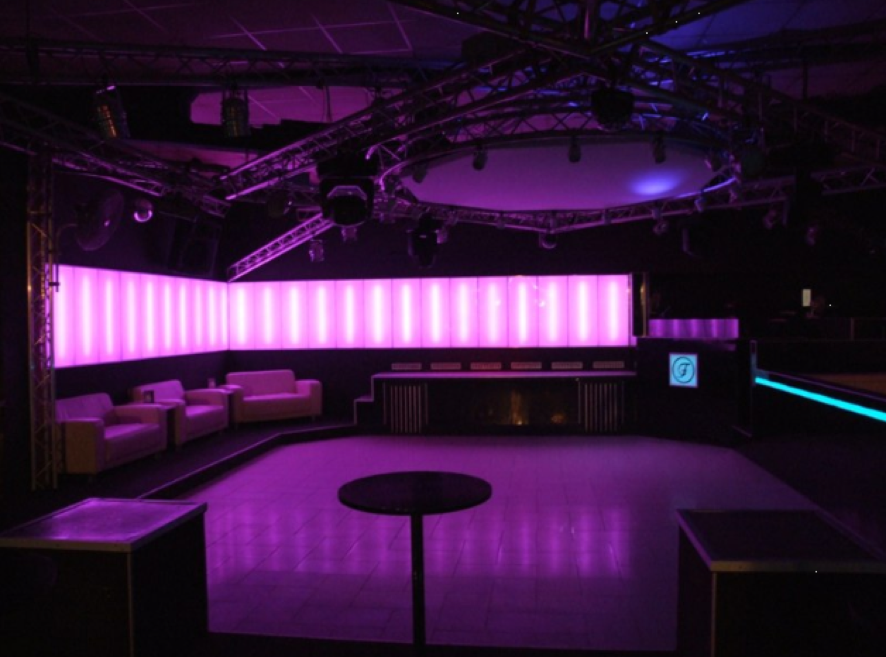
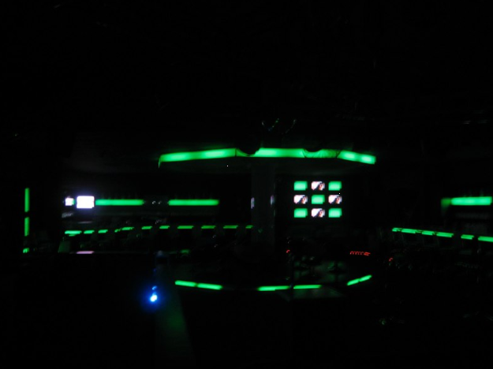
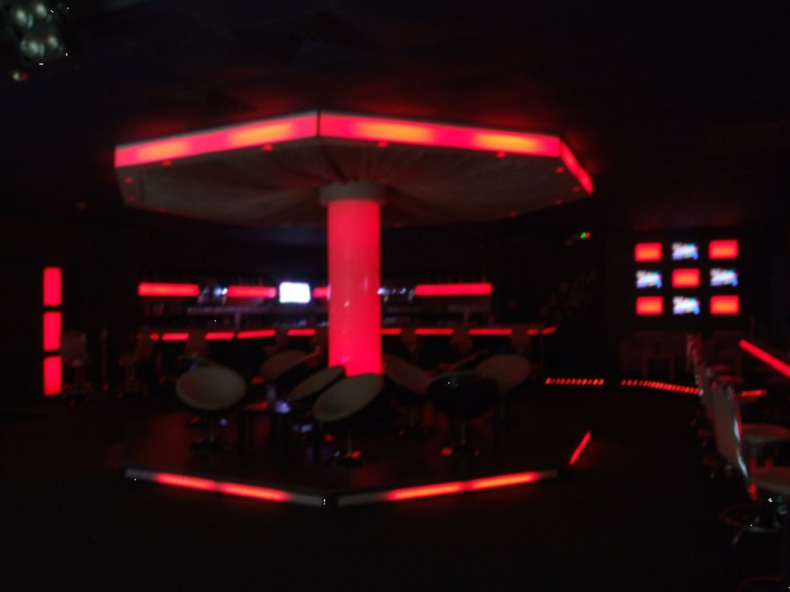
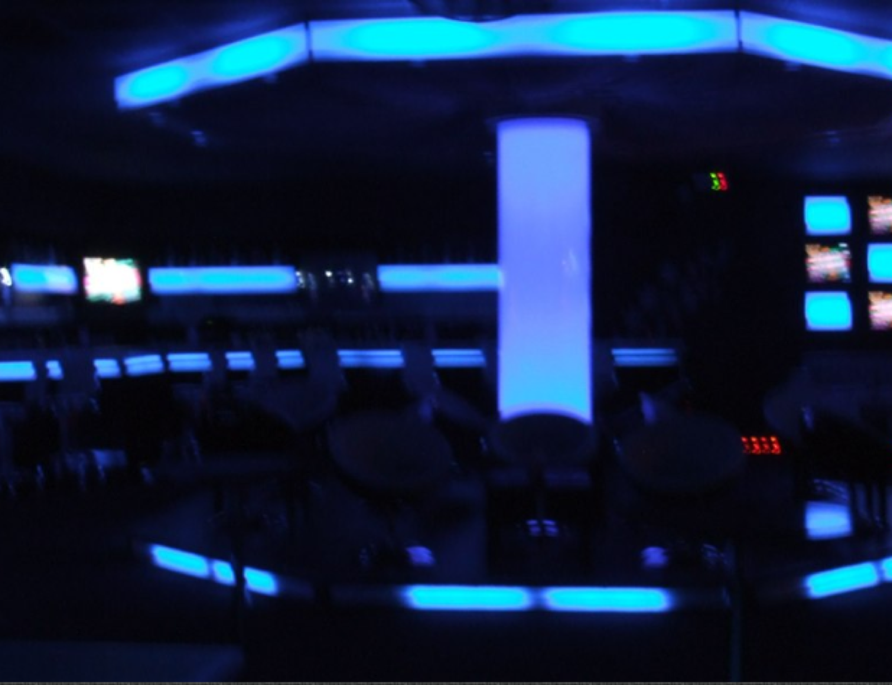
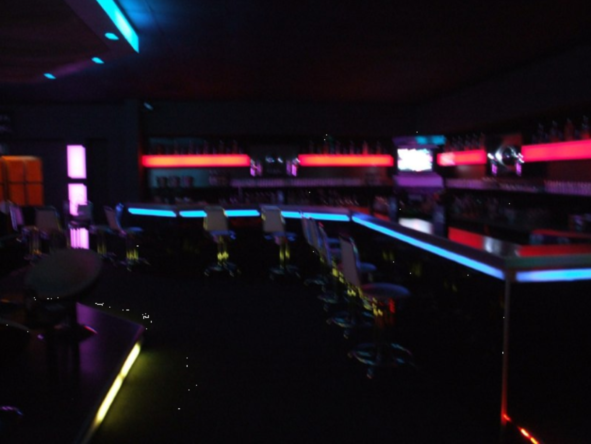

# Club project

### from 2004 til 2010 i was the chief technican and LJ (Light jockey) in a Berliner Club at the weekends for example.

as i started in 2004 the most  light controllers was controlled with 1-10V and DMX, to control old 250W-500W PAR54/PAR64 cans and 14 moving heads and  a lot of big scanners.. 2 other smaller rooms with a total of 32 scanners.

It was time to **change the old analog stuff** to RGB LEDs, new Movingeheads and everything was changed to digital controlled by a PC with touchscreen. Additional functions like recording and playback was a great help for a "disaster recovery process".

At all was the system in a "bad" condition, less maintenance , often outages of Sound and Light devices.

&gt; at this time I worked in my daily job with IT Service Management and I started to bring my knowledge in the "Clubs"

One of my main goals was to start/implement a **Riskmanagement** for outages of the hole Club ! And furthermore develop Solutions for a lot of risks. **From easy tasks**- but planned: device service - every week, **process driven services for repairs, maintenance of Mixers, Turntables, Amps, Speakers.**

**to more complicated tasks: "**acceptance and continues improvements" –   After less than one year the Crew and all involved people was successful in the processes and the outages of the Sound system and Light System was in a stable state.

Furthermore: Feedbacks with DJs, **Awareness** Talks with Djs, MCs, other technicians -  about Gain Limits, Wiring (Notebooks with **ground loop issues**), It was a big issue that DJs connected their own devices and destroyed very often the Turntable ground cable and RCA cables (for example)

**some impressions:**

**custom touch screen controller**

****

**RGB LED tubes with nice effects**

****

RGB LED Stripe

i installed on the Main Stage around 15 controllers to change each section in different colour (sound to light with custom pc based audio analyzer)

videos and more later here
