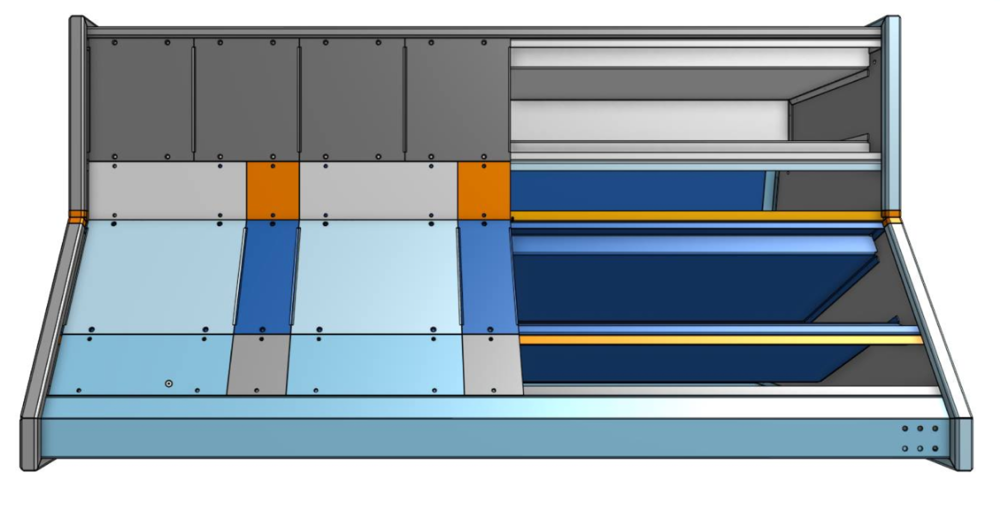
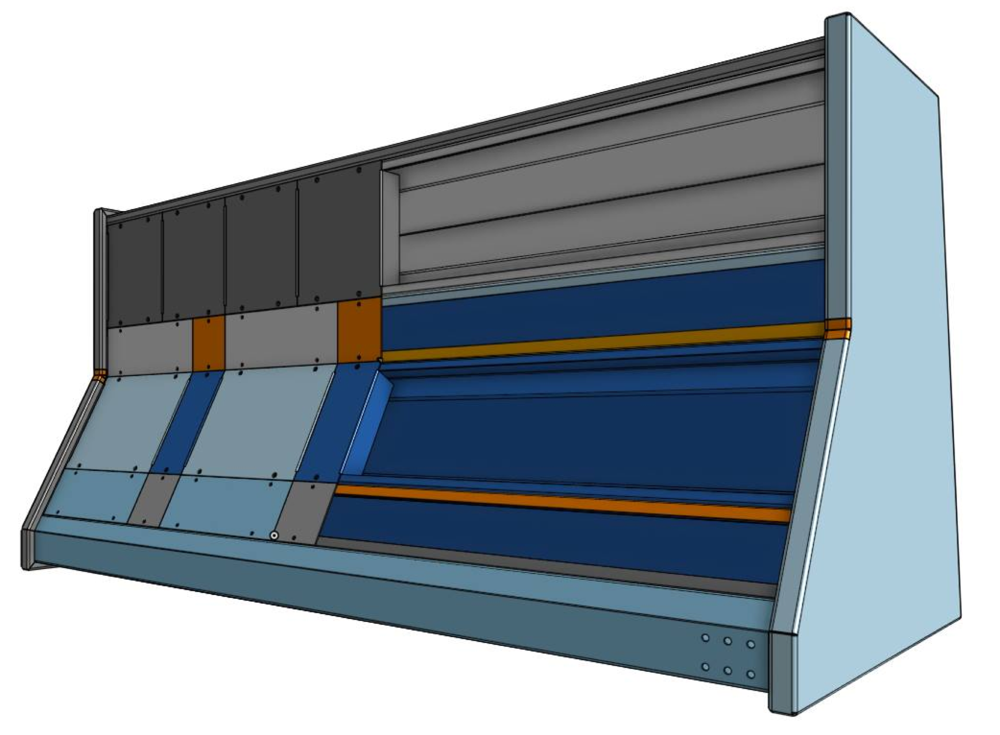

# Universal Cabinet for Modular Systems

> **Project**
>
> ### Projecttitel: Universal Cabinet for Modular Systems
>
> ### Status: `Plan`
>
> ### Startdate:
>
> ### Duedate:
>
> ### Manufacture link:

The official name is to be announced later.

This cabinet can be used with 3U, 4U, 5U, 6U and goliath modules - (not approved info)

    

