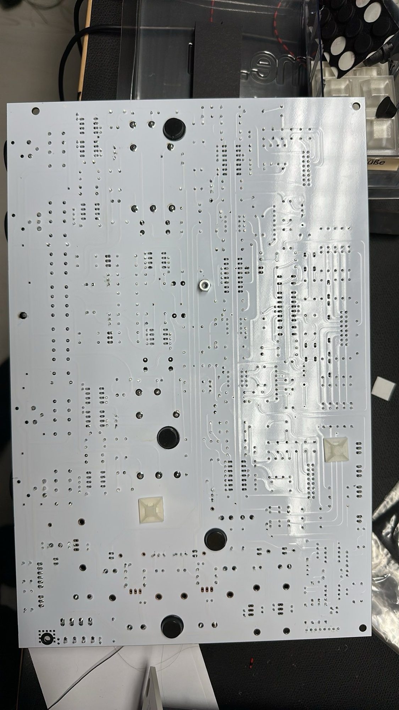
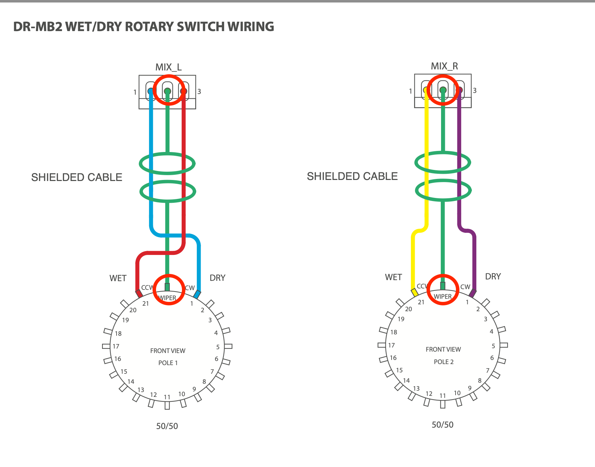
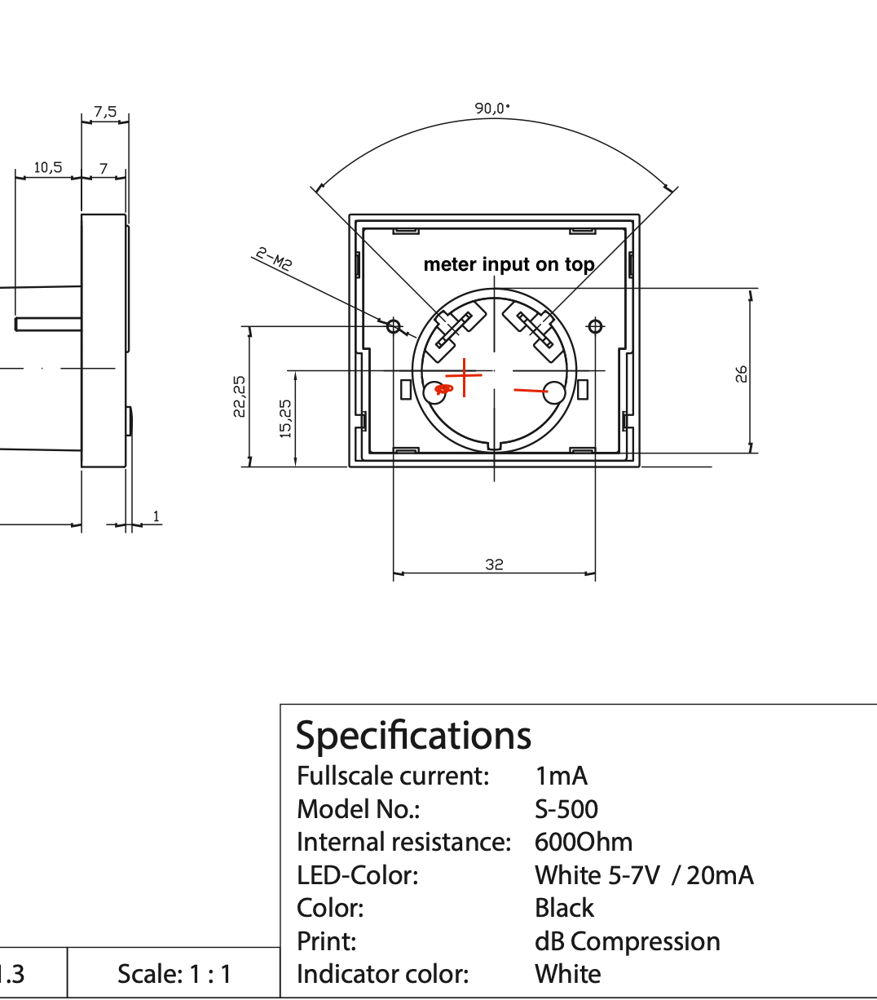
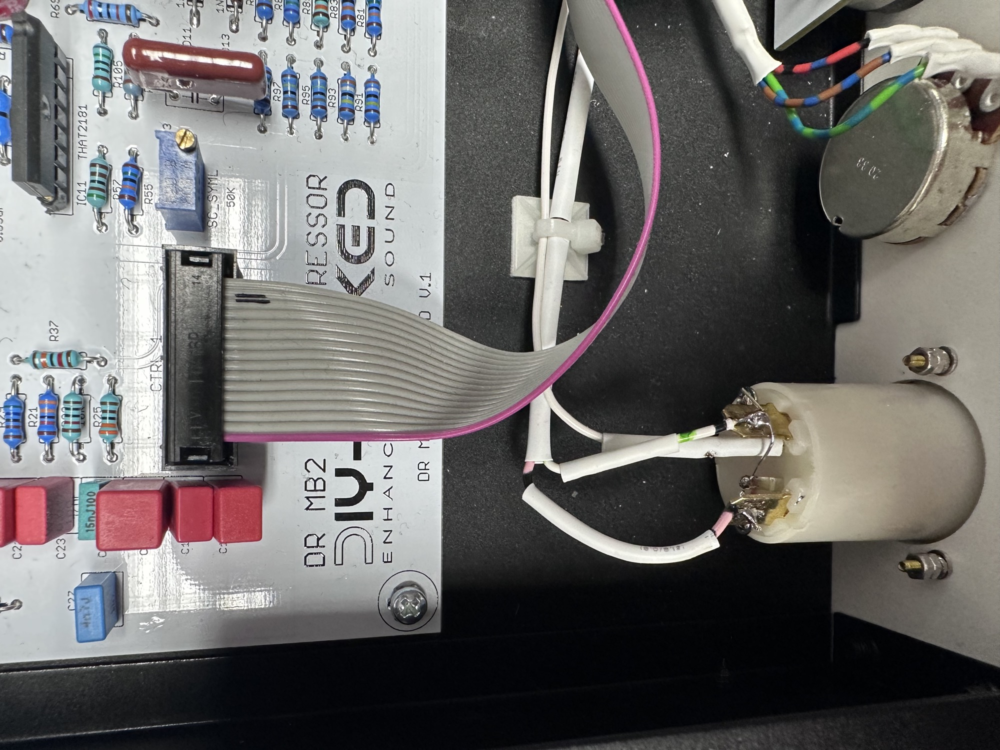
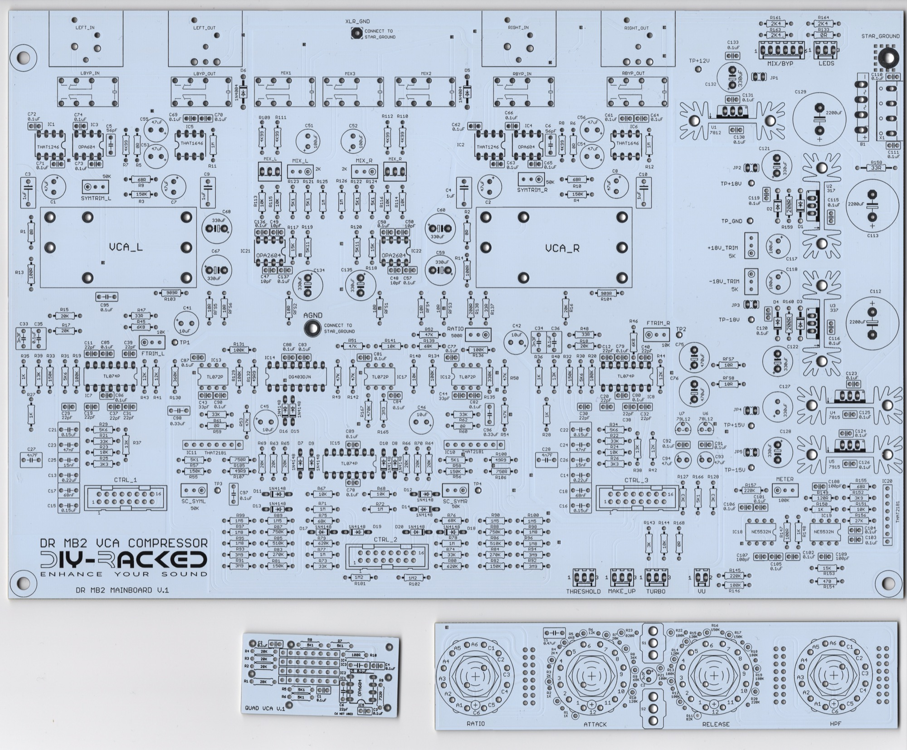
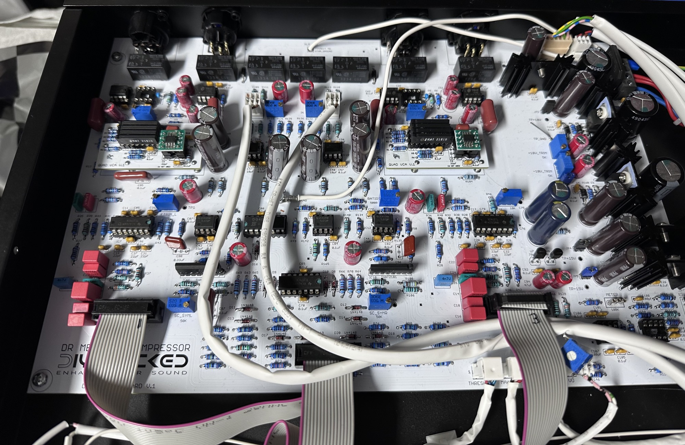
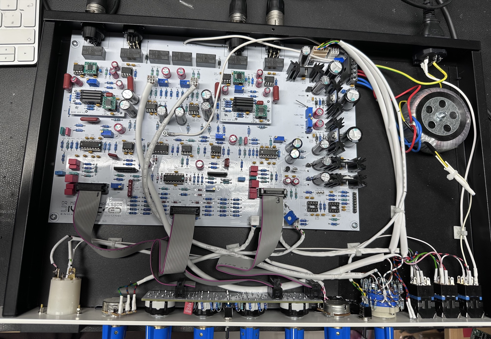
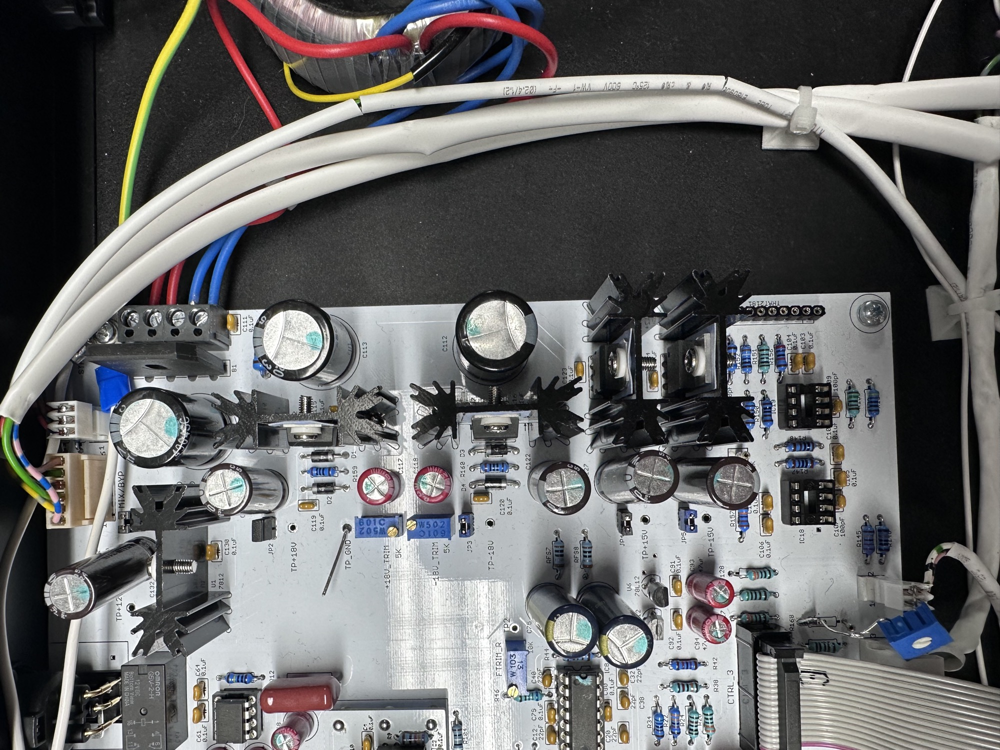
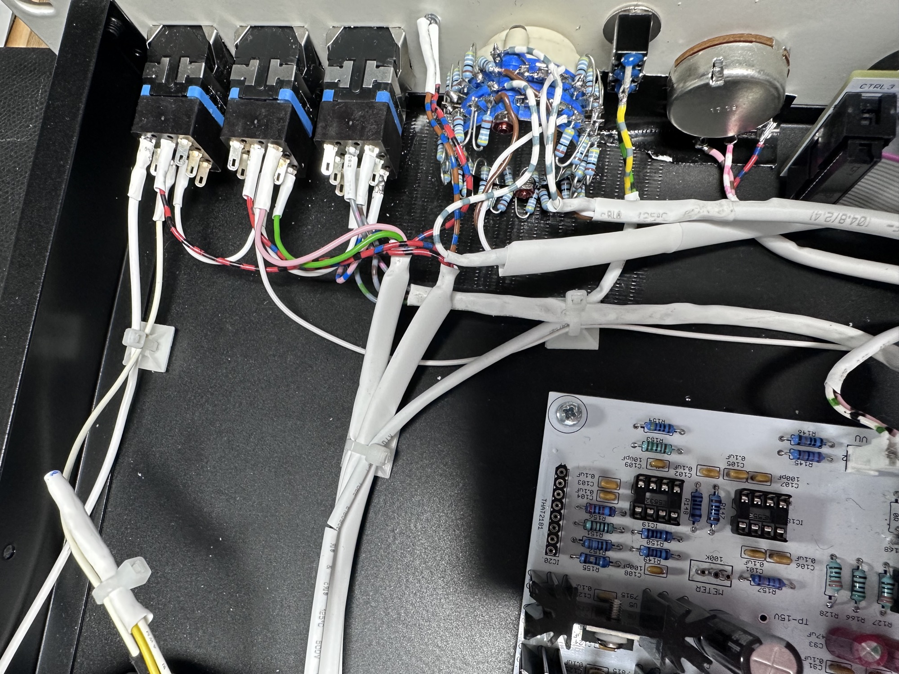
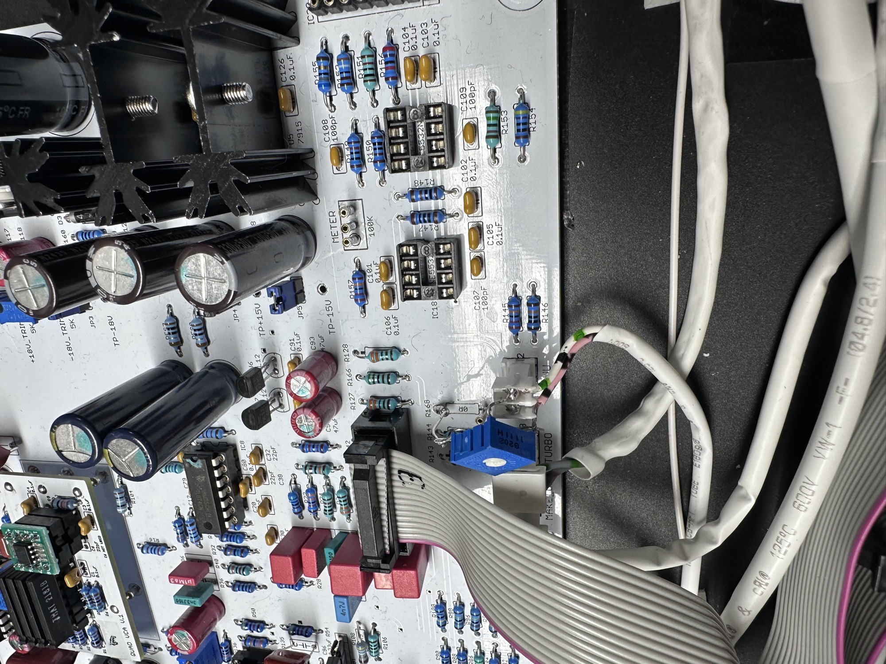

# DIYRACKED DR-MB2 SSL clone

> **Project**
>
> ### Projecttitel: DIYRACKED DR-MB2
>
> ### Status: `done`
>
> ### Startdate: 01/2025
>
> ### Duedate: 04/2025
>
> ### Manufacture page: [https://www.diy-racked.com/product/dr-mb2/](https://www.diy-racked.com/product/dr-mb2/)

The DR-MB2 from DIYracked is a SSL inspired DIY compressor.

its not recommended for amateur or DIY newbies.

price:  312€ case and panel, pcbs

without any further part, total price depends on your home stock.

with a optimized mouser cart (buy 10 resistors instead of 8 ) and using [tme.eu](http://tme.eu) and reichelt or other shops around 400€ for all parts plus the 312€ for the case/pcb kit = around 700€

the knobs, stepped potentiometer can be replaced by cheaper parts if required.

**BOM and “buildguide”:**

[MB2 1MA MOD.pdf](assets/MB2-1MA-MOD.pdf)

[DR\_MB2\_V1\_BOM\_22.07.15.pdf](assets/DR_MB2_V1_BOM_22.07.15.pdf)

[DR\_MB2\_BUILD-MANUAL\_22.07.2015.pdf](assets/DR_MB2_BUILD-MANUAL_22.07.2015.pdf)

**BOM notes:**

I bought the most parts from [tme.eu](http://tme.eu) and [mouser.com](http://mouser.com)

from Donaudio:

[VU-Meter S-500 dB Compression White](https://www.don-audio.com/VU-Meter-S-500-dB-Compression-White_1) 43,70 €

1 x [Classic British Console Pushbutton Switch Illuminated Yellow](https://www.don-audio.com/Classic-British-Console-Pushbutton-Switch-Illuminated-Yellow_1)  17,34 €

2x [Classic British Console Pushbutton Switch Illuminated Blue](https://www.don-audio.com/Classic-British-Console-Pushbutton-Switch-Illuminated-Blue_1) 34,67 €

7x [Elma Classic Collet Knob 21mm gray, indicator line, glossy](https://www.don-audio.com/Elma-Klassischer-Spannzangenknopf-21mm-grau-021-4410) 27,91 €.  **make sure it matches with your potentiometer and rotary switch diameters**, which must be 6mm instead of 1/4inch

7x [Classi Knob Cap 21,3mm Blue Glossy Indicator line by Elma](https://www.don-audio.com/Classi-Spannzangen-Knopfkappe-213mm-blau-glossy-indicator-Linie-by-Elma) 7,69 €  **you have to cut the length of the potentiometers**

1x [Classi Knob Cap 21,3mm Blue Glossy None by Elma](https://www.don-audio.com/Classi-Spannzangen-Knopfkappe-213mm-blau-glossy-by-Elma) 0,89 €

1x [Rotary Switch 2024 Gold, 2 Pole 24 Position, goldplated](https://www.don-audio.com/Drehschalter-2024-Gold-2-Pol-24-Positionen-vergoldete-Kontakte) 18,34 €. double check diameter - data sheet is different to website.   or buy a stereo potentiometer and save 15€

Gesamtsumme:**156,53 €**

> **Achtung**
>
> **pay attention on this :**
>
> the pcb is very close to the bottom, you must be cut all pins very close to the pcb but not in the solderpint itself.
>
> attach self adhesive rubbers at the pcb- to prevent contact to case.
>
> 

**build notes:**

in case that your pcb doesn't match with the rear cutouts or with the bottomcase plate spacers, remove the rearpanel screws - attach

the pcb to the bottom and then mount the rear panel or just re-install the screws. in worst case wide the pcb holes with 3.5mm or 4mm.

pay attention of the WET/DRY wiring, all 3 pins must be connected. (in the older build guides is the ground/shield not connected or can be misinterpreted - basically the shield must be connected at the wet/dry switch too. because the Stepped potentiometer acts as voltage divider between 2 voltage sources. its not just a simple attenuator.

red circles are connected each other to make things more clear/described.

**Meter pinout:**

the upper connectors are the Meter inputs, in case the meter acts reverse, swap the pinout from left to right, but pay attention on the LED polarity connections.

(on my build is the pinout crossed, i attached a little wire/bridge from - LED to the upper opposite pin)

the lower connectors are for the LED, from rear view is the left pin + and right pin is minus.

make sure to connect a 1K resistor at + side and connect in series the input cable from the compress switch

**THAT opamps/drivers:**

make sure to buy A or B-grade THAT2181-BL or THAT2181-AL  not C grade.

B grade are available by mouser.

**A grade** versions are available too

[https://eu.profusion.uk/de\_en/that2181al08-u](https://eu.profusion.uk/de_en/that2181al08-u)

**OP-Amp availability**

you can´t buy all other opamps in DIP-8, you should go for SMT with adapters, or ask me - I have adapters or can prebuilt it for you.

**PCB Scan:**

- [IMG_0861.jpeg](assets/IMG_0861.jpeg)
- [20250202-MB2-Compressor _001.jpg](assets/20250202-MB2-Compressor-_001.jpg)
- [DR_MB2_BUILD-MANUAL_22.07.2015.pdf](assets/DR_MB2_BUILD-MANUAL_22.07.2015.pdf)
- [image-20250207-064642.png](assets/image-20250207-064642.png)
- [DR_MB2_V1_BOM_22.07.15.pdf](assets/DR_MB2_V1_BOM_22.07.15.pdf)
- [MB2 1MA MOD.pdf](assets/MB2-1MA-MOD.pdf)
- [Bildschirmfoto 2025-02-07 um 19.41.31.png](assets/Bildschirmfoto-2025-02-07-um-19.41.31.png)
- [IMG_1349.jpeg](assets/IMG_1349.jpeg)
- [IMG_1350.jpeg](assets/IMG_1350.jpeg)
- [image-20250324-134932.png](assets/image-20250324-134932.png)
- [IMG_1405-20250324-135225.jpeg](assets/IMG_1405-20250324-135225.jpeg)
- [IMG_1403-20250324-135111.jpeg](assets/IMG_1403-20250324-135111.jpeg)
- [IMG_1407-20250324-135240.jpeg](assets/IMG_1407-20250324-135240.jpeg)
- [IMG_1404-20250324-135215.jpeg](assets/IMG_1404-20250324-135215.jpeg)
- [IMG_1406-20250324-135237.jpeg](assets/IMG_1406-20250324-135237.jpeg)
