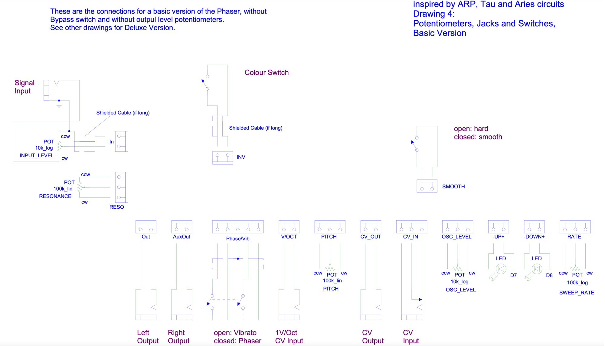
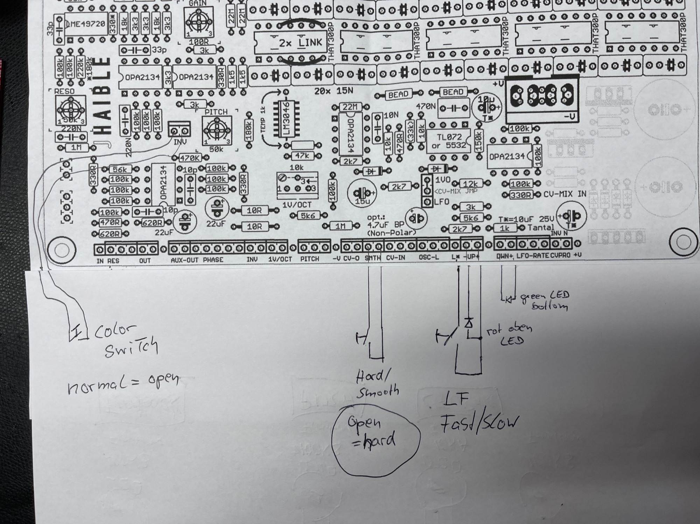
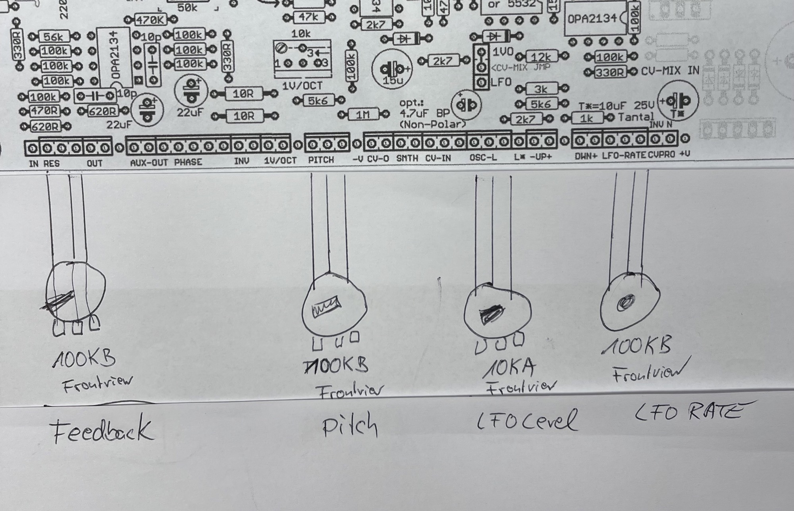
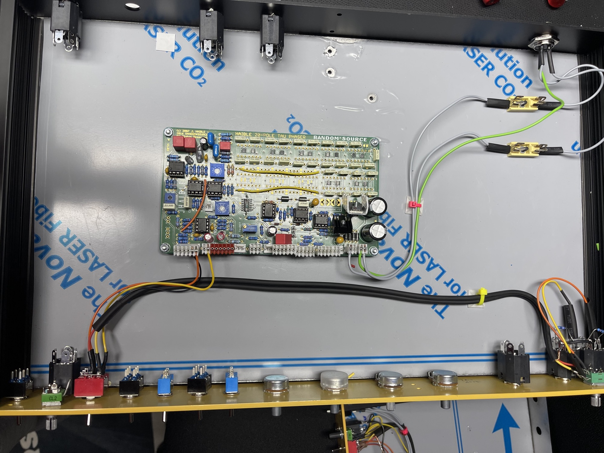
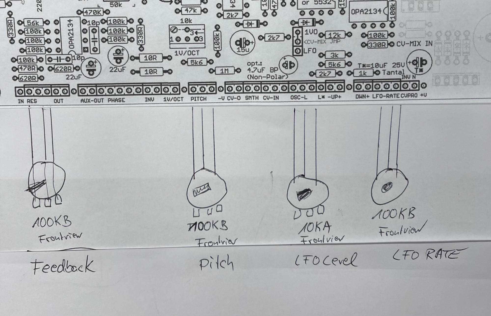

# Haible Tau Pipe Phaser Rackformat

> **Project**
>
> ### Projecttitel:Haible Tau Pipe Phaser Rackformat
>
> ### Status: `done`
>
> ### Startdate: 03/2023
>
> ### Duedate: 05/2023
>
> ### Manufacture link:

I built over the years a lot of Haible Tau pipe phasers in 5U Format. [Juergen Haible Tau Pipe Phaser](../../../diy-5u-modular-synthesizer/modular-in-5u-projects/juergen-haible-tau-pipe-phaser/index.md)  [Tau Pipe  Random Source Version](../../../diy-5u-modular-synthesizer/modular-in-5u-projects/juergen-haible-tau-pipe-phaser/tau-pipe-random-source-version/index.md)

2 Friends asked me to release a 1U 19inch Rack Version.

**PCB and BOM**

the PCB is a remake from Randomsource. (you can't use the normal Wiring scheme from Haible )

The BOM parts are used for the 15V version since we use the onboard double 18V AC to 15/-15V DC regulators.

external PSU: just use Thomans dual AC version: Yamaha PA20 or remake from Thomann 

**for my rack you need from Thonk:**

1x dual 10kA  Poti 9mm alpha version - T18 knurled   

1x 10kA Poti alpha 9mm - T18 knurled 

(16mm doesn't  match with the height of the 19inch panel for the input gain and output gain Potis

2x you can also buy from thonk the knobs for knurled pots - tall trimmer caps fits too.

3x 100KB 16mm alpha pot

1x 10KA 16mm pot

3x 6.3mm audio jacks mono switched version !! (amphenol for example) 

2x 3mm LEDs red flat

1x 3mm green LED flat

1x DPST power switch

2x fuse holder

shielded cable 1-2m

\*\* dont forget to buy the rare 5x OPA2134

1x LME49720 Ebay

**MOD**:

install only 14 poles instead of 20 → 7 CA3046 and drop the caps for this ICs.. , connect cables from output of the last IC/cap to the input (you can see it in the pictures here on bottom, with a yellow cable)

**wiring:**

this is only for support not for the wiring directly:

[http://www.jhaible.info/tau/jh\_tau\_sch\_page5\_pots.pdf](http://www.jhaible.info/tau/jh_tau_sch_page5_pots.pdf)

that's what we need for the AUDIO input/output wiring with a 3PT switch:

[jh\_tau\_signal\_and\_cv\_connections.pdf](assets/jh_tau_signal_and_cv_connections.pdf)

Pitch Knob (Manual Sweep) 100k Linear - to "pitch" on PCB

Resonance Knob (Feedback) 100k Linear - to "reso" on PCB

LFO Rate Knob (LFO Rate) 100k Linear - to "rate" on PCB

Oscillator Level Knob (LFO level) 10k Log - to "osc\_level" on PCB

Input  10K log 9mm alpha

output 10k log stereo !! 9mm alpha 

 

