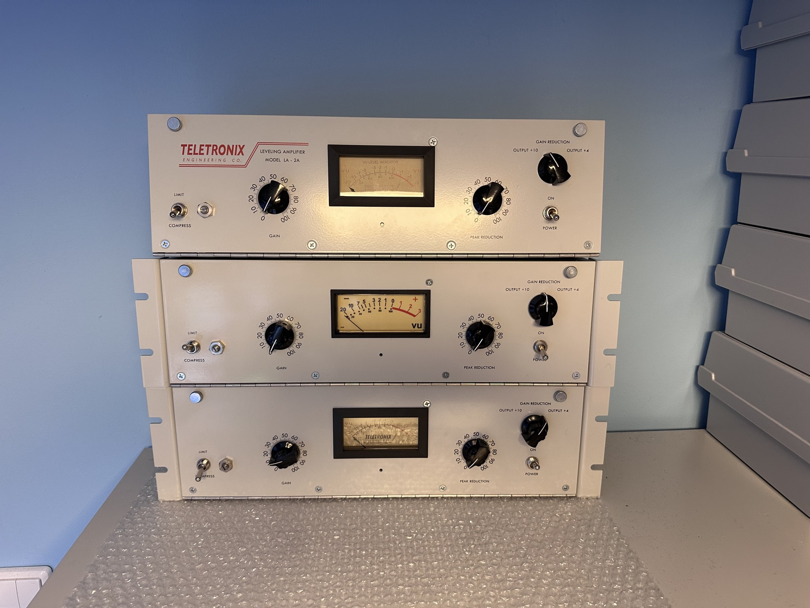
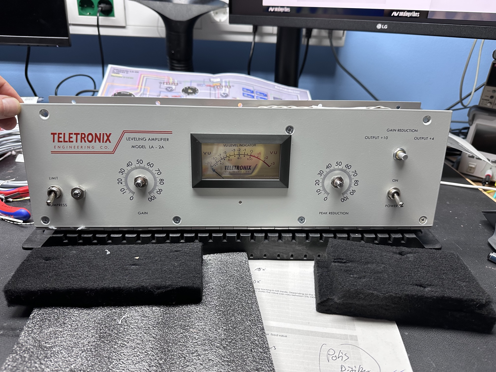
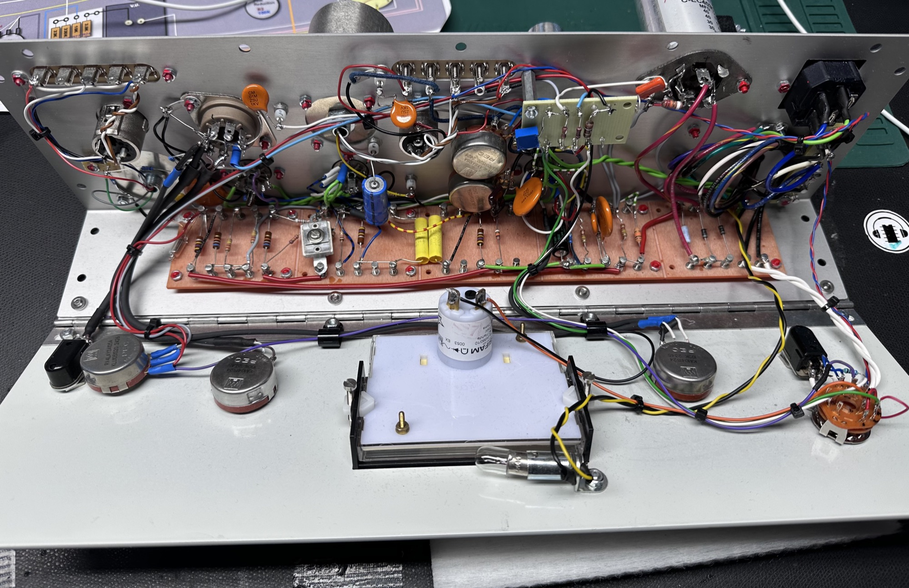
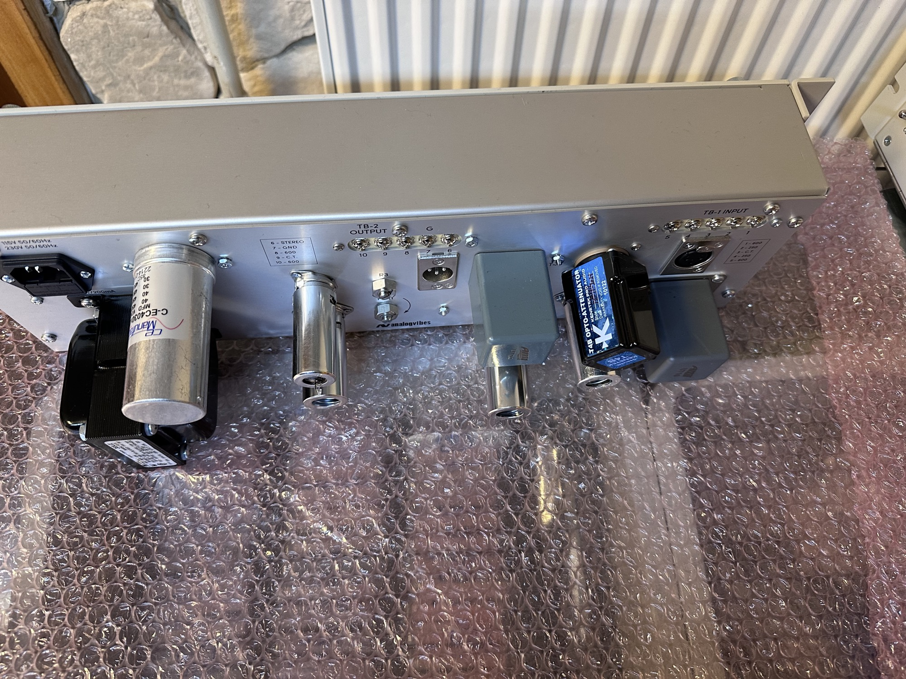
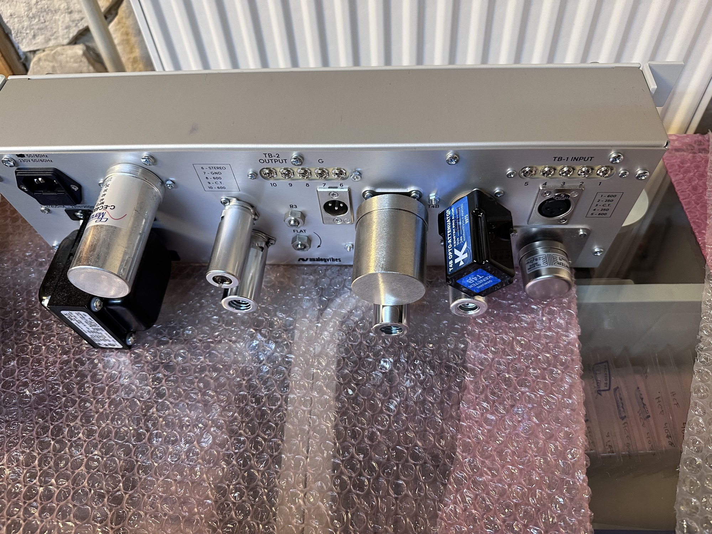
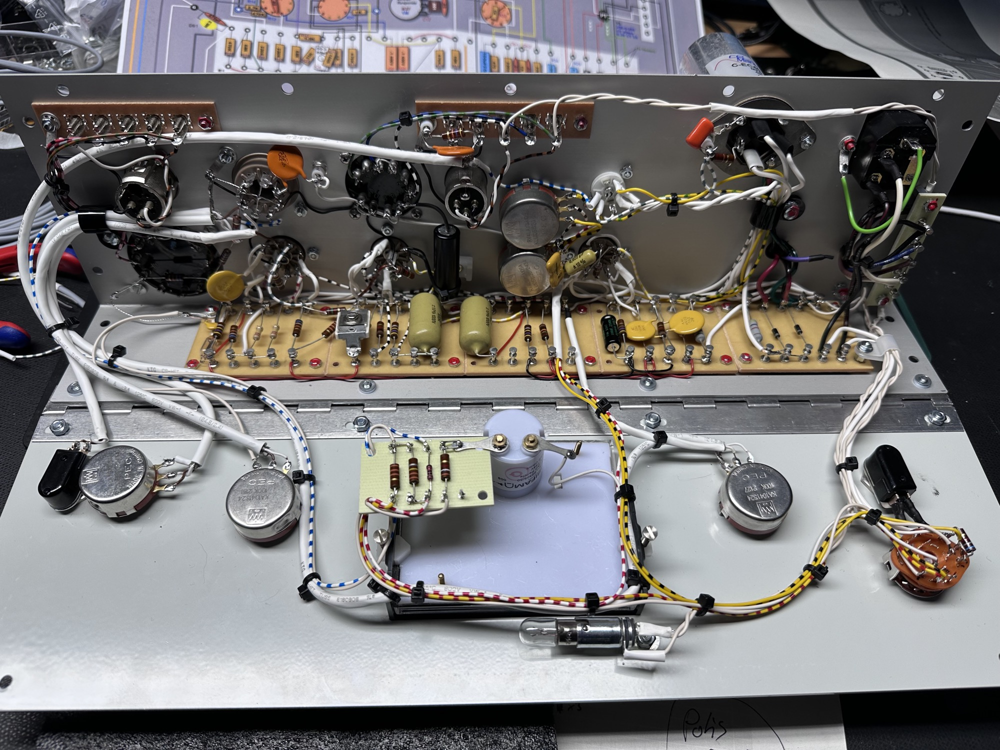
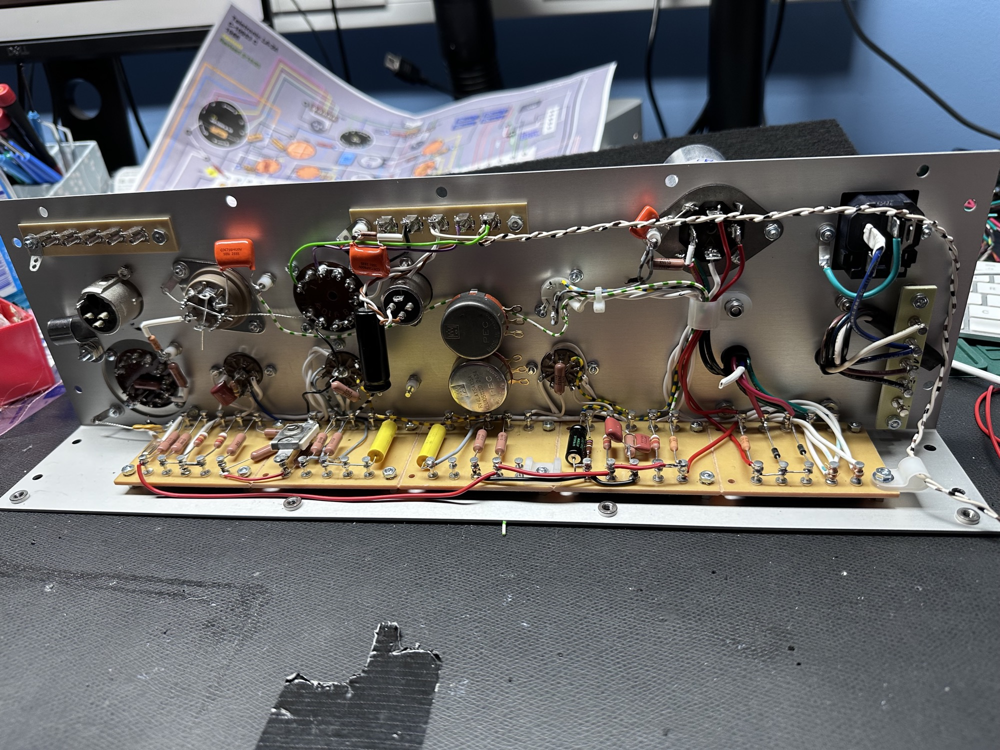
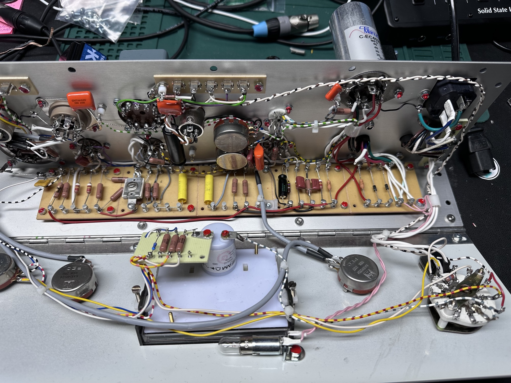
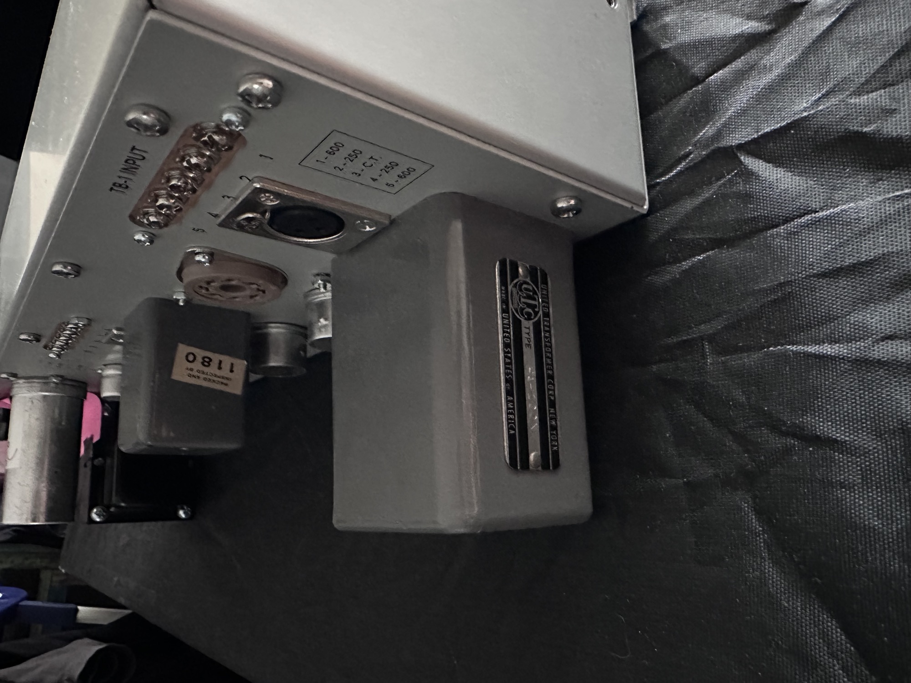

# LA-2A projects

I built few LA2A, one from a full-kit and 2 with own parts

Status: `done`

Date: 2024-2025

Mouser cart is for my own project  = not for everyone

[https://www.mouser.de/ProjectManager/ProjectDetail.aspx?State=EDIT&ProjectGUID=586baf33-2bbc-4482-8195-1417991b2616](https://www.mouser.de/ProjectManager/ProjectDetail.aspx?State=EDIT&ProjectGUID=586baf33-2bbc-4482-8195-1417991b2616)

BOM notes

| **Part** | **Source** | **price in Euro** |   | **stock/ordered** |
|---|---|---|---|---|
| Case  vintage look | Don Audio or vintage vibes | 400 |   | x |
| Transformer U10 U24 | [https://www.tab-funkenwerk.org/ami-parts/transformers/](https://www.tab-funkenwerk.org/ami-parts/transformers/) | 400 with shipping |   | x |
| PCB - Torret board (big) | banzai or mouser/digikey | 40 |   |   |
| tube sockets and tube covers | banzai | 20 |   |   |
| Meter | Don audio | 220 |   |   |
| cables | Lapp cable colour labeled | 45 |   |   |
| caps , resistors | mouser, digikey, don audio | 50-100 |   |   |
| potis | mouser/digikey | 120 | optional use bourns MIL specs instead of PEC |   |
| power transformer | don-audio | 90 |   | x |
| screws metric and US.norm | mouser, digikey | 10 |   |   |
| 2x power switch | mouser digikey | 20 |   |   |
| lamp, socket |   |   | for meter |   |
| spacer/isolation |   |   |   |   |
| cable holder |   |   |   |   |
| cable tube shrink |   |   |   |   |
| IEC socket plus fuse |   |   |   |   |
| tubes | different sources, depends on the region.  ECC vs 12Ax for example |   |   |   |
| 10uF cap |   | 10-100 |   | x |
| rotary switch |   | 3-20 |   |   |
| knobs |   |   |   | x |
| soffite lamp |   |   |   | x |

Build notes:

1. the Analog vibes Build guide (tube-opto-compressor-ultimate-step-by-step-guide\_analogvibesV\_1\_5.pdf)

has a failure on the main torret board is the connection at R35 and R34 wrong.

correct is: R34 is with a green cable to Pin5 of V4 and R35 with a grey cable to V4 pin 6.

1. Add a 50K multiturn trimmer instead of R25 (33K) to the Meter torret board, its described in the kenetek T4B owners guide
2. Check all Ground with a continuity test / Ohmmeter at all GNDs to the IEC ground/earth before you power on the device for testing
3. double check all screws and use screw paint
4. check under the torret board, that nothing is there (screws, washers, cable parts from installation) before you power on the device
5. use a 100K 5Watt resistor to unload the capacitors and double check the voltage at the caps before you proceed further

> **Hinweis**
>
> **Known Issue:  GR Gain reduction isn't working, GR Meter doesn't work**
>
> - the most information is often “change the V4 tube” or “optocell”. **BUT did you tried to turn stereo adjust Potentiometer - its important for DIY Builds (first testing)**
> - in 99% of all DIY Builds is a 33K resistor on the meter pcb fine, replace R25 as described in the T4B optocell install guide with a 50K trimmer.. (ask google)
> - longterm issue with Meter/GR function at all: the NE- filament lamp (at left side of the pcb)  acts like voltage regulator and degrade over the time → check the DC Voltage across the NE lamp. furthermore its possible and better in longterm to use a 62V Zenerdiode (1Watt or more) instead of the NE-lamp, which gives you a stable voltage and less noise.
> - more important for old devices is degradation of the Optocell, it makes so sense to buy old used “Original” optocells.

note

**Improvements for DIY Builds**

1. use t**rue PCB Version** DIY Projects - cheaper, more safety, faster and easier to build and repair, less problems/issues/risks to build it,  less hum/noise (better grounding) less bleeds ([https://www.dripelectronics.com](https://www.dripelectronics.com) [https://honeybadgeraudio.com/shop/diy/compressors/la2a-limiter-diy-pcbkit/](https://honeybadgeraudio.com/shop/diy/compressors/la2a-limiter-diy-pcbkit/) ) chassis are available worldwide for the pcb versions too (don-audio, [frontpanels.de](http://frontpanels.de), diy-racked and others)
2. start with a **star grounding** to avoid known issues with noise or non functional operation
3. use a Dremel around the grounding holes, the eloxal from the case prevent good contact to the case - which ends in “grounding issues”
4. use High Quality **resistors** parts - there's no reason to use 5% overpriced carbon resistors - use 1% Metal film as much you can mouser: RN55 or RN65 series for example (less thermal noise)
5. use High Quality **film** **capacitors**: don't use the yellow/orange ceramic caps which are with the Z5U Dialectricum - it inserts a microphone effect and Distortion.  more on my page: [capacitors](../../../knowhow/sdiy-knowho/capacitors/index.md) [capacitor types](../../../knowhow/sdiy-knowho/capacitors/capacitor-types/index.md)  the best what you can install are Polypropylene caps for example Vishay, Panasonic ECW  series or silver mica for the 510-2nF caps.
6. install decoupling cap at the NE lamp/zener diode with at minimum 470pF or more  - check with a scope the ripple across the NE lamp or zener diode and change the cap value.
7. **Shielded cables** : as described in the vintage vibes guide or other guides, shielded cables are important or you get bleeds, hum and hiss.
8. the chassis/case is often painted or anodized, eloxal - which means a ground connection from just a screw and nut isn't enough, measure the resistance from Earth connection on the IEC connector to the groundpad/screw - it must be less 0.6-1Ohm, the best value  should  be 0.1-0.2R. (depends on your DMM and DMM cables too), which brings us a solution, use tooth washers and/or scratch carefully the coating behind the washer. but from my experience a good tooth washer is enough. or go with 2. star grounding.
9. **Optocell**: the response time is affected by the optocell, a standard a good Optocell system is the T4B cell.  there are others like the IGS cell and with different “speed times” [https://www.dripelectronics.com](https://www.dripelectronics.com)
10. **Powersupply** ripple:  the LA-2A Design is by default noisy, but can be improved with a solid ground as described above.  but more important is the PSU Ripple, use High Quality Powersupply electrolyte caps with **low ESR**, measure the ripple with a scope under load and  install additional decoupling caps for **DC only** , at the Rectifier CR1/CR2 or across C7-A C7-B, make sure to install 400V ratings.
11. last but not least : **C5 10uF/200V capacitor**: this affect the sound at the output, you can choose from cheap 1€ caps thru snake oil.  A problem is the availably worldwide.. What do we need: it's basically an audio grad cap , **bipolar** is fine , power rating MUST BE more than 200V for safety reasons. the measured voltage is 115V but with headroom for long llifecylce, we need 200V rating.    Mundorf caps, Jantzen caps should be used. take care on the physical dimensions or look at Number 11.   A good choice are Mundorf supreme caps   or look here: [https://www.soundimports.eu/de/frequenzweichen-bauteile/kondensatoren/film-folien-kondensatoren/?\_gl=1\*v8vaq0\*\_up\*MQ..\*\_gs\*MQ..&gclid=CjwKCAiAzba9BhBhEiwA7glbat5uiISXjEajsEc0mgqY8m2-OOVeiau4dDVH7RwsMTjXHPH4JgCrJRoCVoUQAvD\_BwE&gbraid=0AAAAAoYHINhLQytNrjQqpVkv6AYKXOnN1&hr-page=%7B%22active\_filter%22%3A%22extraDataList.capacitance%22%2C%22filters%22%3A%5B%22extraDataList.capacitance%3A10%20%C2%B5F%22%5D%2C%22product\_count%22%3A0%2C%22page%22%3A1%7D](https://www.soundimports.eu/de/frequenzweichen-bauteile/kondensatoren/film-folien-kondensatoren/?_gl=1*v8vaq0*_up*MQ..*_gs*MQ..&gclid=CjwKCAiAzba9BhBhEiwA7glbat5uiISXjEajsEc0mgqY8m2-OOVeiau4dDVH7RwsMTjXHPH4JgCrJRoCVoUQAvD_BwE&gbraid=0AAAAAoYHINhLQytNrjQqpVkv6AYKXOnN1&hr-page=%7B%22active_filter%22%3A%22extraDataList.capacitance%22%2C%22filters%22%3A%5B%22extraDataList.capacitance%3A10%20%C2%B5F%22%5D%2C%22product_count%22%3A0%2C%22page%22%3A1%7D)
12. You can mount the C5 cap with additional holders (drill holes in the chassis/frame and use cable tie holders (screwed to the chassis))

**Pictures are not for reference !**

at one build is R4 and R3 swapped (R3 at front panel - customer request/mod)

