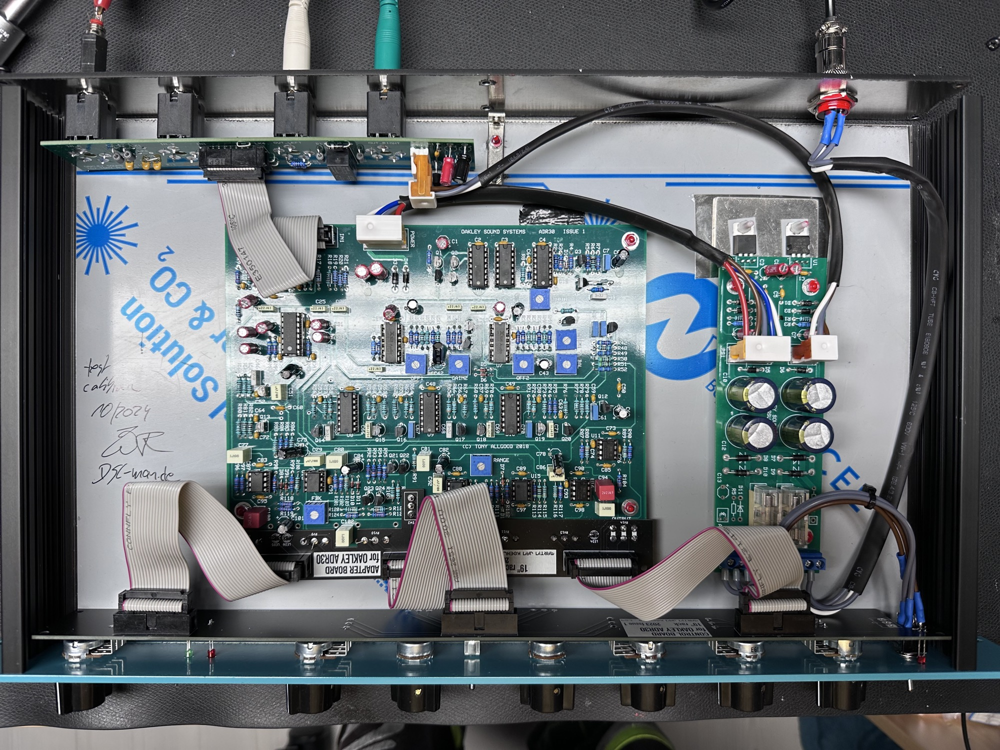
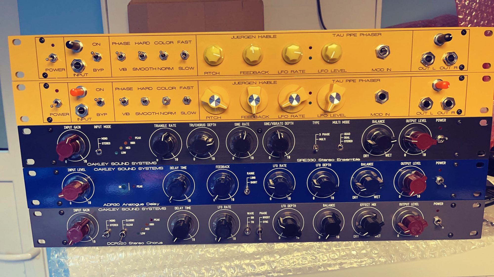
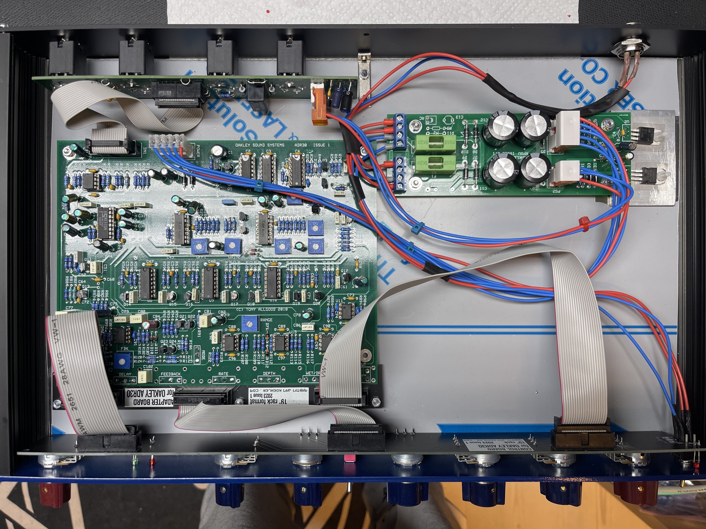
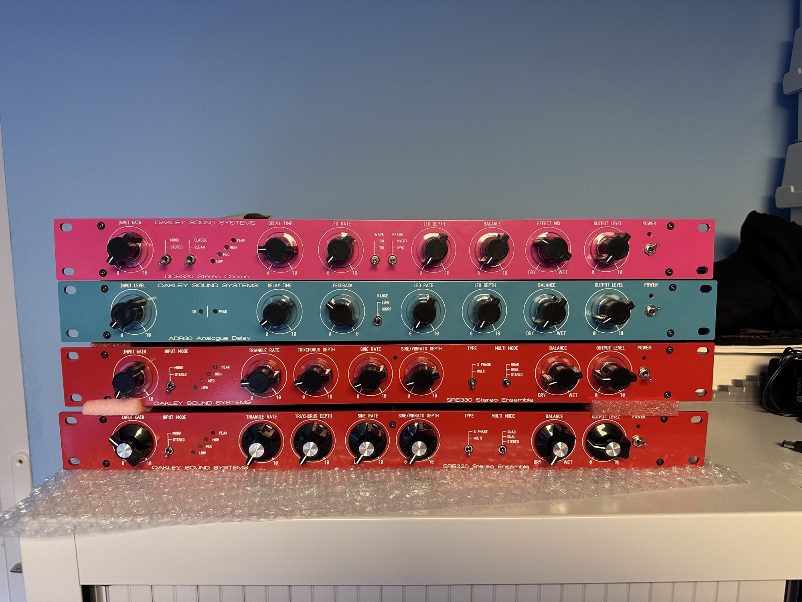

# Oakleysound ADR30 Delay

> **Info**
>
> ### Projecttitel:Oakleysound ADR30
>
> ### Status: `done`
>
> ### Startdate: 07/2020
>
> ### Duedate: 10/2020
>
> **Updated 03/2026**
>
> ### Manufacture link: [http://www.oakleysound.com](http://www.oakleysound.com)
>
> **new since 18.March 2026 is the owner of the 19” Projects:**[http://DIYSYNTH.de](http://DIYSYNTH.de)
>
> **The Oakleysound Projects was acquired by me and the products are for sale in my**[**DIYsynth.de**](http://DIYsynth.de)**shop.**

this page is under construction (19.3.2026)

I built a lot of ADR30 and here is the documentation.

I left one new ADR30 for sale.

**Oakley page:**

[https://www.oakleysound.com/ADR30.htm](https://www.oakleysound.com/ADR30.htm)

Usermanual:

[ADR30-UM1.pdf](assets/ADR30-UM1.pdf)

BuildGuide:

[ADR30-BG1.pdf](assets/ADR30-BG1.pdf)

Panel original and overlay:

[ADR30-original.fpd](assets/ADR30-original.fpd)

[ADR30\_YM300.fpd](assets/ADR30_YM300.fpd)

My own **copyrighted** panel:

[ADR30-custom-19inch-v5.fpd](assets/ADR30-custom-19inch-v5.fpd)

the Dual version is here: [Oakleysound ADR30 dual](../oakleysound-adr30-dual/index.md)

