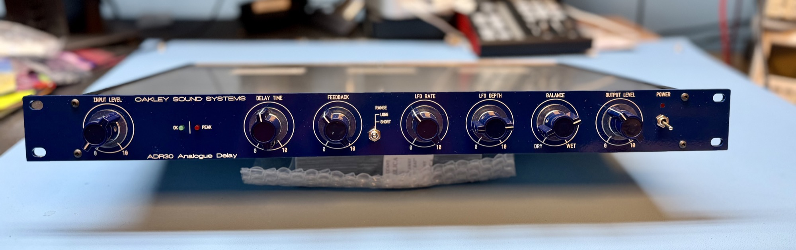

# Oakley Sound Systems ADR30 Product Information

# Oakley ADR30 - Analogue Delay Line and Chorus Module

**Construction difficulty: This is a moderately large project on a four layer circuit board. An oscilloscope is recommended for calibration.**

---

*This build uses a Takachi YM-300 case with an engraved metal overlay for the front panel legending from Scheaffer. Both the SREIO socket board and RPSU power supply module have been fitted.*

The Oakley Sound Systems ADR30 is an analogue delay module that processes audio signals to create echo and chorus effects. It uses two Xvive MN3005 bucket brigade delay (BBD) integrated circuits to produce a very distinct 'vintage' sound. Classic companding noise reduction circuitry further adds to the sonic characteristics.

Delay time is controlled by a single control on the front panel as well as a built in low frequency modulation oscillator and/or an external control voltage. With short delay times using the modulation oscillator can create both subtle and deep chorus effects. A front panel switch controls whether the signal runs through one or both MN3005 devices. Anti-aliasing filtering is achieved by two 6-pole discrete switched capacitor low pass filters that track the delay time, giving the maximum audio bandwidth for the specific delay time. Thus short delays remain reasonably bright sounding while longer delays become increasingly dark. Delay time can be varied continuously from 15ms to 300ms in short mode, and 30ms to 600ms in long mode.

*The board is sized so that two can be fitted next to each other in one 1U high 19" rack case.*

The unit is mono but features separate outputs for the wet/dry signal and the delayed signal. The audio input and outputs are balanced but are compatible with non balanced connections. A two LED level meter helps you keep signal levels at optimum ensuring a respectable signal to noise ratio without clipping. The unit will not be damaged by driving the unit into overdrive and interesting sounds can be obtained by deliberately doing so, either by turning up the input level or by allowing the feedback to build up to self oscillation. Although the unit does feature noise reduction circuitry the delay line devices are inherently noisy and have a very restricted bandwidth. The signal will deteriorate in an interesting manner as the delay time is increased and/or feedback is heavily applied.

*Two MN3005 re-issue BBDs provide the analogue delay pathway. A swtch on the front panel determines whether the signal runs through one or both BBD chips.*

The ADR30 PCB is 198mm wide and 153mm deep and is a four layer design using only through hole components and no difficult to get parts. The unit could be built into a 1U high 19” rack enclosure - although the PCB only takes up half that width. Two units could be fitted side by side in a 1U 19" rack although the case must be deep enough to accomodate the power supply and the I/O sockets. Alternatively, the project could be housed in one of the many standalone enclosures available such as the low cost Takachi YM-300.

*The ADR30 main board can be wired to its sockets directly if desired but an optional I/O board, called the SREIO, is available which makes wiring easier and also has a relay based anti thump circuit.*

An optional input/output board, the SREIO, is available to go with the ADR30 main board. This features space for three Switchcraft 114BPCX and one 112APCX socket and has a relay controlled muting circuit to reduce thumps on the audio outputs when the power supply is switched on and off. The power to the unit should be a regulated split supply of +/-15V. Power is admitted onto the main circuit board via a five way 0.156” (2.96mm) header of MTA or KK type. Power consumption is +80mA and -50mA at +/-15V. Although you can use any quality +/-15V power supply an optional power supply module has been created for the ADR30 called the RPSU. This is can be powered from an external 500mA 15V AC output mains adapter. Alternatively, an internal mains transformer can be used with the RPSU if you have sufficient knowledge on how to install one safely. The RPSU PCB is 150mm x 51mm.

---

**Sound Samples**

Single bass note processed with the ADR-30. The internal LFO is modulating delay time while the feedback control is manually altered.

Single hits (basic VCO/VCF/VCA combo) with delay time being manually controlled to produce pitch shifted echoes.

Single random note hits with delay time modulated by the internal LFO while altering the amount of feedback.

Low frequency drone manually gated by the input level control and then left to recycle with the feedback set to self-oscillate.

Another drone, this time altering the cut-off frequency of the filter and then on the ADR30 manually introducing LFO modulation and adding feedback.

Some plucky notes manually played and processed through the delay line while altering the delay time.

White noise filtered with a low pass filter controlled by a fast decaying envelope triggered by hand. The delay time and feedback controls on the ADR30 are manually altered

---

The **ADR30 pot bracket kit** contains seven special pot brackets. The brackets are used to hold the PCB mounted Alpha and ALPS pots safely to the PCBs. They are not required if you are using different types of pots or hand wiring any pots to the board.

Most of the other parts should be able to be purchased from you usual electronic component supplier. Please see the Builder's Guides for more details.

See the [Oakley Sound ordering](https://www.oakleysound.com/os-order.htm) page for ordering information, shipping charges and payment methods.

---

---

**Downloads**

Before building any Oakley project please ensure you have the most up to date documentation.

[ADR30 User Manual](https://www.oakleysound.com/ADR30-UM1.pdf)

[ADR30 Builder's Guide](https://www.oakleysound.com/ADR30-BG1.pdf)

[Construction Guide](https://www.oakleysound.com/construct.pdf) Our handy guide to building Oakley DIY projects

[Parts Guide](https://www.oakleysound.com/parts.pdf) Our handy guide to buying parts for Oakley DIY projects.

Use 'save as...' button to download and view the files.

The schematic is provided only to purchasers of the printed circuit board. This will be sent to you as a PDF file with your shipping confirmation e-mail.

**Front Panel databases (old files - look here for other files:**[Oakleysound ADR30 Delay](../index.md) )

You can edit these to suit your own panel design or print it out to use as a drilling template.

[ADR30.fpd](https://www.oakleysound.com/ADR30.fpd) Frontplatten Designer file for the suggested panel overlay suitable for a 1U rack case.

[ADR30\_YM300.fpd](https://www.oakleysound.com/ADR30_YM300.fpd) Frontplatten Designer file for the suggested panel overlay suitable for the YM300 case.

[RPSU\_shim.fpd](https://www.oakleysound.com/RPSU_shim.fpd) Frontplatten Designer file for the suggested heatsink shim plate.

To read these files you will need a copy of 'Frontplatten designer' from [Schaeffer](http://www.schaeffer-ag.de/). The program also features on-line ordering. The company are based in Berlin in Germany and will send out panels to anywhere in the world. For North American users you can also order your Schaeffer panels from [Front Panel Express](http://www.frontpanelexpress.com/).

For technical support on all Oakley projects please refer to the knowledgeable and helpful [Oakley Sound Forum](http://www.modwiggler.com/forum/viewforum.php?f=36) which is hosted at [ModWiggler.com](http://www.modwiggler.com/forum/index.php). [DIYSYNTH.de](http://DIYSYNTH.de) and DSL-man.de does not provide official building support for Oakley projects, but he and many others are usually available for help via the [forum](http://www.modwiggler.com/forum/viewforum.php?f=36).

*All front panel components are soldered directly onto the board which makes building straightforward.*

---

**Back to the**[**start**](https://www.oakleysound.com/index.htm)**page**

---

##### Copyright: Tony Allgood and [http://DIYSYNTH.de](http://DIYSYNTH.de) Last revised: April 9th, 2026
