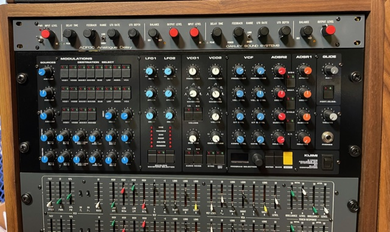
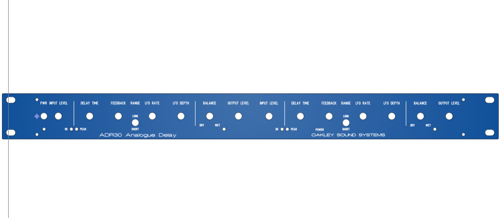

# Oakleysound ADR30 dual

> **Project**
>
> ### Projecttitel: Oakleysound ADR30 dual
>
> ### Status: `finsihed`
>
> ### Startdate: 2020
>
> ### Duedate: 2023
>
> last update 13.Sep.2024 - PCB Scan added
>
> ### Manufacture link: [http://www.oakleysound.com/ADR30.htm](http://www.oakleysound.com/ADR30.htm)

I built a DUAL Version of the ADR30 and a standard single Version

In case you want a buy a built version, please contact me

## BOM and Guide:

[ADR30-BG1.pdf](assets/ADR30-BG1.pdf)

the Schematic is only available for Clients/Owner of a ADR30

[Oakley-ADR30-pcbscan.pdf](assets/Oakley-ADR30-pcbscan.pdf)

Panelfile from Tony.A (not as shown on bottom !!!)

[ADR30.fpd](assets/ADR30.fpd)

## Usermanual

[ADR30-UM1.pdf](assets/ADR30-UM1.pdf)

**My own Design:**

[**dual-ADR30.fpd**](assets/dual-ADR30.fpd)**. → must be corrected (LED holes for example, power switch, total height allignment against the case)**

