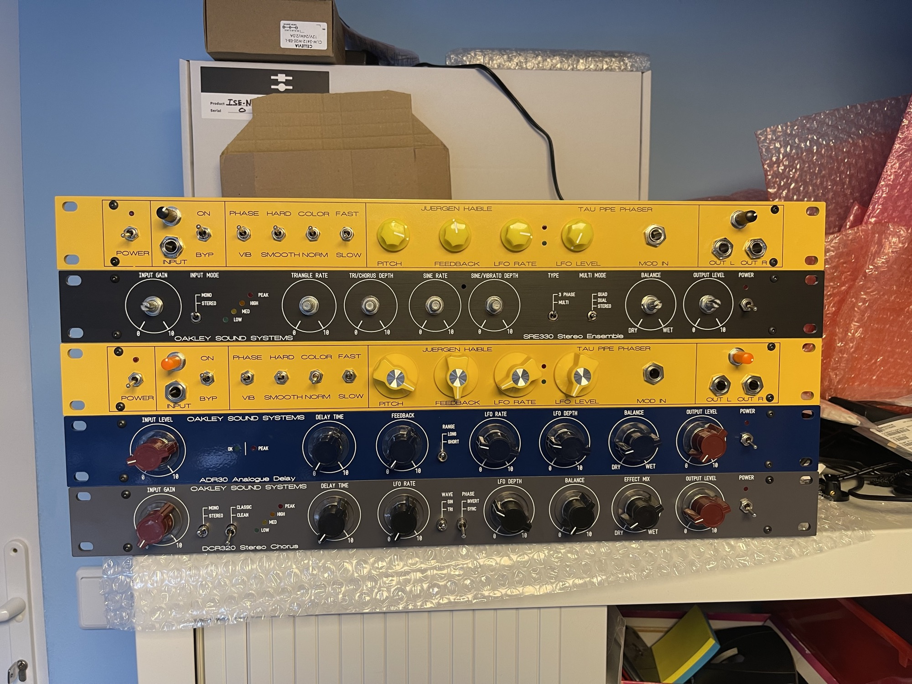
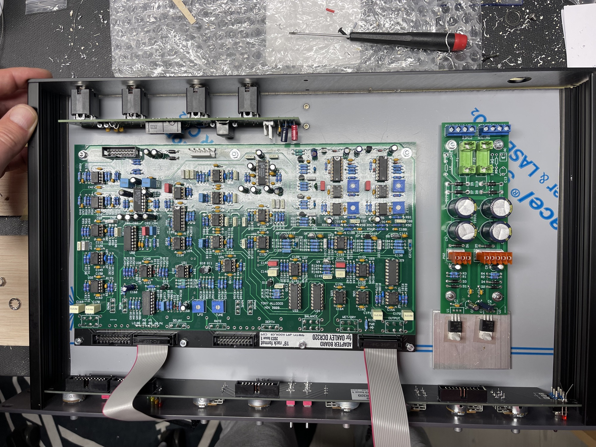
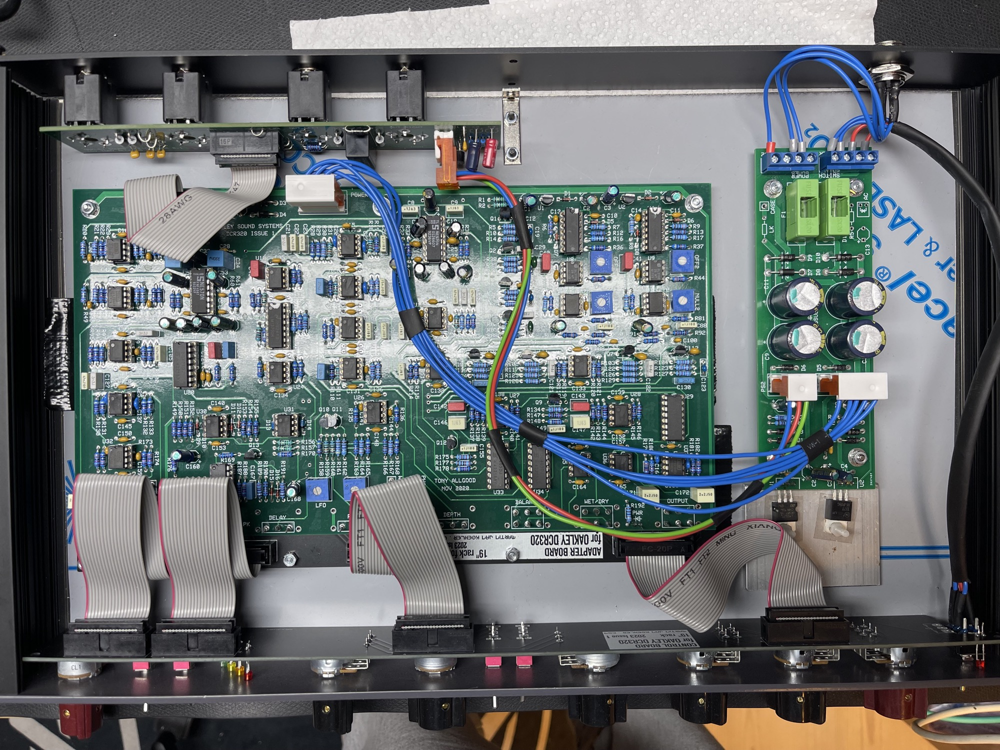

# Oakleysound DCR320

> **Project**
>
> ### Projecttitel: Oakleysound DCR320
>
> ### Status: `done`
>
> ### Startdate: 2023
>
> ### Duedate: 2023
>
> **UPDATED: 03/2026**
>
> ### Manufacture link: [http://www.oakleysound.com/DCR320.htm](http://www.oakleysound.com/DCR320.htm)
>
> **new since 18.March 2026 :**[Oakley Sound Systems DCR320 Product information](oakley-sound-systems-dcr320-product-information/index.md)
>
> **The Oakleysound 19” Projects was acquired by me and the products are for sale in my**[http://DIYsynth.de](http://DIYsynth.de) **shop.**

**Child Pages:**

"The Oakley DCR320 is a stereo ensemble unit designed to mimic the behaviour of a well known stereo chorus rack effect used in countless audio productions since the early 1980s. The original unit, and its various clones, have only four preset buttons on the front panel which limited the amount of control the user had on the effected sound. The Oakley DCR320 has no such buttons but instead allows full control over the most important parameters.

The DCR320 now provides controls for the wet/dry mix, the amount of left right cross processing, the modulation speed and depth, the modulation waveform and phase, and the delay time.

Input and output level control pots are also provided to allow maximum flexibility in dealing with a variety of input signal levels. Both the stereo input and output connections are balanced but can be used with unbalanced connections if desired. A mono/stereo switch is available on the front panel to allow just a single input to be processed in stereo.

In the DCR320's classic mode the unit features the original tonal equalisation and companding noise reduction circuitry which keeps unwanted noise levels to an acceptable level while also adding a 'vintage' sound of its own.

In the DCR320's clean mode the unit now gives a sound more reminiscent of the chorus units used in classic analogue synthesisers. The clean mode has no companding circuitry, no noise shaping EQ, and the effected signal has a wider bandwidth. Intermodulation distortion is significantly less in this mode which means pad sounds remain clear. However, the downside, like the original chorus units the clean mode tries to emulate, is that the audio outputs have a low level of swishing white noise that comes from using BBD devices.

A four LED level meter helps you keep signal levels at optimum ensuring the best signal to noise ratio without clipping." Source:oakleysound.com

I built few machines per year and in case you want one - contact me or look in my shop [DIYSYNTH.de](http://DIYSYNTH.de)

**BOM/Buildguide**

[DCR320 Builder's Guide.pdf](assets/DCR320-Builder-s-Guide.pdf)

**Relais replacement in 2024:**

Omron G6A-234P-ST15-US-DC12

**PCB SCAN**

[Oakley-DCR320-pcbscan.pdf](assets/Oakley-DCR320-pcbscan.pdf)

**Userguide/Calibration**

[DCR320 User Manual.pdf](assets/DCR320-User-Manual.pdf)

**Frontpanel**

[DCR320-custom-19inch-v4-holes.dxf](assets/DCR320-custom-19inch-v4-holes.dxf). with copyright by me

[DCR320.fpd](assets/DCR320.fpd) original without copyright

