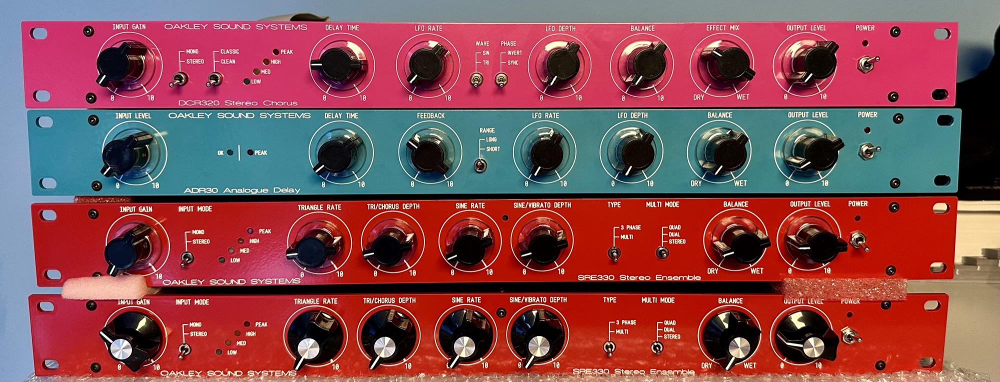

# Oakley Sound Systems DCR320 Product information

# Oakley DCR320 - Classic Stereo Chorus Module

**Constructional Difficulty: This is a large and complex project with a great many parts. An oscilloscope is required for calibration.**

---

*A completed DCR320 fitted into a 1U high 250mm deep rack. The front panel and legending is a printed metal overlay made by Schaeffer.*

The Oakley DCR320 is a stereo ensemble unit designed to mimic the behaviour of a well known stereo chorus rack effect used in countless audio productions since the early 1980s. The original unit, and its various clones, have only four preset buttons on the front panel which limited the amount of control the user had on the effected sound. The Oakley DCR320 has no such buttons but instead allows full control over the most important parameters.

The DCR320 now provides controls for the wet/dry mix, the amount of left right cross processing, the modulation speed and depth, the modulation waveform and phase, and the delay time.

Input and output level control pots are also provided to allow maximum flexibility in dealing with a variety of input signal levels. Both the stereo input and output connections are balanced but can be used with unbalanced connections if desired. A mono/stereo switch is available on the front panel to allow just a single input to be processed in stereo.

In the DCR320's classic mode the unit features the original tonal equalisation and companding noise reduction circuitry which keeps unwanted noise levels to an acceptable level while also adding a 'vintage' sound of its own.

In the DCR320's clean mode the unit now gives a sound more reminiscent of the chorus units used in classic analogue synthesisers. The clean mode has no companding circuitry, no noise shaping EQ, and the effected signal has a wider bandwidth. Intermodulation distortion is significantly less in this mode which means pad sounds remain clear. However, the downside, like the original chorus units the clean mode tries to emulate, is that the audio outputs have a low level of swishing white noise that comes from using BBD devices.

A four LED level meter helps you keep signal levels at optimum ensuring the best signal to noise ratio without clipping.

*Two 3207 BBDs run from +9V act as the delay elements.*

The unit is designed to be built into a 1U high full width 19” rack and uses no difficult to get parts. The unit can be powered from an external Yamaha PA-20 'line lump' type mains adapter, or, if you know how use high voltages safely, an internal mains transformer.

An optional input/output board has been designed to go with the DCR320 main board. This features space for four Switchcraft 114BPCX sockets (or equivalents) and has a relay controlled muting circuit to reduce thumps on the audio outputs when the power supply is switched on and off.

*The DCR320's main board can be wired to its sockets directly if desired but an optional I/O board is available which makes wiring easier and also has a relay based anti thump circuit.*

The main DCR320 PCB is 280mm (width) x 153mm (depth) and is a four layer design using only through hole components.

The power to the unit should be a regulated split supply of +/-15V. Power is admitted onto the main circuit board via a five way 0.156” (2.96mm) header of MTA or KK type. Power consumption is around +190mA and -140mA at +/-15V. An optional power supply module has been created for the DCR320 called the RPSU. This is designed to be run from an external AC output mains adapter such as the widely available Yamaha PA-20. However, an internal mains transformer can be used with the RPSU if you have sufficient knowledge on how to install one safely. The RPSU PCB is 150mm x 51mm.

*The RPSU designed to power the DCR320 main board circuitry with +/-15V.*

This is a big and complex project with a large number of parts – there are over 190 resistors alone. Proper calibration can only be done with an oscilloscope.

---

**Sound Samples**

This is a six part sample set of the Oakley Sound Systems DCR320 stereo chorus. Each part starts with the unprocessed sound.

In the first part you will hear a raw sawtooth Dm chord being processed by the DCR320 to introduce stereo vibrato at a variety of LFO speeds. The second part gives an example of the clean chorus sound at a variety of LFO speeds. The third part is of the DCR320 in classic mode with the balance control central and the LFO speed slightly changed towards the end of the sample.

The fourth part is a simple filtered sawtooth sequence in clean mode to give a stereo chorus - the LFO speed is varied througout the sample. The fifth part is the same sequence this time in classic mode - again the LFO speed is varied througout the sample. The final part is a different sequence using two VCOs and with the DCR320 in clean mode.

---

*The first prototype uses an internal mains transformer. The case is a 250mm deep 1U high 19" rack case.*

The **DCR320 pot bracket kit** contains seven special pot brackets. The brackets are used to hold the PCB mounted Alpha or ALPS pots safely to the PCBs. They are not required if you are using different types of pots or hand wiring any pots to the board.

Most of the other parts should be able to be purchased from you usual electronic component supplier. Please see the Builder's Guides for more details.

See the [Oakley Sound ordering](https://www.oakleysound.com/os-order.htm) page for ordering information, shipping charges and payment methods.

All prices include VAT at UK rates. Shipping/postage is additional to these prices. See also the [FAQ](https://www.oakleysound.com/FAQ.htm) page.

---

*The three pin power socket for use with external PA-20 power supplies.*

---

**Downloads**

[DCR320 Builder's Guide](https://www.oakleysound.com/DCR320%20Builder's%20Guide.pdf)

[DCR320 User Manual](https://www.oakleysound.com/DCR320%20User%20Manual.pdf)

[Construction Guide](https://www.oakleysound.com/construct.pdf) Our handy guide to building Oakley DIY projects

[Parts Guide](https://www.oakleysound.com/parts.pdf) Our handy guide to buying parts for Oakley DIY projects.

new Frontapanel files are  here: [Oakleysound DCR320](../index.md)

[DCR320.fpd](https://www.oakleysound.com/DCR320.fpd) Frontplatten Designer file of the suggested panel overlay design. You can edit this to suit your own panel design or print it out to use as a drilling template.

[RPSU shim.fpd](https://www.oakleysound.com/RPSU_shim.fpd) Frontplatten Designer file for the suggested heatsink shim plate.

Use 'save as...' button to download and view the files.

The schematic is provided only to purchasers of the printed circuit board. This will be sent to you as a PDF file with your shipping confirmation e-mail.

To read the Frontplatten Designer files you will need a copy of 'Frontplatten designer' from [Schaeffer](http://www.schaeffer-ag.de/). The program also features on-line ordering. The company are based in Berlin in Germany and will send out panels to anywhere in the world. For North American users you can also order your Schaeffer panels from [Front Panel Express](http://www.frontpanelexpress.com/).

For technical support on all Oakley projects please refer to the knowledgeable and helpful [Oakley Sound Forum](http://www.modwiggler.com/forum/viewforum.php?f=36) which is hosted at [ModWiggler.com](http://www.modwiggler.com/forum/index.php).

*The 2 mm thick printed overlay is fixed to the front of the rack case to provide a neat front panel.*

---

##### Copyright: Tony Allgood and [http://DIYSYNTH.de](http://DIYSYNTH.de) Last revised: April 9th, 2026
