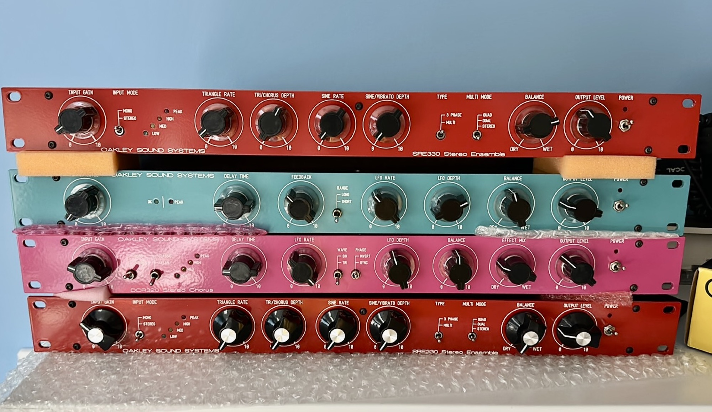
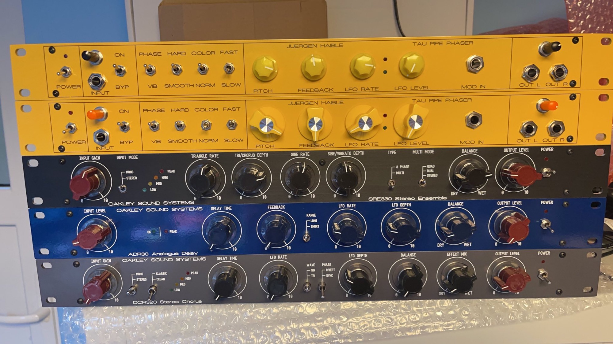
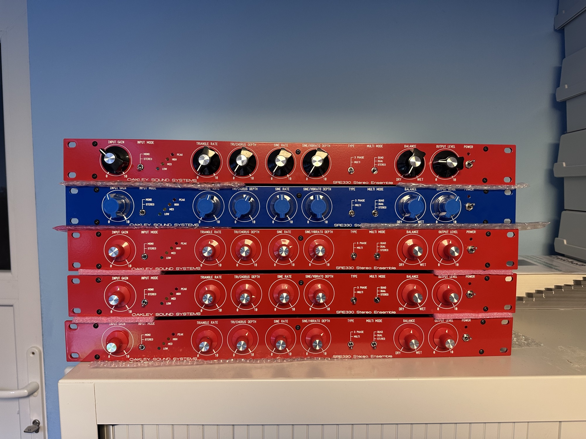
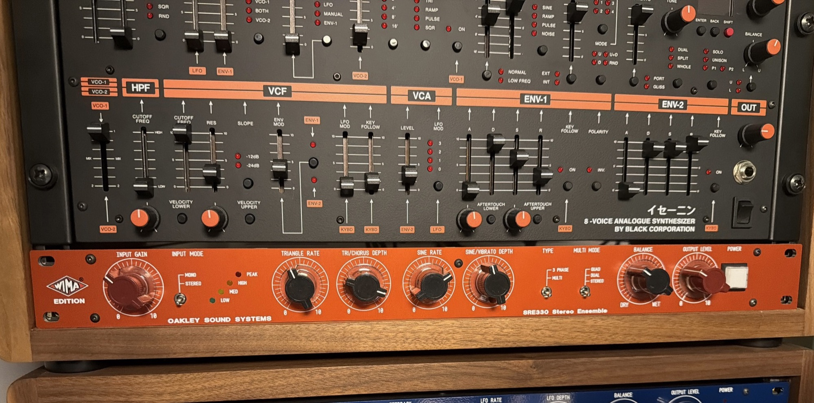
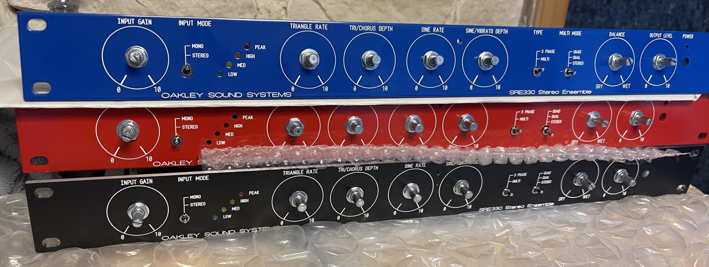
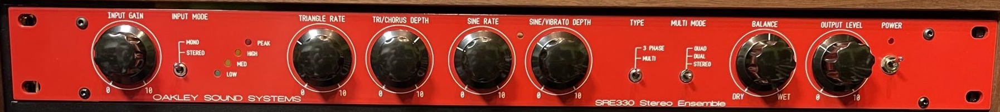
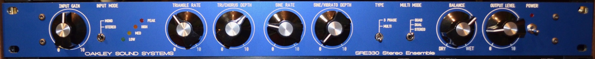
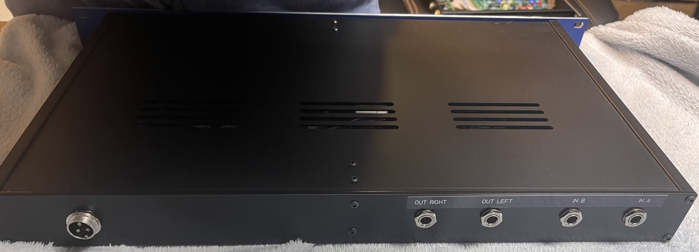
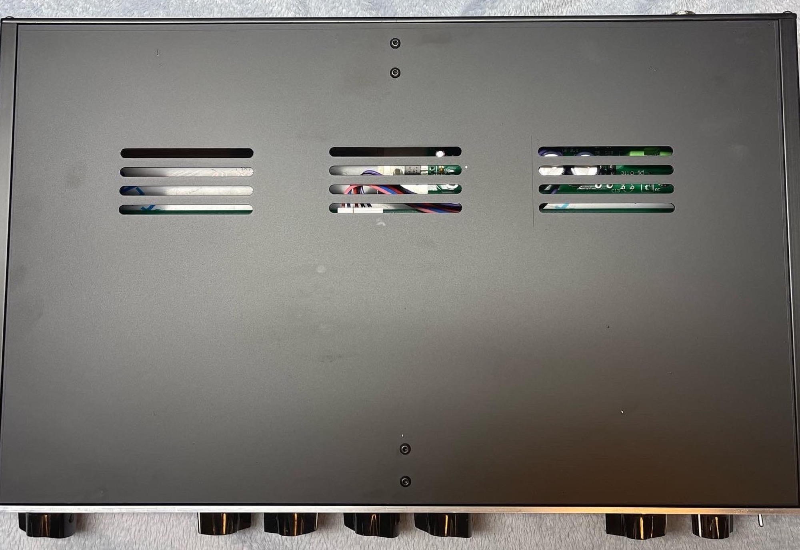
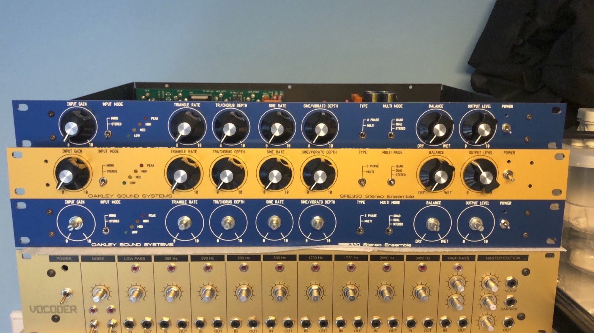

# Oakleysound SRE330

> **Project**
>
> ### Projecttitel:Oakleysound SRE330
>
> ### Status: `done`
>
> ### Startdate: 07/2020
>
> ### Duedate: 10/2020
>
> **Updated 03/2026**
>
> ### Manufacture link: [http://www.oakleysound.com](http://www.oakleysound.com)
>
> **new since 18.March 2026:**[Oakley Sound Systems SRE-330 Product information](oakley-sound-systems-sre-330-product-information/index.md)
>
> **The Oakleysound 19” Projects was acquired by me and the products are for sale in my**[http://DIYsynth.de](http://DIYsynth.de) **shop.**

**Please read my review for Amazona.de:**

[https://www.amazona.de/test-oakleysound-sre-330-ensemble-chorus-diy/](https://www.amazona.de/test-oakleysound-sre-330-ensemble-chorus-diy/)

**The SRE-330 is a high quality device with Stereo balanced inputs and Stereo balanced Outputs ! The Noise Ratio is very good, the SRE-330 use companders for less noise/artifacts from BBDs (aliasing/clock)**

I offer 1-2 times per year a very limited sale of the SRE-330, as build to order or from stock. contact me

the Price depends on different things like Panel color (Eloxal or Painted) and the supplier chain. at all its around 1200 - 1500€ for single orders. 

Its a lot of handmade and the high quality case and Panel is Made in Germany, the PCBs are non cheap Chinese productions.

The capacitors are low ESR and everything is in spec of 1% Metalfilm resistors, less 5% Capacitors mostly.

2026 Build:

**Build Guide:**

[SRE330-BG2.pdf](assets/SRE330-BG2.pdf)

**Notes**:

 in my builds was the MN3102 not working, (different batches too) you should use BL3102 or V3102., the symptom was Offset calibration wasn't possible, effect not working.

in case of the device overdrive at the outputs, check the 571/570 ICs- I got a lot of fake branded Philips NE570.

in case of the SIN/TRI is wrong- check the transistors for correct value.

in case of one output isn't working, check with a scope at the SRIO PCB the 16pin header or at the relays the inputs, (compare In 1 vs 2), in one of my builds was a relay faulty.

**Relais replacement in 2024:**

Omron G6A-234P-ST15-US-DC12

**PCB SCAN 2024**

[Oakley-SRE330-pcbscan.pdf](assets/Oakley-SRE330-pcbscan.pdf)

**User Guide**

[SRE330-UM2.pdf](assets/SRE330-UM2.pdf)

**Blue Panel with white silk.**

[SRE330-blue\_\_final\_batch2.fpd](assets/SRE330-blue__final_batch2.fpd).

**Gold Panel with black silk**

[SRE330-gold\_\_final\_batch2.fpd](assets/SRE330-gold__final_batch2.fpd)

**Overlay method (deprecated)**

use 1.5mm as overlay or change it and order a sticker with just the print

[output\_SRE330.fpd](assets/output_SRE330.fpd)

Dont miss to install a Alumium plate for the voltage regulators of the RPSU, I used my own plates - which is much cheaper.

**Tipps:**

order the parts from TME - as much you can to safe some money.

Thomann.de offer the Case and PSU (Yamaha PA-20)

The total costs for the Build is for the hardware around 500euro but its absolutely okay, the SRE-330 is wonderful.

Use metric screws for the Case - at the bottom side panels or the included screws touch the pcb

**PSU:**

use nylon screws for the isolation of the regulators if you have trouble with the isolation

you can also use a cooler: SK08/37.3/SA.  (TME part number) - you have to drill 2 holes and make metric threads

**Gallery:**

the SRE-330 was built in different versions - different case, color, Panel quality:

