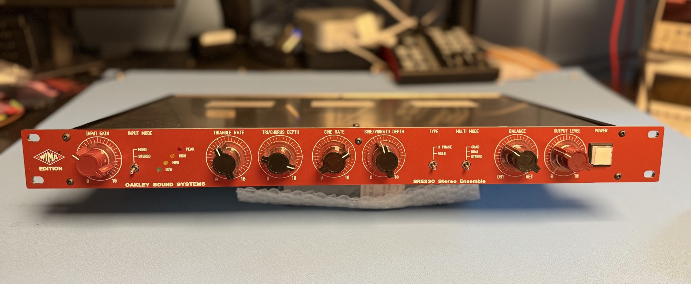

# Oakley Sound Systems SRE-330 Product information

# Oakley SRE330 - Enhanced Stereo Ensemble and Chorus Module

**This project is moved to**[**DIYSYNTH.de**](http://DIYSYNTH.de)**aka**[**DSL-man.de**](http://DSL-man.de)

---

*A completed SRE330 fitted into a 1U high 250mm deep rack. The front panel and legending is a metal overlay made by Schaeffer.*

The Oakley SRE330 is a multi mode stereo ensemble unit designed to mimic the behaviour of the multichannel chorus and ensemble units of late 1970s and early 1980s. The SRE330 uses up to four channels of bucket brigade delay (BBD) lines and up to four voltage controlled low frequency oscillators (LFO) to achieve a sound reminiscent of various types of string machines, guitar chorus pedals and studio rack effects of yesteryear.

Unlike the original devices the SRE330 allows greater control over the modulation depths, speeds and waveforms, as well as featuring a wet/dry control. Input and output level control pots are also provided to allow maximum flexibility in dealing with a variety of input signal levels. Both the stereo input and output connections are balanced but can be used with unbalanced connections if desired.

The unit features classic companding noise reduction circuitry which keeps unwanted noise levels to an acceptable level while also adding a 'vintage' sound of its own. A four LED level meter helps you keep signal levels at optimum ensuring a good noise to signal ratio without clipping.

*The SRE330 uses four analogue delay channels each one based around the 3207 BBD.*

The SRE330 features two basic types of ensemble, three phase and multimode, which are selected by a front panel switch.

The three phase setting replicates the action of classic string machines originally from Europe such as the Solina and Logan String Melody. Three BBDs are used in this mode and their delay times are controlled by two three phase fixed frequency sine wave oscillators. One of the oscillators, the chorus, runs very slowly. And the other, the vibrato, runs a little faster. However, unlike the majority of classic string machines, the modulation depths of each oscillator can be controlled with the appropriate front panel level pot.

The Multimode setting is designed to replicate the actions of various classic synth chorus units and string machines from Japan. The Multimode setting, as its name implies, has three modes of operation:

1. Quad ensemble. All four delay lines are operating in this mode – with two BBDs and two LFOs being used for each stereo channel. This mode is at its most effective when the wet/dry control is set to around 100% wet.

1. Dual ensemble. In this mode two BBDs are being used, one per stereo channel. Each BBD can be modulated by its own pair of LFOs. This mode is very effective when the wet/dry control is set to around 50%.

1. Stereo Chorus. Again, in this mode, two BBDs are being used. But this time both BBDs are being driven from the same pair of LFOs. However, one of the BBDs will receive the inverted outputs of the VC-LFO pair. Like mode 2, this mode is very effective when the wet/dry control is set to around 50%.

The four LFOs used in the Multimode setting are made from four separate circuits. Two of the LFOs produce sine waves and two of them produce triangle waves. The SRE330 is wired so that each stereo channel's BBDs are controlled by one set of triangle and sine wave LFOs. Each pair of similar waveform LFOs are controlled by their own speed and depth pots. So one set of pots controls the two sine wave LFOs and one set controls the two triangle wave LFOs. Each pair of similar waveform LFOs will therefore track each other but one is set to always run 20% slower than the other.

The unit is designed to be built into a 1U high full width 19” rack and uses no obsolete parts.

An optional input/output board has been designed to go with the SRE330 main board. This features space for four Switchcraft 114BPCX sockets and has a relay controlled muting circuit to reduce thumps on the audio outputs when the power supply is switched on and off.

*The SRE330 can be wired to its sockets directly if desired but an optional I/O board is available which makes wiring easier and also has a relay based anti thump circuit.*

The main SRE330 PCB is 389mm (width) x 153mm (depth) and is a four layer design using only through hole components.

The power to the unit should be a regulated split supply of +/-15V. Power is admitted onto the main circuit board via a five way 0.156” (2.96mm) header of MTA or KK type. Power consumption is +225mA and -180mA at +/-15V. An optional power supply module has been created for the SRE330 called the RPSU. This is designed to be run from an external AC output mains adapter such as the widely available Yamaha PA-20. However, an internal mains transformer can be used with the RPSU if you have sufficient knowledge on how to install one safely. The RPSU PCB is 150mm x 51mm.

*The issue 2 RPSU especially designed to power the SRE330 main board circuitry with +/-15V.*

This is a big and complex project with a large number of parts – there are over 260 resistors alone. Proper calibration can only be done with an oscilloscope.

---

**Sound Samples**

Playing around with the prototype Oakley Sound Systems SRE330 stereo ensemble. In this sound sample set you hear the raw sawtooth first from a Roland Alpha Juno 2, and then the rest of the set processing the Juno's mono output with the SRE330 to produce a rich string synth sound. At extreme modulation depths the induced vibrato effect can be very pronounced.

This sample set uses a Roland Alpha Juno to create a raw sawtooth pad which is then sent to both an Oakley Sound SRE330 and a Lowrey Symphonic Ensemble unit from 1975. The Lowrey ensemble is basically their version of the triple ensemble circuitry from the Solina string machine complete with TCA350Y BBDs.

In this set you hear the same sound firstly played through the Lowrey and then the SRE330 in Triple Ensemble Mode. I crossfade between the two effects after each sound to show how similar they sound. However, they are not identical. The Lowrey is noisier with considerable modulation oscillator breakthrough and there is some of sort of peak in the frequency response which isn't there in the more mellow SRE330. The latter could be added with EQ should one wish to replicate that part of the sound.

It should be noted that the SRE330's and Lowrey's outputs have been put into mono for this sample set to recreate the sound of most analogue string machines.

*The second prototype awaiting its front panel overlay. The case is a 250mm deep 1U high 19" rack case.*

---

**Downloads**

[User Manual](https://www.oakleysound.com/SRE330-UM2.pdf)

[Builder's Guide](https://www.oakleysound.com/SRE330-BG2.pdf)

[Construction Guide](https://www.oakleysound.com/construct.pdf) Our handy guide to building Oakley DIY projects

[Parts Guide](https://www.oakleysound.com/parts.pdf) Our handy guide to buying parts for Oakley DIY projects.

please look here for the new Panel files: [Oakleysound SRE330](../index.md)

[SRE330.fpd](https://www.oakleysound.com/SRE330.fpd) Frontplatten Designer file of the suggested panel overlay design. You can edit this to suit your own panel design or print it out to use as a drilling template.

[RPSU shim.fpd](https://www.oakleysound.com/RPSU_shim.fpd) Frontplatten Designer file for the suggested heatsink shim plate.

Use 'save as...' button to download and view the files.

The schematic is provided only to purchasers of the printed circuit board. This will be sent to you as a PDF file with your shipping confirmation e-mail.

To read the Frontplatten Designer files you will need a copy of 'Frontplatten designer' from [Schaeffer](http://www.schaeffer-ag.de/). The program also features on-line ordering. The company are based in Berlin in Germany and will send out panels to anywhere in the world.  For North American users you can also order your Schaeffer panels from [Front Panel Express](http://www.frontpanelexpress.com/).

For technical support on all Oakley projects please refer to the knowledgeable and helpful [Oakley Sound Forum](http://www.modwiggler.com/forum/viewforum.php?f=36) which is hosted at [ModWiggler.com](http://www.modwiggler.com/forum/index.php).

---

**Back to the**[**start**](https://www.oakleysound.com/index.htm)**page**

---

##### Copyright: Tony Allgood and [http://DIYSYNTH.de](http://DIYSYNTH.de) Last revised: April 9th, 2026
