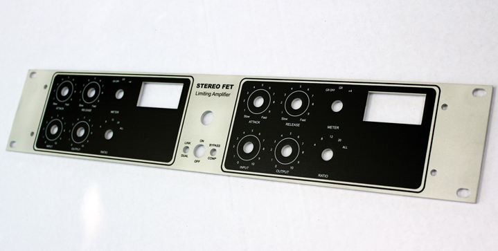
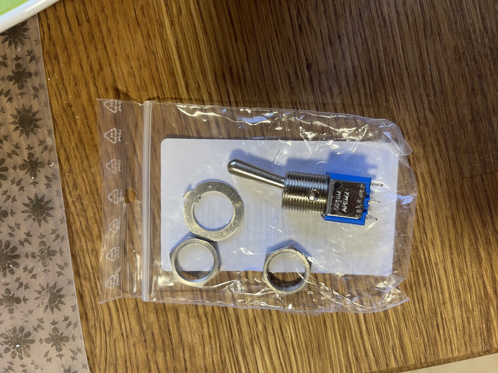
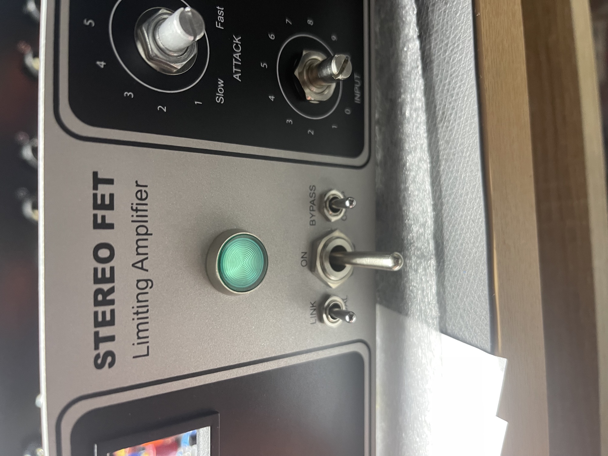
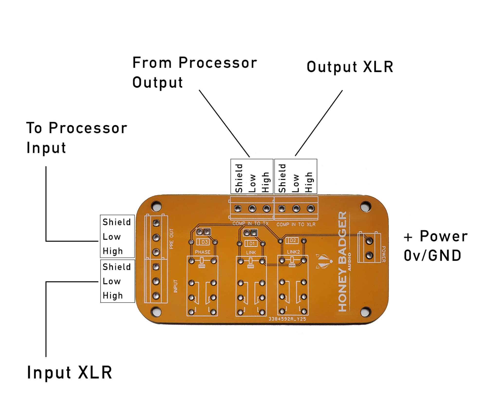
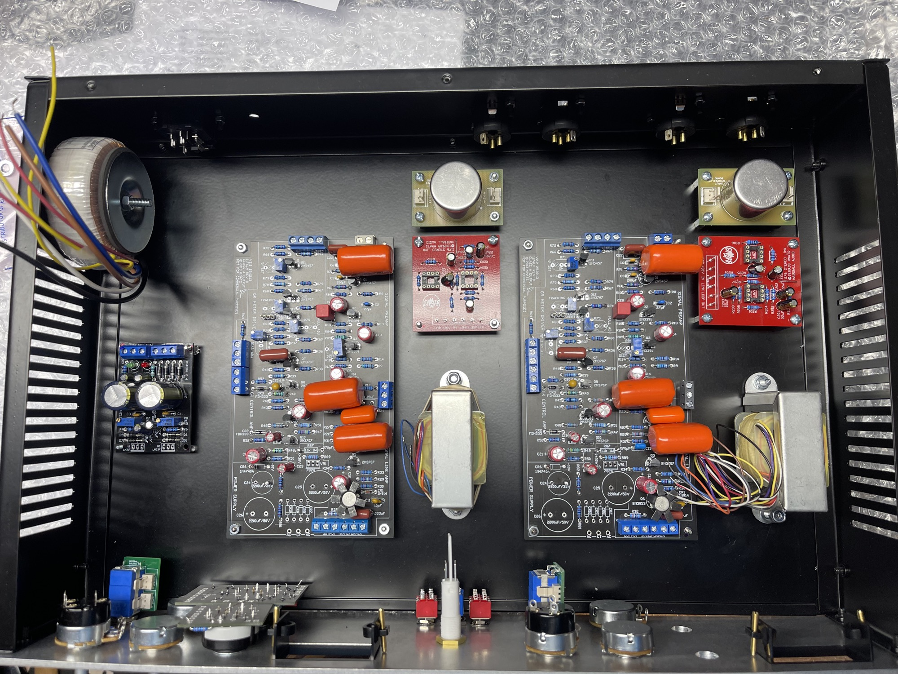
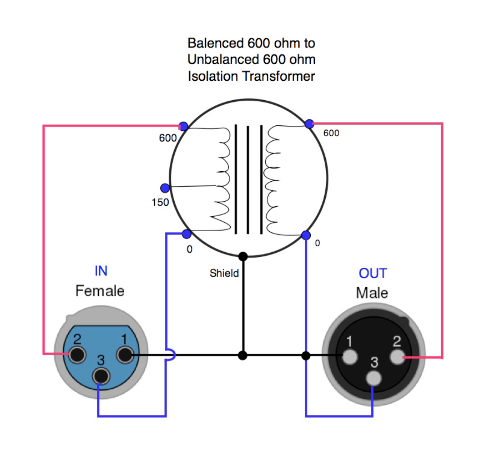
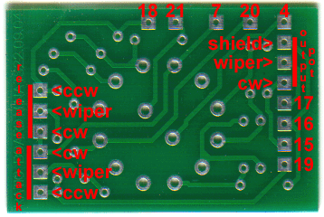
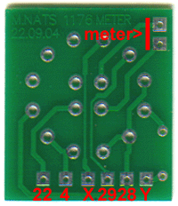
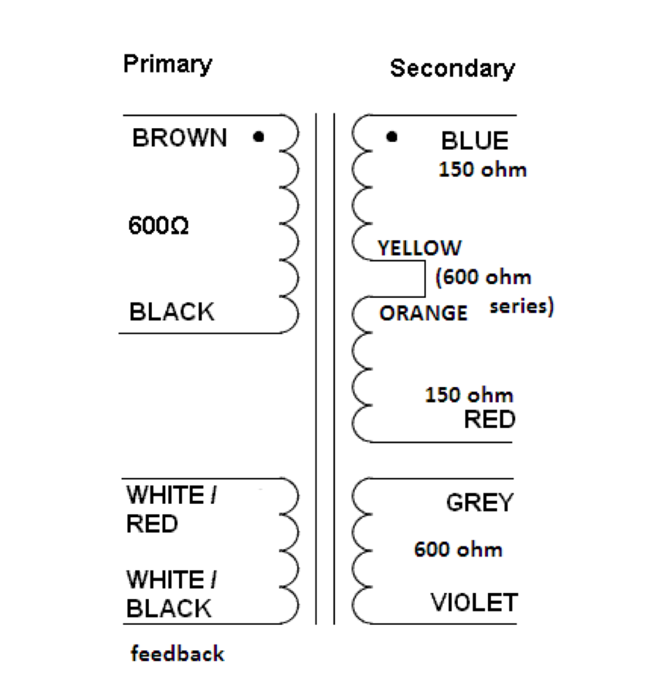

# Stereo 1176D clone

> **Project**
>
> ### Projecttitel: Stereo 1176D clone
>
> ### Status: `in progress`
>
> ### Startdate: 02.03.2023
>
> ### Duedate: 01.04.2023
>
> ### Manufacture link:

### PCB:

hairball audio 1176 D version - which is the mnats version

[http://mnats.net/1176.html](http://mnats.net/1176.html)

### Panel and Case:

[https://collectivecases.com/?product=stereo-1176](https://collectivecases.com/?product=stereo-1176)

Mehr anzeigen

FINISHES

1. STEREO 1176 cases will be powder coated black.
2. The faceplates come in 3 different color options. They are raw aluminum and black with white lettering (UA style), raw aluminum and blue with white lettering (Blue Stripe style), a powder coated (creamy color) with black and white silk screen lke the first option.

MADE IN THE USA, ENCLOSURE DETAILS:

1. 2 rack space height
2. 18 gauge metal cases
3. Rear Panel XLR, IEC, and Star Ground cutouts
4. 11″ deep
5. 17″ wide case
6. Vent holes on tops and sides
7. Clean outside for easy installation in racks
8. Ships flat for lower shipping cost

ENCLOSURE INCLUDES

- 1 Faceplate
- 1 Top & bottom panel
- 1 Rear panel
- 2 Side panels

RECOMMENDED COMPONENTS:
Meters – Hairball Audio (8027-WF VU)
XLR’s – Nuetrik D series connectors (part # Neutrik NC3FD-L-1-B & Neutrik NC3MD-L-1-B)
IEC – Schurter 6200.2100 (Mouser Part # 693-6200.2100)
For support look here: ([http://www.groupdiy.com/index.php?topic=44882.0](http://www.groupdiy.com/index.php?topic=44882.0))
For kits look here: ([http://hairballaudio.com/shop/product\_info.php?cPath=22&products\_id=79](http://hairballaudio.com/shop/product_info.php?cPath=22&products_id=79))

### BOM and Schematic:

[1176LN\_REVD\_V2.2\_DOC.pdf](assets/1176LN_REVD_V2.2_DOC.pdf)

Hairball Audio offer part kits/half kits for a stereo version, you have to add the PCBs too.

| **ID** | **Part** | **add. info** | **link** | **price netto** | **price with all fees** |
|---|---|---|---|---|---|
| 1 | case | case | [https://collectivecases.com/?product=stereo-1176](https://collectivecases.com/?product=stereo-1176) | 150 USD |   |
| 2 | pcbs | hairball PSU x2 |   | 20 USD |   |
| 3 | part kit pcb | - 2 x Matched Pair of 2N5457 FETs - 1 x Dual Primary Toroidal 2X30 30VA Power Transformer - 2 x FET Compressor Attack Control - 2 x FET Compressor Release Control - 2 x FET Compressor Output Control - 2 x 8027-WF VU Meter - 2 x C-3837-1 Input Transformer - 2 x EA-5002 Output Transformer w/ Channel Frame - 2 x Bourns 600Ω T-Pad Attenuator w/ PCB - 1 x Stereo Link Kit | [https://www.hairballaudio.com/catalog/parts-store/old-style-fetrack/stereo-fet-compressor-rev-ad-bundle](https://www.hairballaudio.com/catalog/parts-store/old-style-fetrack/stereo-fet-compressor-rev-ad-bundle) | 475USD |   |
| 4 | XLR | XLR’s – Nuetrik D series connectors (part # Neutrik NC3FD-L-1-B & Neutrik NC3MD-L-1-B) 2 of each !!! |   |   |   |
| 5 | IEC power inlet | IEC – Schurter 6200.2100 (Mouser Part # 693-6200.2100) | look for better version with filter |   |   |
| 6 | PSU PCB | PSU pcb from hairball | only one needed !! - check capacitor sizes RM7.5mm | 10USD |   |
| 7 | link switch | SPST switch of your choice |   |   |   |
| 8 | Powerswitch | DPST 12mm diameter | [https://www.voelkner.de/products/42017/APEM-5646MA-Kippschalter-250-V-AC-3A-2-x-Ein-Ein-rastend-1St..html](https://www.voelkner.de/products/42017/APEM-5646MA-Kippschalter-250-V-AC-3A-2-x-Ein-Ein-rastend-1St..html)   | 12euro |   |
| 9 | case part | you need distance spacer 28x 5mm-10mm height M3 for the psu you need 4 x 5mm height spacer M3 |   |   |   |
| 10 | case part | 4x M4 screws 15-20mm lenght for the output transformer mounting |   |   |   |
| 11 | screws | you need at minimum 28mm flat M3 screws - lenght 6mm to mount the spacer from bottom |   |   |   |
| 12 | screws | a lot of M3 screws and washers, nuts for thge pcb mounting and XLR connectors |   |   |   |
| 13 | Rotary switches | 2x 4pole 3positions 2x 2Pole 6 positions (change the locker to 5) | lorlin or C&K |   |   |
| 14 | pcb parts | Solder nails and connectors 1mm diameter for the rotarty switch pcbs and main pcbs |   |   |   |
| 15 | cable | powercable 1.5mm2, shielded cable 2 and 3 pole, and few meters 0.5mm2 for interconnection between pcbs |   |   |   |
| 16 | headers | I used MTA and molex connections as shown in my pictures |   |   |   |
| 17 | jewel lamp | I used from TME: | AE-C027500NAH from tme.eu |   |   |

### Buildinfos:

[Building The DIY 1176LN Revision D.pdf](assets/Building-The-DIY-1176LN-Revision-D.pdf)

The 1176 doesn't have a true bypass, just a GR off.  The GR off is usually placed as a switch on the attack pot.

or use : [True Bypass Module – Obsoletetechnology](https://obsoletetechnology.wordpress.com/projects/true-bypass-module/) → LED can be powered by a 3PDT switch 

or this

[https://honeybadgeraudio.com/shop/diy/other-boards/link-controller/](https://honeybadgeraudio.com/shop/diy/other-boards/link-controller/)

Mehr anzeigen

BOM

[Link-controller-BOM.pdf](assets/Link-controller-BOM.pdf)

Schemata:

[Schematic\_1276-LINK-BOARD\_2023-07-01.pdf](assets/Schematic_1276-LINK-BOARD_2023-07-01.pdf)

Wiring:

### Wiring example

[1176LN-module\_connection.pdf](assets/1176LN-module_connection.pdf)

link switch guide

[Stereo\_Link\_Wiring\_Guide.pdf](assets/Stereo_Link_Wiring_Guide.pdf)

[176 manual - HQ - draft edition.pdf](assets/176-manual---HQ---draft-edition.pdf)

[Wiring the 1176LN Clone - Rotary Version.pdf](assets/Wiring-the-1176LN-Clone---Rotary-Version.pdf). → for instructions of the wiring - pots and switch

[Building The DIY 1176LN Revision D.pdf](assets/Building-The-DIY-1176LN-Revision-D.pdf)

Nmats:

I've included potentiometer assignments too that aren't on the silkscreen layer of the boards: **ccw=counter-clockwise - the contact where the wiper comes to rest if the shaft is turned all the way to the left when the pot is viewed from the front**; wiper=the middle contact; **cw=clockwise - the contact where the wiper comes to rest if the shaft is turned all the way to the right**. If you have any doubt, turn the shaft all the way to the end stop and measure the resistance from the middle terminal to each of the other lugs. The one that shows the lowest resistance is the one where the wiper is closest to. It should read very close to zero ohms.

  

[1176REVD\_VOLTS-schematic.pdf](assets/1176REVD_VOLTS-schematic.pdf)
