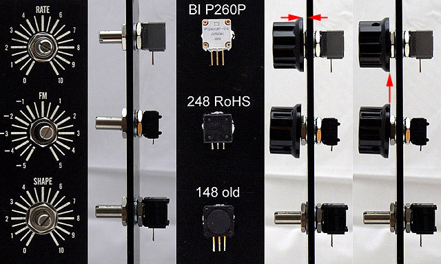
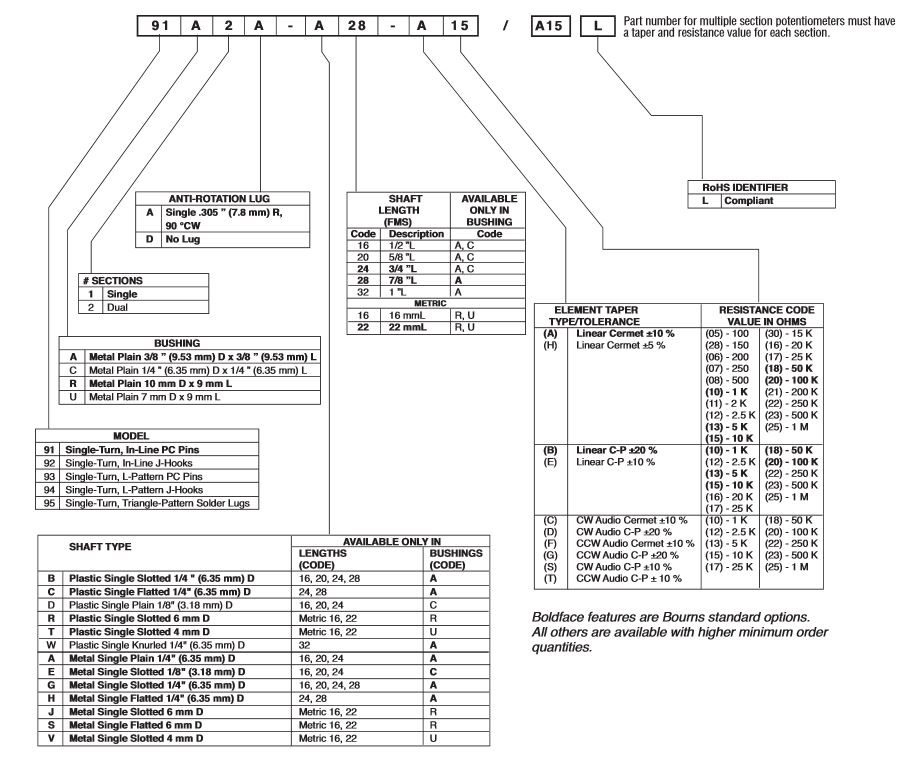

# 40.2 Potis  - Potentiometer

**find some info here:**

**[http://modularsynthesis.com/modules/parts/parts.htm](http://modularsynthesis.com/modules/parts/parts.htm)**

****

**Pots for MOTM, Oakley (S/H):**

**Vishay/Spectrol 148/ 149**

**[http://www.digikey.com/product-search/en/potentiometers-variable-resistors/rotary-logarithmic/262966?k=p260p%20100k](http://www.digikey.com/product-search/en/potentiometers-variable-resistors/rotary-logarithmic/262966?k=p260p%20100k)**

**[http://www.digikey.de/product-detail/de/P260P-D1AS3CB100K/P260P-D1AS3CB100K-ND/3641243](http://www.digikey.de/product-detail/de/P260P-D1AS3CB100K/P260P-D1AS3CB100K-ND/3641243)**

**TT 260P pots (for usage in MOTM preferred)**

**[http://www.rapidonline.com/FFSearchResults.aspx?filterSearchScope=0&filterBrand=TT+Electronics&followSearch=9410&sourceRefKey=GMI1MA\_Jq&keywords=260p](http://www.rapidonline.com/FFSearchResults.aspx?filterSearchScope=0&filterBrand=TT+Electronics&followSearch=9410&sourceRefKey=GMI1MA_Jq&keywords=260p)**

**[http://www.rapidonline.com/electronic-components/100k-linear-rotary-potentiometer-68-1181](http://www.rapidonline.com/electronic-components/100k-linear-rotary-potentiometer-68-1181)  arround 2,8€ with tax**

|   |   |   |
|---|---|---|
| 100K linear; min order qty 240; 8+ week leadtime | BI Technologies | P260P-D1BS3CB100K |
| 100K linear | Digikey | 987-1331-ND  *New* |
| 10K log | Digikey | 987-1332-ND  *New* |
| 100K log | Digikey | 987-1330-ND  *New* |

**Musikding:**

**[http://www.musikding.de/Potentiometer](http://www.musikding.de/Potentiometer)**

**[http://www.musikding.de/Mono](http://www.musikding.de/Mono)**

**Reichelt: (cheap pots 6mm)**

PO6M-LIN 10K

POM-LIN 47K

**Banzai:**

[http://www.banzaimusic.com/Potentiometers/](http://www.banzaimusic.com/Potentiometers/)

[http://www.banzaimusic.com/Bourns-AP-FS-100k-lin.html](http://www.banzaimusic.com/Bourns-AP-FS-100k-log.html)  100k lin poti 3,50€

**USA:**

|   |
|---|
| Bourns #91A1A-B24-B18, 50K conductive plastic w/ pc terminals, for replacing many Blacet 50K pots - Allied #754-9418, 1-9 $4.93, 10-24 $4.29, 25-49 $3.69 Bourns #91A1A-B24-B20, 100K conductive plastic w/ pc terminals, for general use - Allied #754-9420, 1-9 $4.93, 10-24 $4.29, 25-49 $3.69 Spectrol 149 series #149-09-10-104, 100K cermet w/ pc terminals, for high stability uses - Allied #970-1791, 1-9 $5.36, 10-24 $4.97, 25-49 $4.77 - Mouser #594-149-7104, 1-9 $7.48, 10-24 $6.65, 25+ $5.83 |

**Mouser-nr.:**  

652-91A1A-B24-**A**20L  - 10%   ✅ in stock mouser August 2014    100k lin

91A1A-B24-**B**20   -  20%  4,44€  in stock ✅ august 2014   100k lin

otherwise use 95 A1A xxx  = with W pins (no pcb mount)

other pots:

Mouser-nr.:     

652-91R1A-R16-**A**20L   

91R1A-R16-A20L

> **Tipp**
>
> Bourns : keep attention on  A/B (linear) or C/D(Audio/Log) 91R1A-R16-**A**20L

