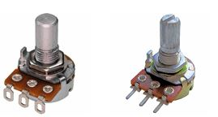
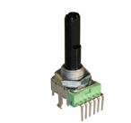
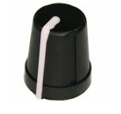
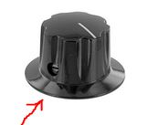
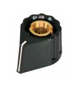

# DIY Modular Knowledge

**Level shifter** from +/ - 5V to 10V

[http://www.modularsynthesis.com/modules/DJB-016/djb016.htm](http://www.modularsynthesis.com/modules/DJB-016/djb016.htm)

[DJB-016\_schematic.jpg](assets/DJB-016_schematic.jpg)

**MOTM Katalog /catalogue**

[motmcat30.pdf](assets/motmcat30.pdf)

**POTIACHSEN**

Es gibt verschiedene Potiachsen:

- Fullshaft/Vollachse (rund, metall oder Kunstoff Achse) 

- Fullshaft knurled - geriffelt 

- Fullshaft knurled mit Schlitz

**-D-Shaft Achse** , gibt es hauptsächlich in Kunststoff - sieht aus wie ein "D" wenn man draufschaut  (der LXR drumsynth hat solche)

Alle typen gibt es in verschiedenen Durchmessern bei uns 6mm - 6,3mm

Die Achslängen sind von 5-30mm, wir haben 9-16mm im Einsatz (je nach Gerät)

## **KNOBS:**

**Es gibt 3 Schwerpunkte**

D-Shaft ( meist die Softknobs wie beim LXR) diese passen nur auf D Shaft potis

Vollachse 6,3mm  - hier passen nur knobs mit Schraube

für die 6mm Achsen als Riffel oder Vollachse gibt es Knobs mit push/pressen,

diese wiederrum gibt es in 2 Ausführungen - normal pressen auf vollachse

oder knurled knobs- dort ist ein Metallinlet welches von vorn mit einer schraube gespannt wird,

dort hat man dann einen Deckel von aussen.

