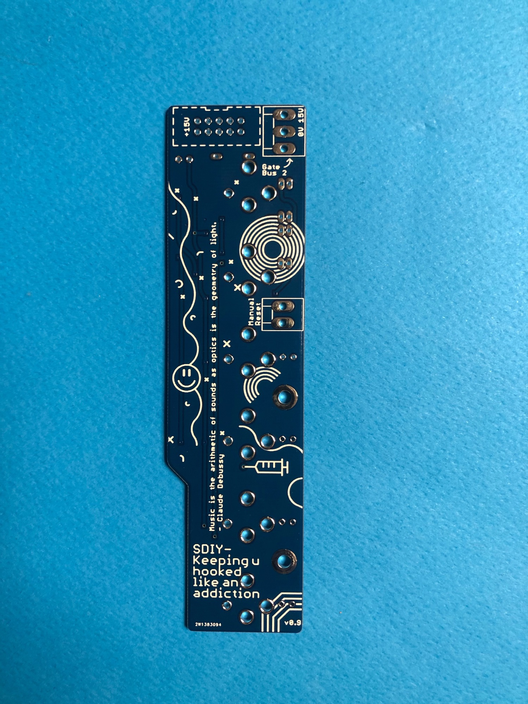
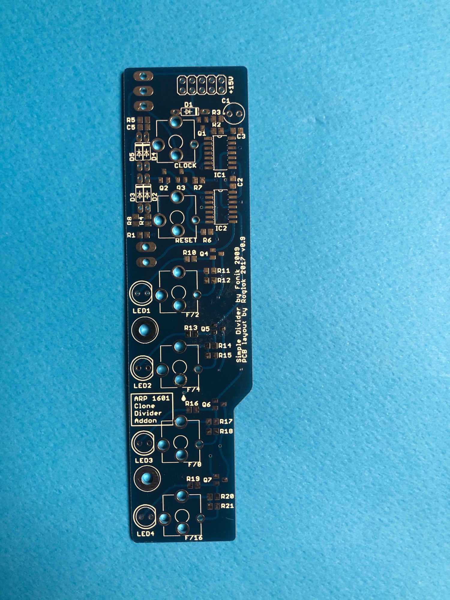
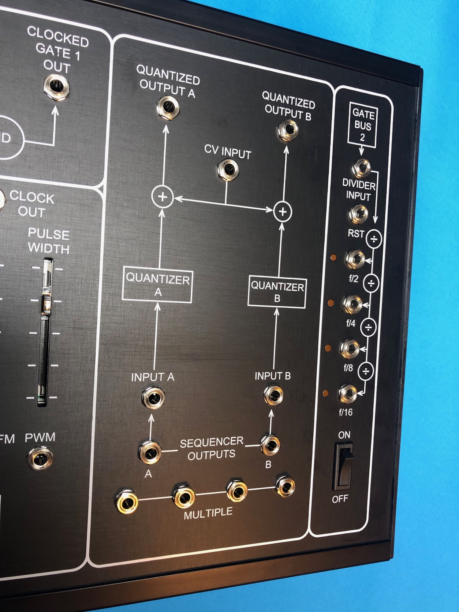

# 1601 Mods

not shown on this page, but here’s a other mod:

[Arp1601 Step1fix Mod](../arp1601-step1fix-mod/index.md)

I left few pcbs and have this for sale in my shop:

[https://www.diysynth.de/pcbs-panels/arp1601-clock-divider-pcb.html](https://www.diysynth.de/pcbs-panels/arp1601-clock-divider-pcb.html)

[1601\_clock\_divider\_BOM\_dsl-man.xlsx](assets/1601_clock_divider_BOM_dsl-man.xlsx)

**Clockdivider:**

[https://github.com/foxacid/1601-addons](https://github.com/foxacid/1601-addons)

### Bill of Materials

---

**Make sure to use 15V versions for the logic ICs**

[1601\_clock\_divider\_BOM\_dsl-man.xlsx](assets/1601_clock_divider_BOM_dsl-man.xlsx)

Mouser BOM: (not complete)

[https://www.mouser.com/ProjectManager/ProjectDetail.aspx?AccessID=3fab799a9e](https://www.mouser.com/ProjectManager/ProjectDetail.aspx?AccessID=3fab799a9e)

