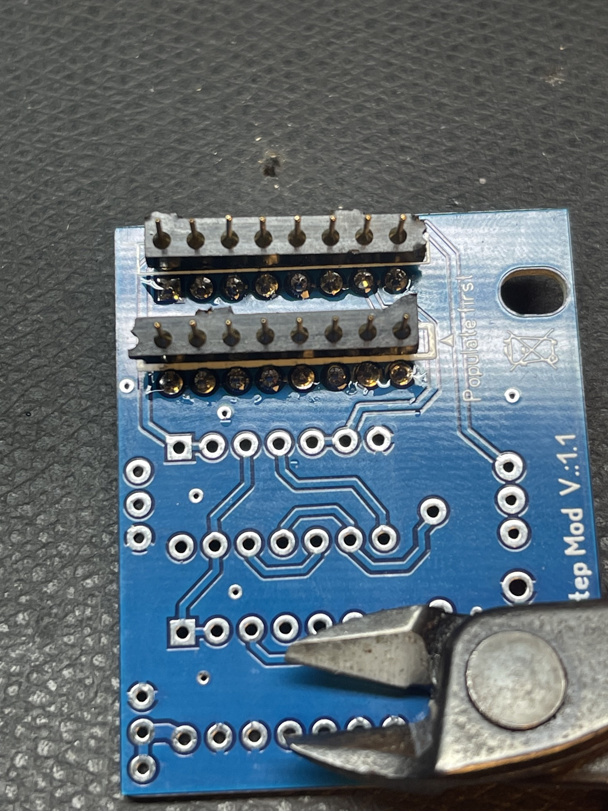
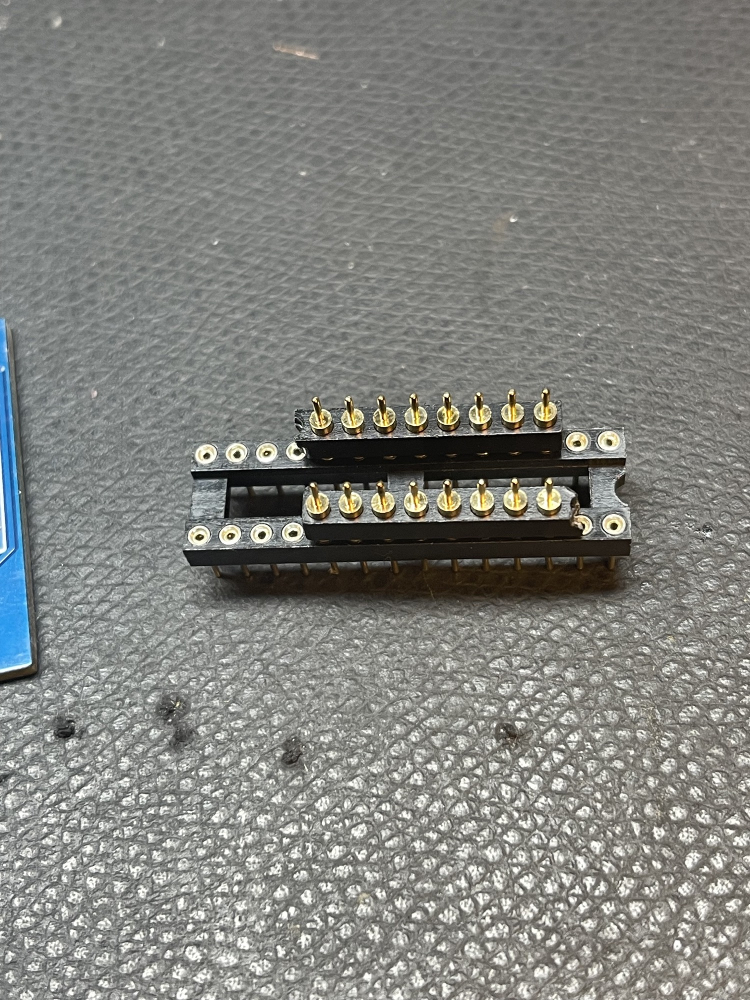
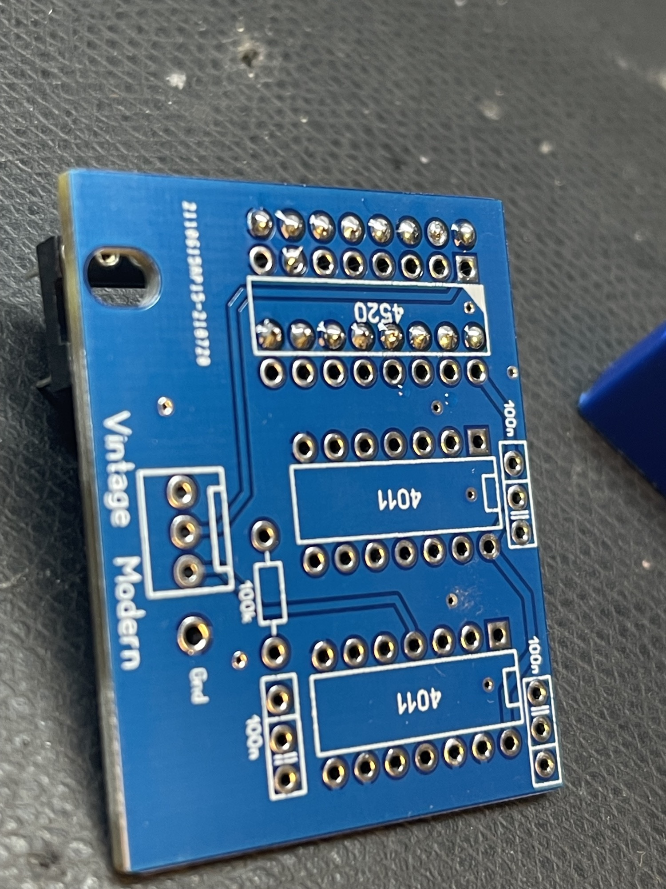
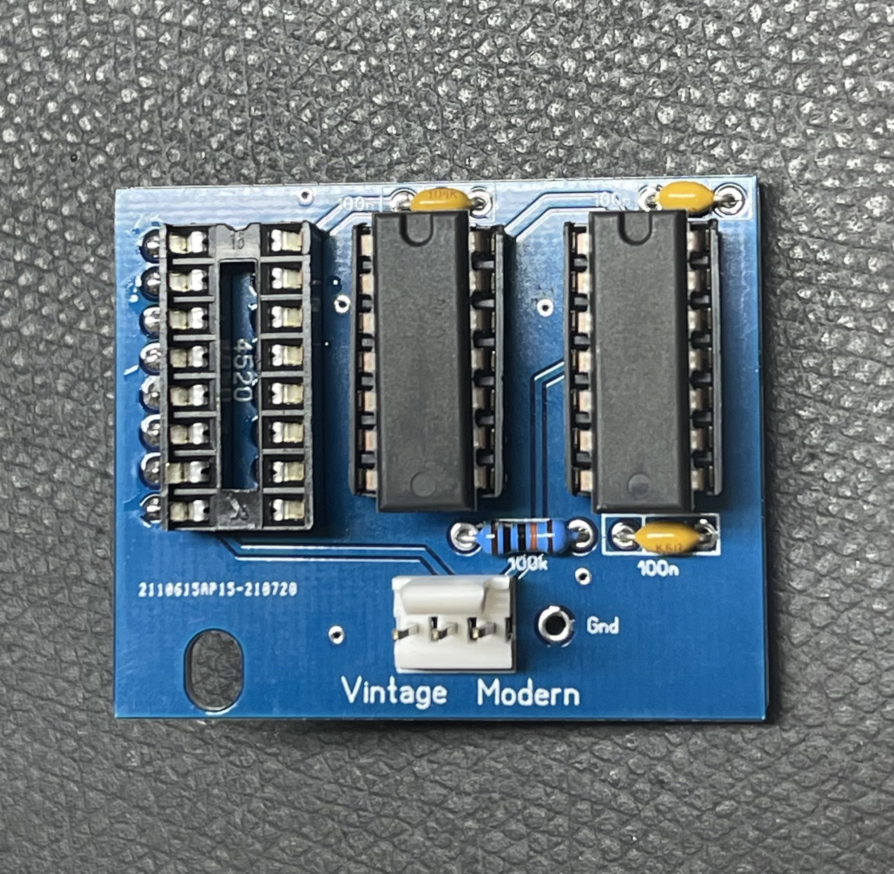
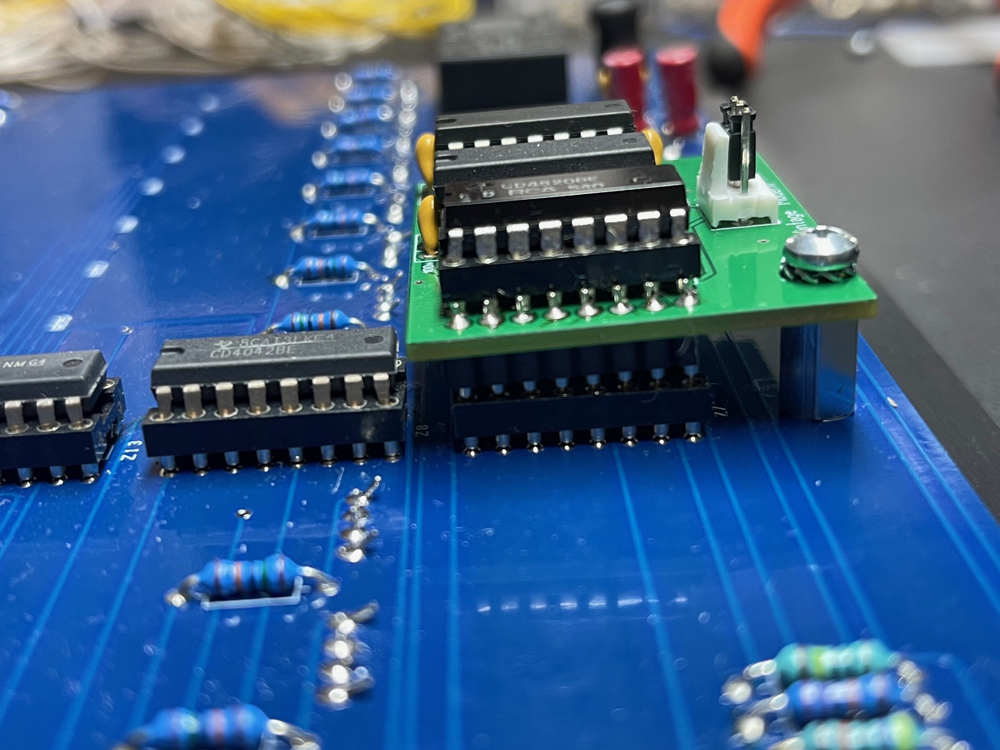
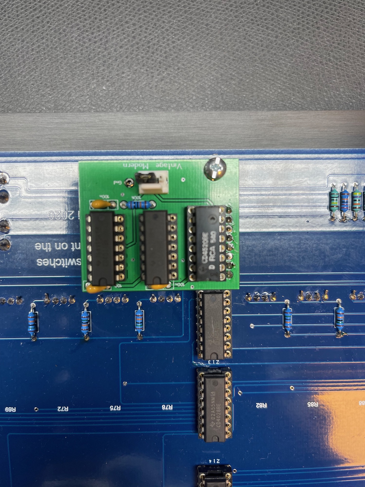
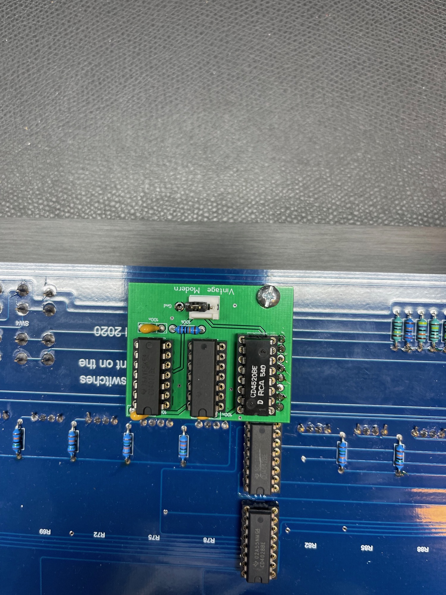

# Arp1601 Step1fix Mod

This Modification helps to syncronize the first step1 to an external source.
when you try to sync from an external source the step2 is in sync with step1 from external.
This Mod fix this issue, for original 1601 and clones

**Available here:**

[https://www.diysynth.de/pcbs-panels/arp1601-step1-fix-mod-pcb.html](https://www.diysynth.de/pcbs-panels/arp1601-step1-fix-mod-pcb.html)

**assembled Version:**

[https://www.diysynth.de/pcbs-panels/arp1601-step1-fix-mod-pcb-97.html](https://www.diysynth.de/pcbs-panels/arp1601-step1-fix-mod-pcb-97.html)

**BOM:**

| amount | value |   |   |   |
|---|---|---|---|---|
| 2 | CD4011 | DIP |   |   |
| 1 | 100k resistor | standard 1/4W |   |   |
| 3 | 100nF | X7R THT capacitor |   |   |
| 1 | MTA 3pole header | MTA100 size | TE-connectivity | or just jumper it with a resistor leg |
| 1 | 10-12mm spacer | Male-male or Female-male M3 |   |   |
| 1 | 16pins needed - double pin row for IC sockets | [https://www.tme.eu/de/details/mct-1-36-1-g/prazisionssockel/adam-tech/](https://www.tme.eu/de/details/mct-1-36-1-g/prazisionssockel/adam-tech/) | [**ADAM TECH**](https://www.tme.eu/de/katalog/p,adam-tech_895/) | **[MCT-2-36-1-G](https://www.tme.eu/de/details/mct-2-36-1-g/prazisionssockel/adam-tech/))** |
| 2 | 14pin ic socket | THT |   |   |
| 1 | 16pin IC socket |   |   |   |
| 1 | PC jumper |   |   |   |

## **guide:**

start with the bottom and the double contacts:

you can hold the double contact pin stripe by using an IC socket

Solder flat as shown:

Then install the remaining parts..

Thats how it fits in the 1601 clone : **(don't forget to install the jumper !! !!!!)**

