# Buildguide rev.1-4

> **Project**
>
> ### Projecttitel: Arp1601 Clone
>
> ### Status: `finished`
>
> ### Startdate: end of 2014
>
> ### Duedate: Summer 2015
>
> ### last update: February 2020 info about c40-c42

**1601 rev.3 update: (Summer 2016  jhulk's pcb run)**

C42 = 1nF c0g Capacitor

C5 = 33nF or use 39nF Filmcap or ceramic cap

C41 and C42 are 1nF MLCC C0G RM5

c40 should be 47uF electrolyte cap 25v or more

**Muffwiggler Thread:**

[https://www.muffwiggler.com/forum/viewtopic.php?t=110640](https://www.muffwiggler.com/forum/viewtopic.php?t=110640)

**Muffwiggler Build Thread**

[https://www.muffwiggler.com/forum/viewtopic.php?t=138862](https://www.muffwiggler.com/forum/viewtopic.php?t=138862)

- [IMG_0171.jpg](assets/IMG_0171.jpg)
- [ARP 1601 Sequencer Rev 5 (BOM)-1.xlsx](assets/ARP-1601-Sequencer-Rev-5-BOM--1.xlsx)
- [IMG_2769-2.JPG](assets/IMG_2769-2.jpg)
- [IMG_3171.JPG](assets/IMG_3171.jpg)
- [IMG_3093.JPG](assets/IMG_3093.jpg)
- [IMG_3092.JPG](assets/IMG_3092.jpg)
- [IMG_3824.JPG](assets/IMG_3824.jpg)
- [ARP 1601 Parts List (Round 2).xls](assets/ARP-1601-Parts-List-Round-2.xls)
- [Mouser BOM (round 2 Rev 2 PCBs).xls](assets/Mouser-BOM-round-2-Rev-2-PCBs.xls)
- [SSfix2.jpg](assets/SSfix2.jpg)
- [11571_arp1601debounce_2.jpg](assets/11571_arp1601debounce_2.jpg)
- [14394_screen_shot_20150604_at_15158_pm_1.png](assets/14394_screen_shot_20150604_at_15158_pm_1.png)
- [ARP 1601 Sequencer Build Doc (Rev 2).pdf](assets/ARP-1601-Sequencer-Build-Doc-Rev-2.pdf)
- [20150524_211401.jpg](assets/20150524_211401.jpg)
- [20150524_211356.jpg](assets/20150524_211356.jpg)
- [20150524_211342.jpg](assets/20150524_211342.jpg)
- [20150524_202321.jpg](assets/20150524_202321.jpg)
- [20150524_202317.jpg](assets/20150524_202317.jpg)
- [20150524_202315.jpg](assets/20150524_202315.jpg)
- [20150524_003829.jpg](assets/20150524_003829.jpg)
- [20150522_233159.jpg](assets/20150522_233159.jpg)
- [20150522_233154.jpg](assets/20150522_233154.jpg)
- [20150522_233148.jpg](assets/20150522_233148.jpg)
- [20150521_211820.jpg](assets/20150521_211820.jpg)
- [20150521_211815.jpg](assets/20150521_211815.jpg)
- [20150521_211756.jpg](assets/20150521_211756.jpg)
- [ARP Sequencer Owners Manual.pdf](assets/ARP-Sequencer-Owners-Manual.pdf)
- [Mouser BOM (Rev 1).xls](assets/Mouser-BOM-Rev-1.xls)
- [ARP 1601 Patch chart.pdf](assets/ARP-1601-Patch-chart.pdf)
- [Arp1601 Sequencer Service Manual HQ.pdf](assets/Arp1601-Sequencer-Service-Manual-HQ.pdf)
- [ARP 1601 Parts List_sorted.xls](assets/ARP-1601-Parts-List_sorted.xls)
- [ARP 1601 Sequencer - Schematic (round 1).pdf](assets/ARP-1601-Sequencer---Schematic-round-1.pdf)
- [ARP 1601 Sequencer Build Guide Rev1.pdf](assets/ARP-1601-Sequencer-Build-Guide-Rev1.pdf)
- [ARP 1601 Panel with dimensions.pdf](assets/ARP-1601-Panel-with-dimensions.pdf)
- [15061_panel_1.jpg](assets/15061_panel_1.jpg)
- [ARP 1601 Sequencer Rev 4 - PCB (full).pdf](assets/ARP-1601-Sequencer-Rev-4---PCB-full.pdf)

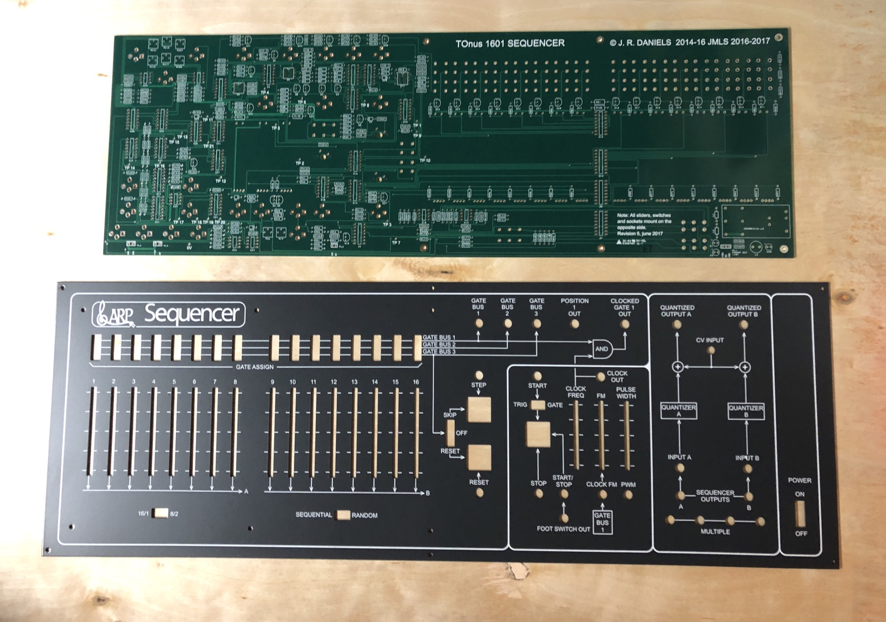

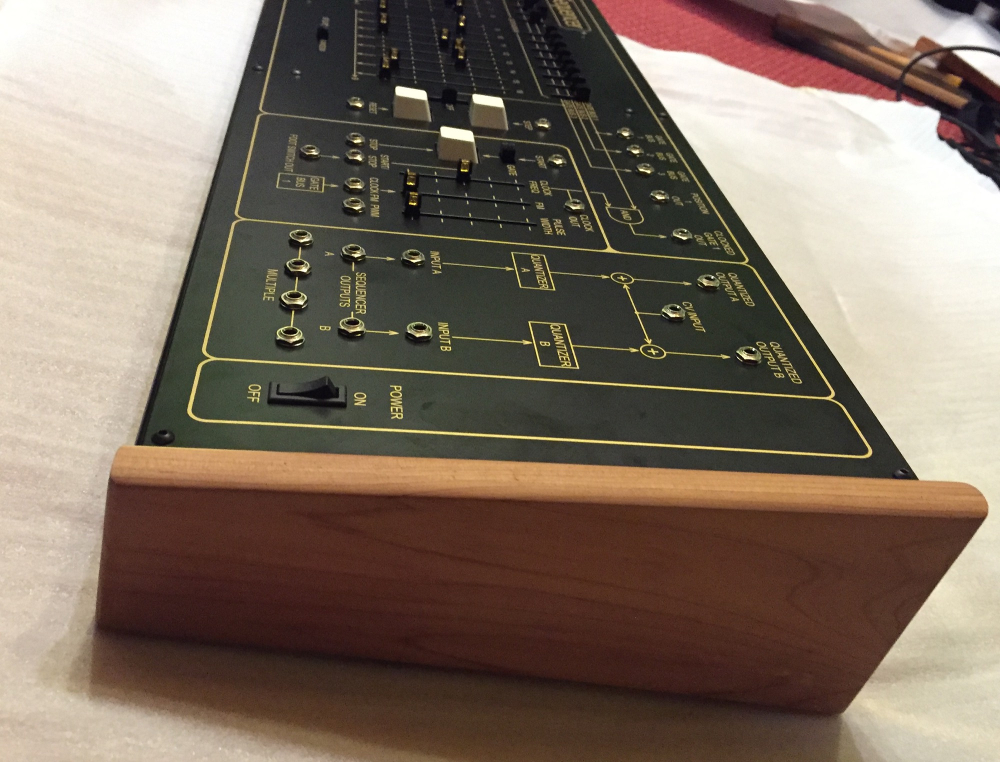

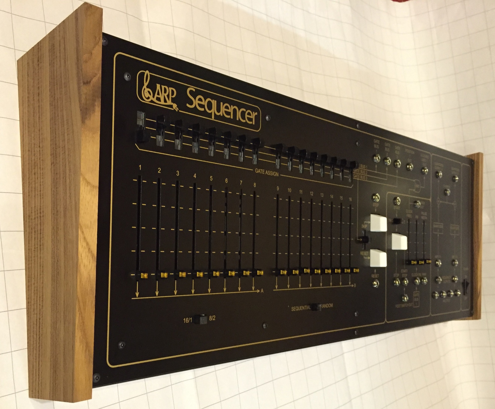

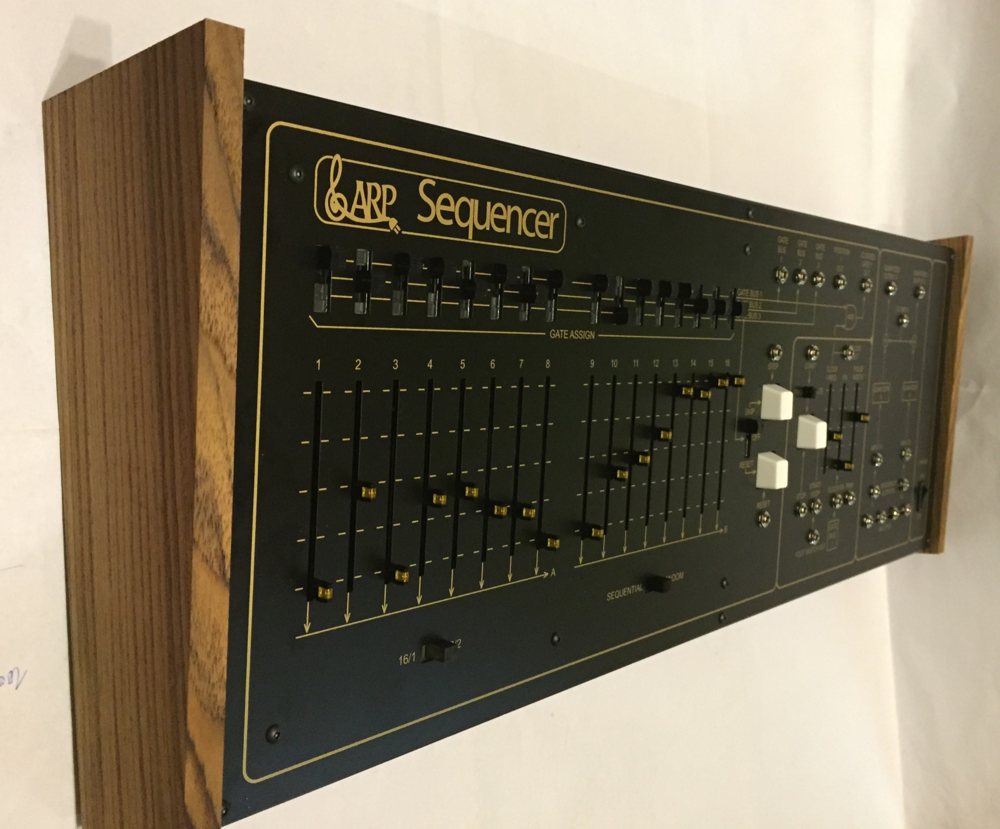

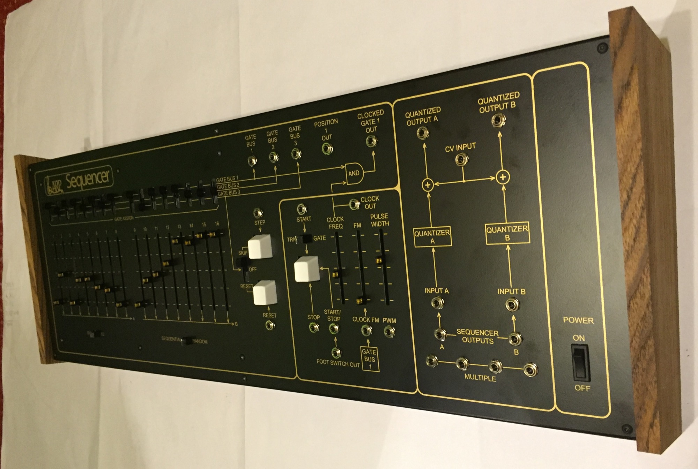

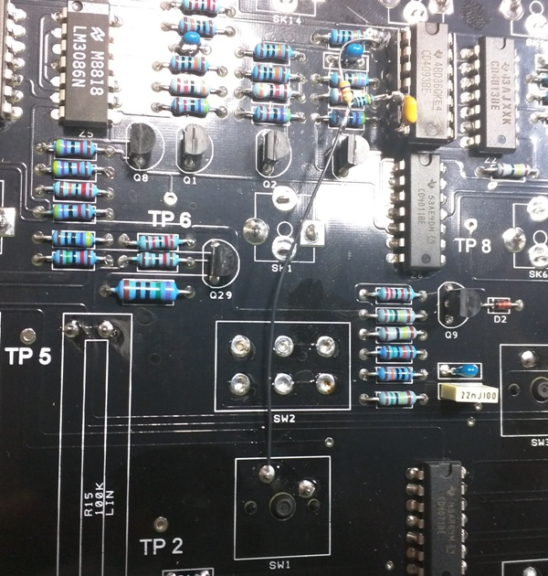

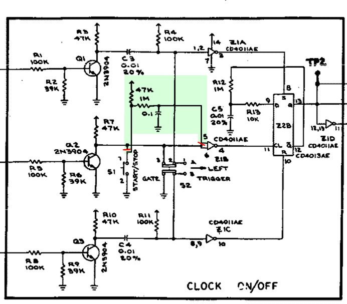

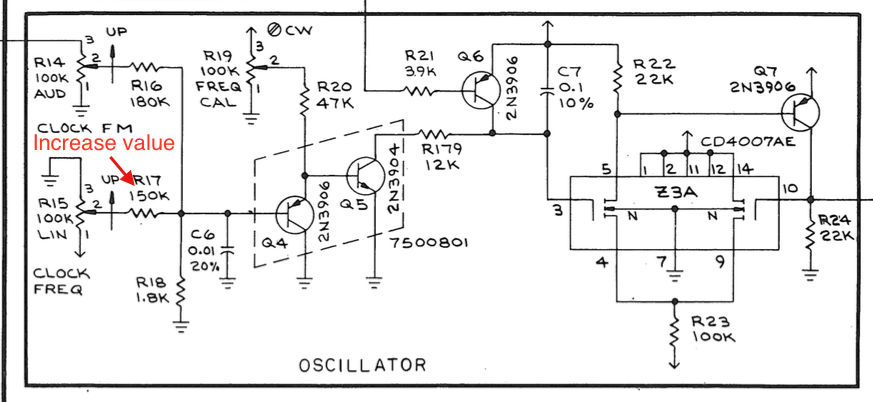

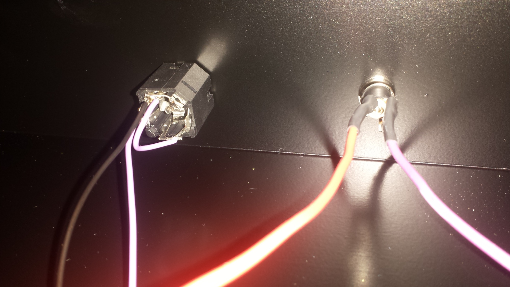

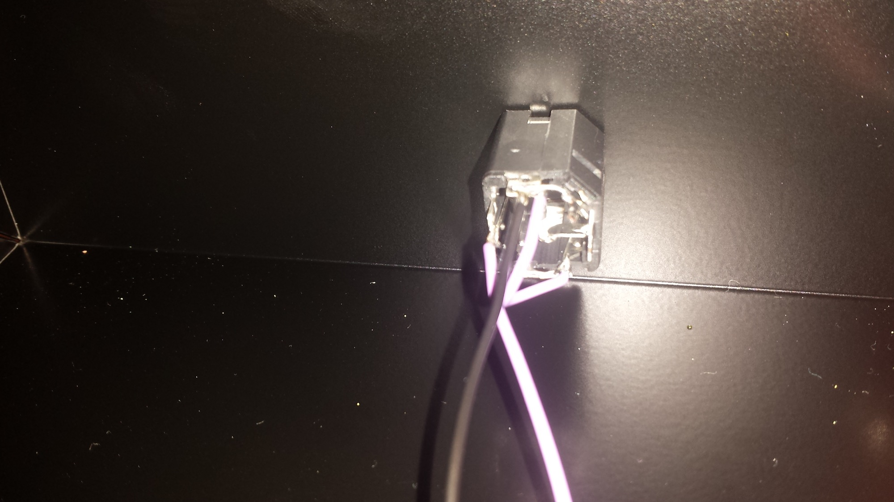

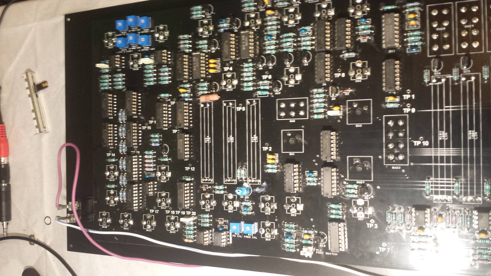

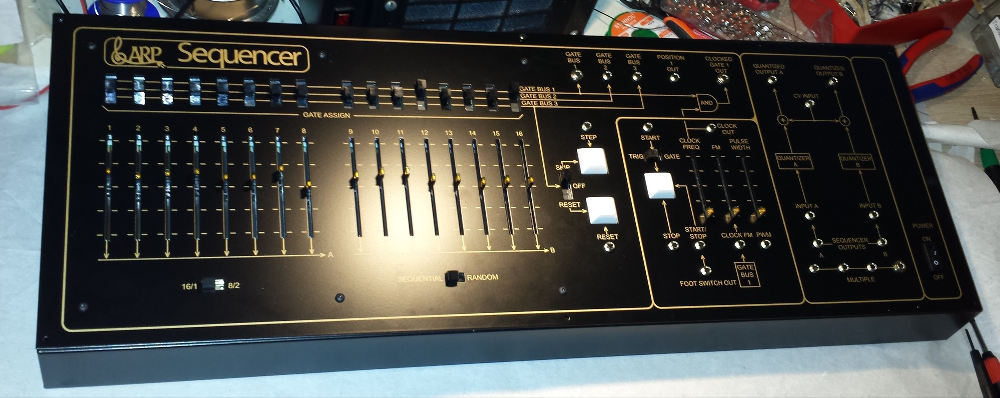

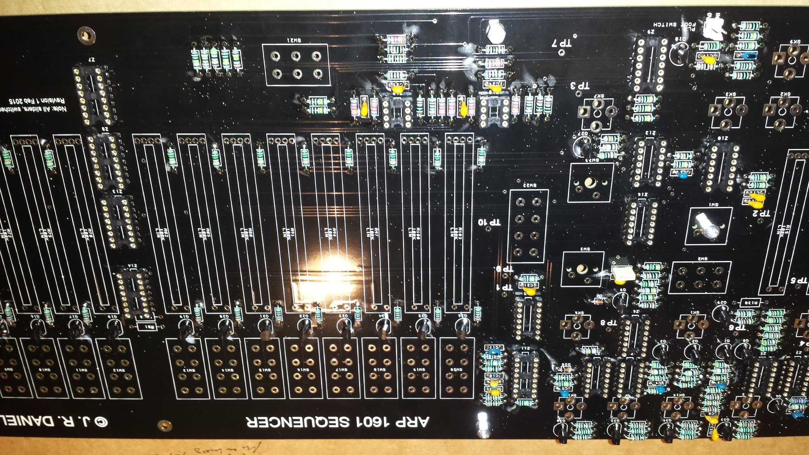

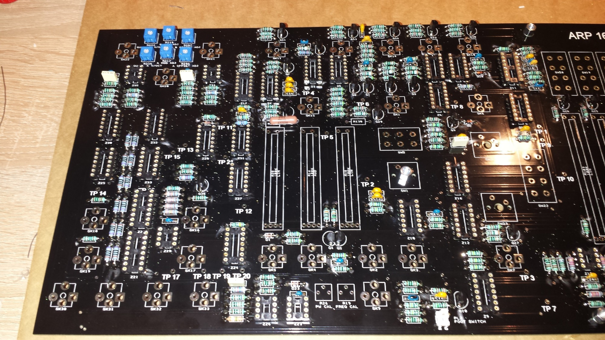

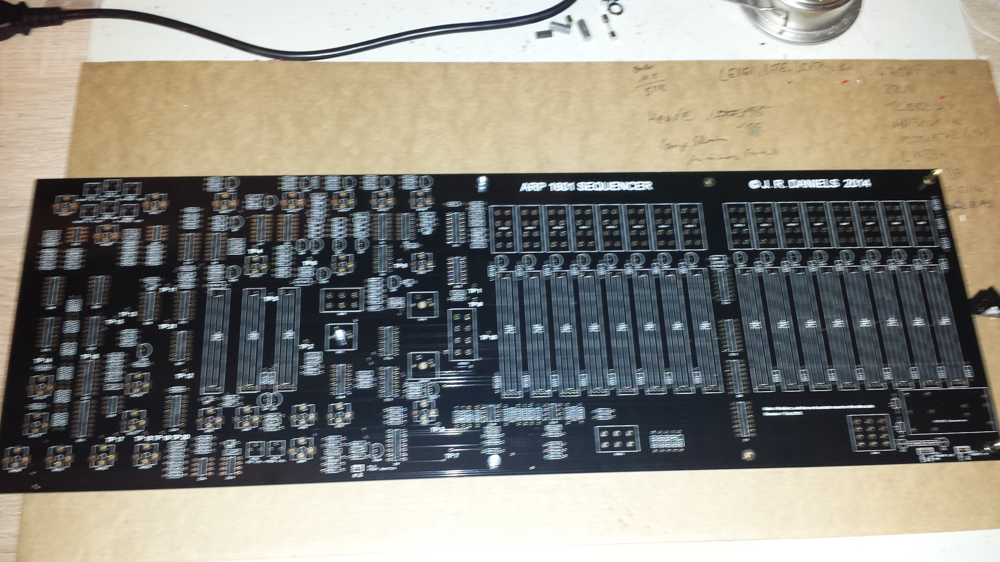

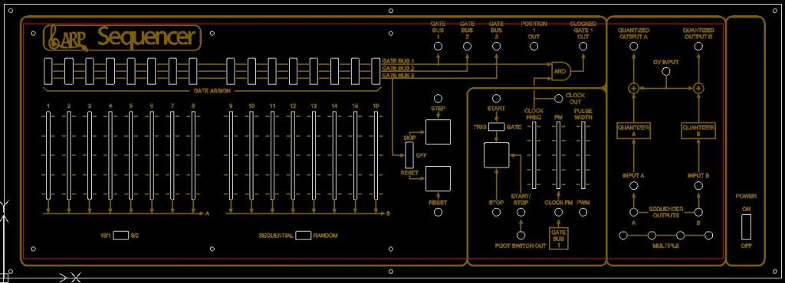

## **BOM: (BOM update 12 jun.2015)**

please see attachment list above

the file: ARP1601\_PartList\_ sorted is sorted for resistor and capacitor values -please use this for building [ARP 1601 Parts List\_sorted.xls](assets/ARP-1601-Parts-List_sorted.xls)

**for Kipplings groupbuy round2 you need a 12uH Inductor and 47uF/25V cap too  (this parts are not in the BOM)**

**Mouser part nr.: 652-RLB9012-120KL and 1-off 667-EEU-EB1E470SH**

**for Round 1 BOM: dont buy the expensive ferrit bead on mouser.. this part dont fit.**

please use: 2x  875-28L0138-80R-10

## keycapps: 3 needed - if you buy the keycap kit, it includes 14caps (instead of 13)

## **Builders Guide: (left rev.1 - right rev.2)**

[ARP 1601 Sequencer Build Guide Rev1.pdf](assets/ARP-1601-Sequencer-Build-Guide-Rev1.pdf)

 

[ARP 1601 Sequencer Build Doc (Rev 2).pdf](assets/ARP-1601-Sequencer-Build-Doc-Rev-2.pdf)

## **PCB Designator/Component Numbers**

**[ARP 1601 Sequencer Rev 4 - PCB (full).pdf](assets/ARP-1601-Sequencer-Rev-4---PCB-full.pdf)**

## **Known Issues: (rev1. and rev2)**

The start/stop pushbutton is a little prone to contact bounce giving multiple triggers. The ever-helpful Nordcore has a fix involving changing one IC, two additional resistors and one capacitor and one track to cut with a little point to point wiring. Unfortunately it is too late to incorporate these changes into the round 2 PCBs so they will remain as PCB rev 2. **A quick fix kippling have tried** with good success is increasing C5 to 33nF, and adding a 1nF capacitor soldered directly across the SW1 terminals, and for me at least gives no noticeable lag.

Further tips will be added as I think of them or they are pointed out by users

**Mods for Start/Stop:** As mentioned above change C5 (10nF) to something around 33/39nF, and add a 1nF directly across the pins of SW1 to eliminate the contact bounce causing the unreliable start/stop push-button operation.

take a look at Page 9 of the Buiders Guide rev.2  (for Rev.1 Users are this fix too)

**further its possible** to change the IC "Z1" CD 4011 to CD4093 for the start/stop issue, cut on frontpanel pcb side a trace add few R/Cs  (1M and 10nF  ?) - see this pics:

## **Mod: Clock Frequency** (thanks to Ultravox)

source: [https://www.muffwiggler.com/forum/viewtopic.php?t=138862&postdays=0&postorder=desc&start=25](https://www.muffwiggler.com/forum/viewtopic.php?t=138862&postdays=0&postorder=desc&start=25)

I was able to get the Clock Freq slider to work full travel by increasing the resistance of R17 to approx 222.5k. I didn't have a resistor of that value so I put a 100k trimmer in series with R17 and adjusted it so that the clock will still operate when the slider is set to min. The Clock Freq slider now gives 1Hz - 100Hz from min to max travel.

**Schematics** (round 1)

[ARP 1601 Sequencer - Schematic (round 1).pdf](assets/ARP-1601-Sequencer---Schematic-round-1.pdf)

**Panel:**

[ARP 1601 Panel with dimensions.pdf](assets/ARP-1601-Panel-with-dimensions.pdf)
