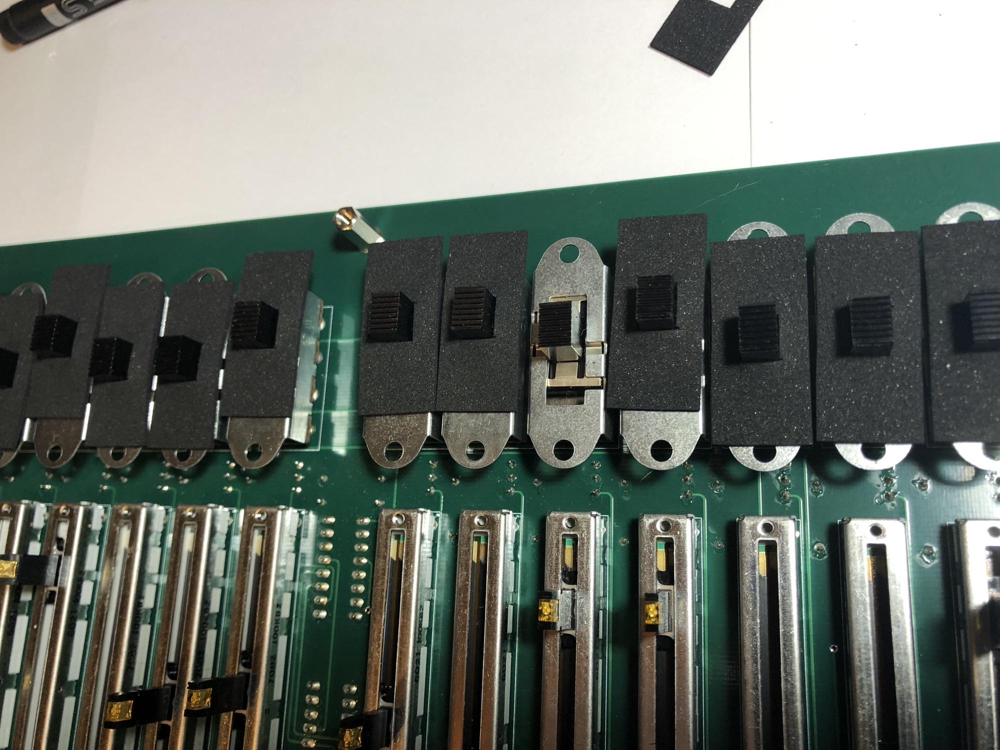
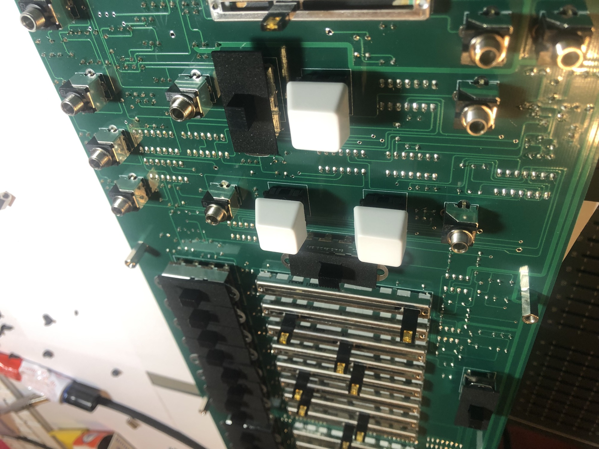
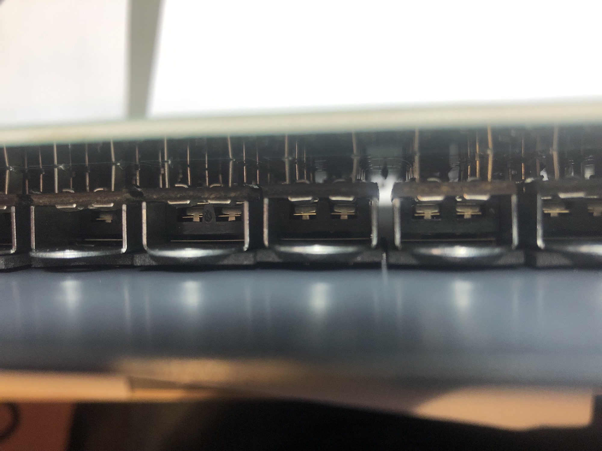
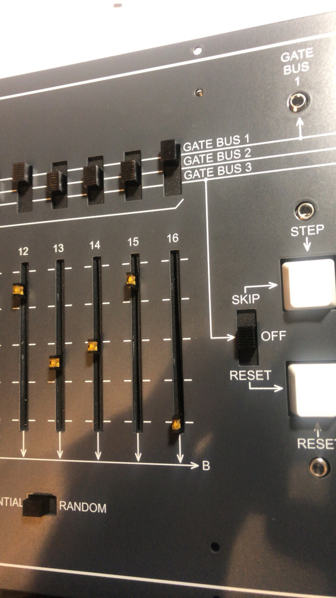
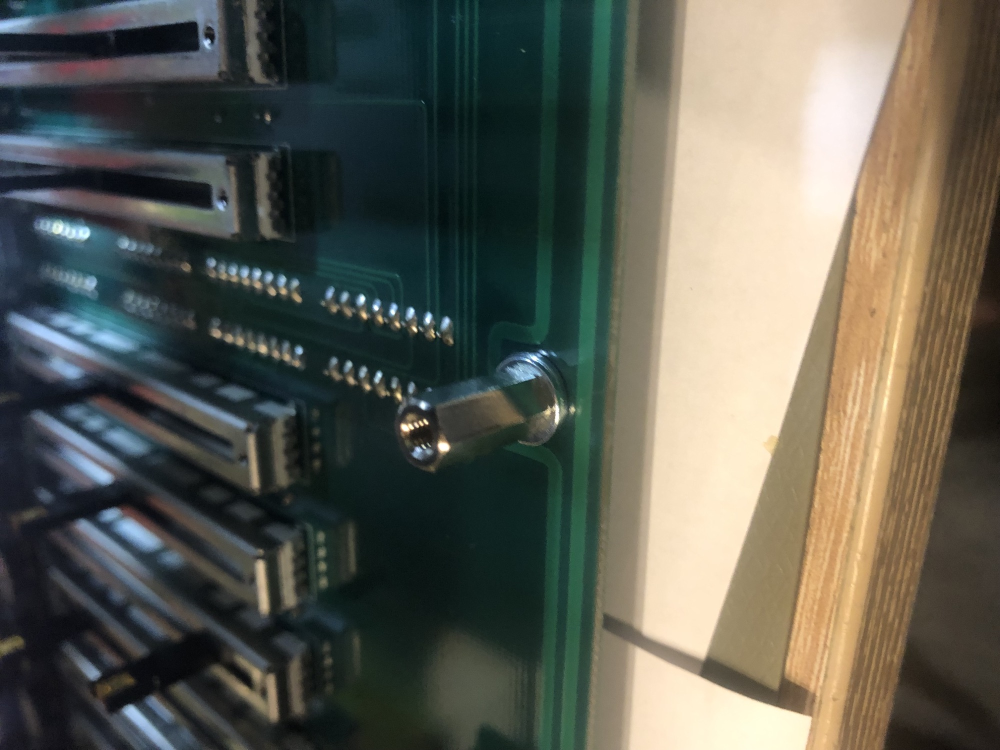

# Dust Cover mats

**Dustcover mats are available from:** [http://synthronics.de/dust-covers-arp-1601-clone/](http://synthronics.de/dust-covers-arp-1601-clone/)

**Build note:**

the slideswitches are close with the front panel, the mats for the switches must be able to move with the current position of the switches, 

to fix this: remove the 11m metal spacer and use 12mm and a washer or use the 11mm spacer with 3-4washers.

furthermore out on all jacks around the TRIG/GATE switch and  Gate-bus switch washers behind the panel - at this jacks we can't use washers between panel and the fixing screw - so you can use this washers for this solution.

**a instruction how-to install the mats is described here:** [TTSH Dust Cover Installation](../../../ttsh/ttsh-mods/ttsh-dust-cover-installation/index.md)

