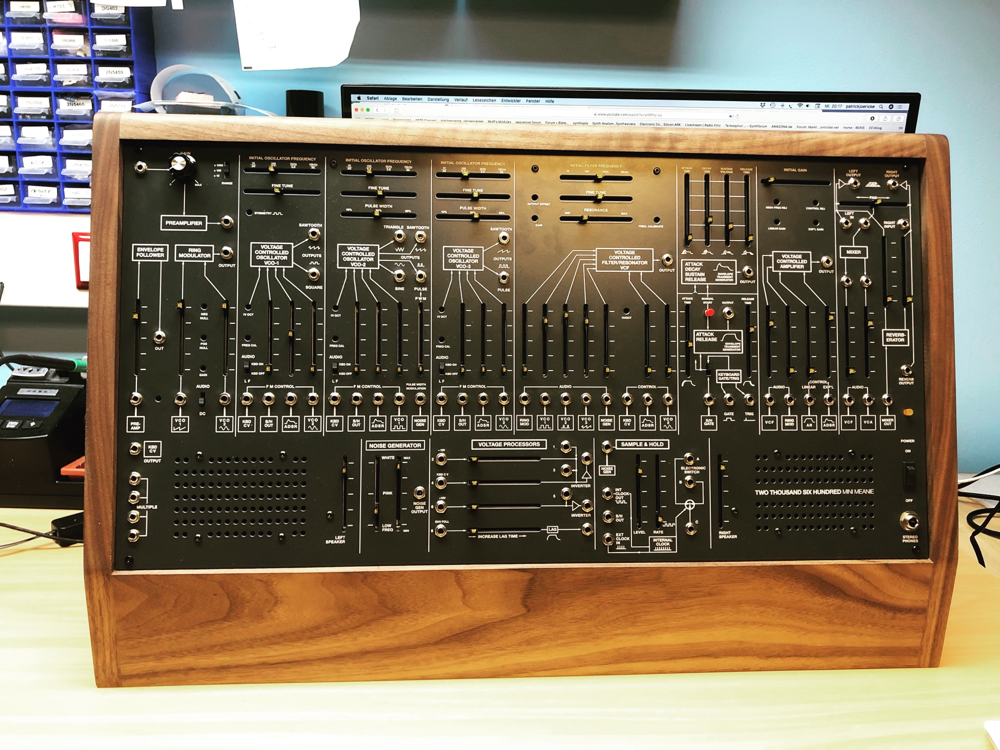
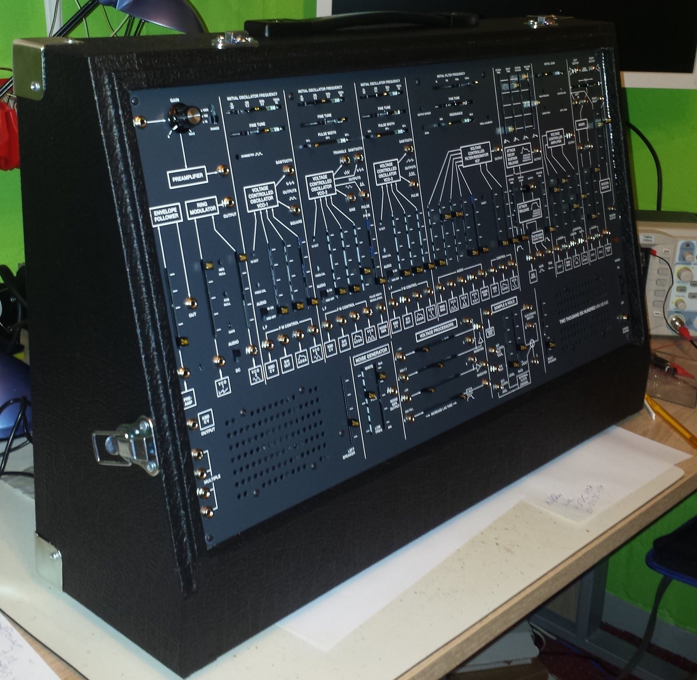

# TTSH Home

## The documentation of the great TTSH project

(new website structure since 07 March 2017)

due to changes in my webhosting (rootserver) costs for RAM/Backup and my worktime in Adminstration of the Server & Web Application Server it would be very helpful to use my paypal gift function, thank you.

[https://www.youtube.com/watch?v=20A\_ju8nWqU](https://www.youtube.com/watch?v=20A_ju8nWqU)

<form action="https://www.paypal.com/cgi-bin/webscr" method="post" target="_top">
<input type="hidden" name="cmd" value="_donations">
<input type="hidden" name="business" value="percysworld@web.de">
<input type="hidden" name="lc" value="GB">
<input type="hidden" name="item_name" value="DSL-man">
<input type="hidden" name="no_note" value="0">
<input type="hidden" name="currency_code" value="EUR">
<input type="hidden" name="bn" value="PP-DonationsBF:btn_donateCC_LG_global.gif:NonHostedGuest">
<input type="image" src="https://www.paypalobjects.com/en_US/i/btn/btn_donateCC_LG_global.gif" border="0" name="submit" alt="PayPal - The safer, easier way to pay online!">

</form>

##### These project documentations and services are non commercial !

please respect the copyrights. thx

### most important direct links:

[TTSH Release rev.1](ttsh-release-rev-1/index.md)

[TTSH Release rev.2](ttsh-release-rev-2/index.md)

[TTSH Release rev.3](ttsh-release-rev-3/index.md)

[TTSH Release rev.4](ttsh-release-rev-4/index.md)

[TTSH Mods](ttsh-mods/index.md)

[TTSH Rare Partkit, Survival Kit](ttsh-rare-partkit-survival-kit/index.md)

**TTSH release plan (rev.1 released 11/2013, rev.2 10/2014, rev.3 →  pcb version is different  rev.1 = 6.x rev.2 = 7.2, rev.3 = 8.x)**

