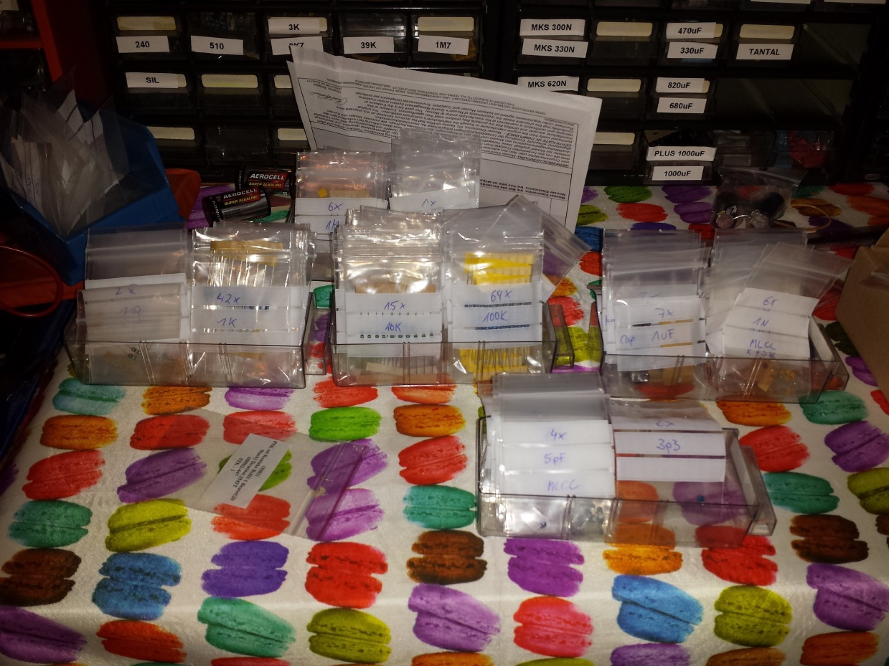

# TTSH hardcore builders guide

# TTSH hardcore builders guide (specially rev.1)

update: 01.October2014 - jumpers, speaker workaround for testing

The first TTSH was build with zthees Builders Guide and works fine, but its not effective to solder section by section.

from my second TTSH on I built them after these steps:

1. add both  jumpers, kybdCV/GND  and near the ferrite beads
2. sort out all resistors in values:   1R - 999R, 1K - 9K, 10K-99K, 100K-999K, 1M-22M  , same with capaciators.

1. take a label/sticker on places where you have MODS/bugfixes like c20 cap, noise mod etc..
2. put the TTSH pcb on 25-30mm spacers (use the BD236/BD237 holes too for spacers)  you have to mount a spacer on each side of the pcb so you can turn the pcb for soldering..
3. build the complete VCO- Subboards (so you don't have to look for missing resistor points on the main pcb all the time)
4. solder all IC sockets on both sides of the pcb (LED IC on the other side of the pcb)
5. solder all voltage connectors (MTA´s) in the powersection, key cv, speaker etc.
6. put all resistors in place on the main pcb, start with the highest amounts; (more than 60 x 100K) ...  if you'll have completed nearly 80% and it'll be easier now to put the rest in place section by section.
7. solder all resistors from the top
8. turn pcb and cut  all pins/legs - this way you can solder all pins/legs in one step..
9. if you have a VCO voltage regulator from nordcore, put a tape over the 100nF/10uF caps near the power MTA header.
10. Capaciators  - begin with 100nF c0g for the audio path, followed by 100nF for the rest,and then all the other caps..   pay attention on the filmresistors... I use film caps (wima) for the VCF near matched trannys which makes the Filter sound really good.
11. solder all caps from the front/rear..  keep attention on the C20 cap
12. put all diodes and trannys in place ..(pay attention on c20, max noise fix, bridge instead of 2n5172 in clock, in VCF matched, sont mount the Amp. cooling blocks
13. put all the LM301 in the IC-sockets
14. build the VCO header connection for all 3 VCOs..
15. unmount the 25-30mm spacers and replace them with the final 12mm spacers and screws..
16. solder all faders, begin with **1** solderpoint on every side, put the frontpanel on the pcb and check the fader orientation. - alternative: bend one leg on each side and solder one point only
17. check the orientaion
18. finally solder all the faders..
19. Jacks: solder on each corner 1-2 jacks, and 3 in middle, place the panel and then solder them
20. then place all jacks, put the panel on top and mount the nuts on the jacks in the corners, then turn the panel, now you can solder all the jacks..
21. switches..  unmount the panel, put all switches in place and mount the panel, turn the panel/pcb .. the switches fall in place, solder a bit.. turn the panel and check the orientation on the frontpanel, if it is good , solder finally ( please check the mechanical function of the switch before you mount them, sometimes you have faulty switches and its hard to desolder them..)
22. \*update 01.October 2014 :  if you want to test the TTSH with speakers but without the headhone jack wiring add a jumper to TN/ T  or RN/R otherwise your speaker won't work.
23. build the power wiring cables and solder the internal DC-DC adapter..
24. initial check :  disconnect all sections,  check the voltage near DC-DC adapter with a DMM .
25. if you have a VCO regulator, build it, put it on the powerheader, drill a hole in the pcb and mount a spacer,calibrate the regulator to 14,6V
26. test and calibrate the TTSH - good luck
