# TTSH rev1 known issues

Here are some important Issues and Fixes from the first batch TTSH pcbs (delivered around March 2014)

other TTSH version known issues are described in the own project sites

update 01.October 2014 VCO2/VCO3 bleed fix

(page links/anchors)

1. [pcb silkscreen failure for powersupply](index.md#TTSHknownissues-FIXforpcbsilkscreenfailureforpowersupply(tick))
2. [Hum issue on Speaker and more](index.md#TTSHknownissues-2fix)
3. [Noise "distorted"](index.md#TTSHknownissues-3fix)
4. [https://dsl-man.atlassian.net/wiki/pages/createpage.action?spaceKey=DSO&title=4fix](https://dsl-man.atlassian.net/wiki/pages/createpage.action?spaceKey=DSO&title=4fix)[Clock bleed on VCO pitch](index.md#TTSHknownissues-4fix)
5. [wrong Silkscreen for matched pairs](index.md#TTSHknownissues-5fix)
6. [wrong Silkscreen or polarity for Capaciator C20](index.md#TTSHknownissues-6fix)
7. [TTSH known issues#VCO Bleed - Regulator](index.md#TTSHknownissues-VCOBleed-Regulator)
8. [not all LEDs are working](index.md#TTSHknownissues-LEDs)
9. [LED Dimming Fix](index.md#TTSHknownissues-LEDDimmingFix)
10. [TTSH known issues#VCO2-VCO3 Bleed fix](index.md#TTSHknownissues-VCO2-VCO3Bleedfix)

## **Solutions:**

✅**= tested**

❌**= untested**

#### **FIX for pcb silkscreen failure for powersupply**✅

cross one Ferrite on top pcb side - the ferrite on other pcb site (not shown here)

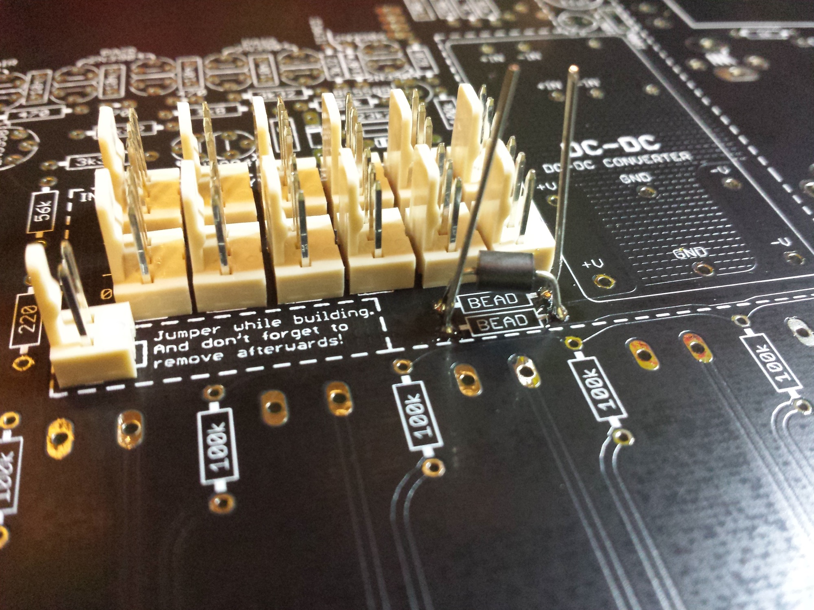

other way:

#### **FIX for Hum issue on Speaker:**✅

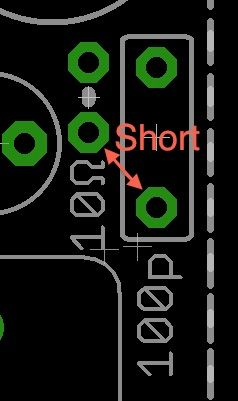

This Issue occurs by using the internal DC-DC Adapter,

**FIX:** short out the 10Ω resistor and the 100p capacitor in the PSU section. E.g. just make a small bridge between the pad close to 10Ω and 100p as in the attached picture.

further use RG174 cables or shielded microphone cable for offboard wiring.

make Attention on resistor 470R on frontside - see [here (LEDs dont work)](index.md#TTSHknownissues-LEDs)

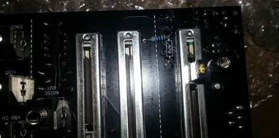

#### **FIX for distorted Noise.** ✅

Option A: the easiest way is the usage of a BC337-16 with folllowing orientation, there´s no need for addional parts.

**Option B** (from nordcore)

leave out the 2n5172 - use a bc337-40, - bend right leg to top, solder a 10K resistor in series to the 1uF cap.

see here to choose the correct BC337: [https://www.muffwiggler.com/forum/viewtopic.php?p=1558920&highlight=#1 558920](https://www.muffwiggler.com/forum/viewtopic.php?p=1558920&highlight=#1558920)

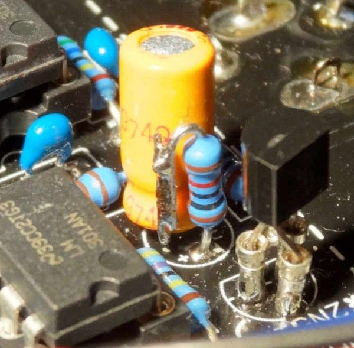

**Option C: (same like Option B)**

other working solution howto connect a 10K resistor to the cap (after soldering, use shrinktube for cap and resistor housing )

leave out the 2n5172 - use a bc337

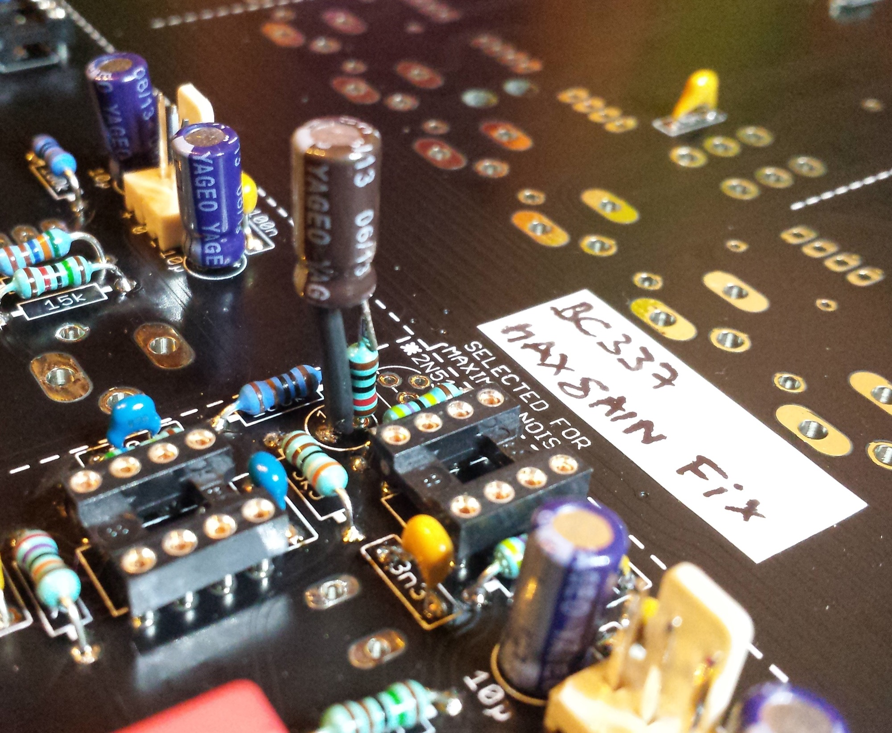

#### **FIX for Clock bleed on VCO pitch**

at the moment 2  steps to fix the Issue -  (both together must used to fix the Issue)

**First Step -  tested solution**✅: leave out the 2n5172 in clock section (led driver for blinken lights), bridge 2 solder holes..

#### **FIX for wrong Silkscreen for matched pairs Transistors in Filter section**✅

the top 2n3906 is unmatched, you have to take 3 matched transistors  if you´re not really sure about it.

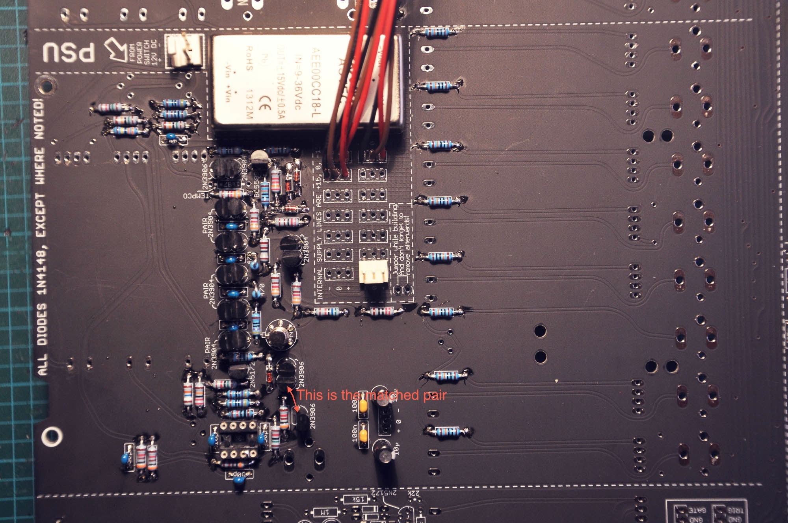

#### **FIX for wrong silkscreen or polarity for capaciator C20 in RINGMOD section** ✅ valid

change the polarity of C20 10µF elecrolytics (its the right hand capaciator)

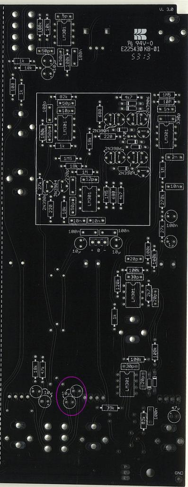

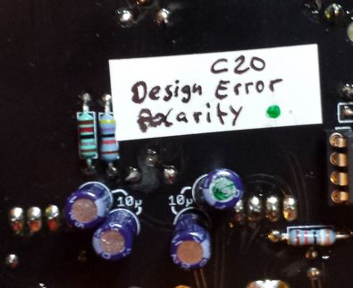

## **VCO Regulator**:

due to VCO Bleed issues, Nordcore from muffwiggler sales VCO Regulator pcbs, this fix this issue.   approved ✅

1. build the VCO regulator
2. desolder or cut the MLCC 100N from the power inputs on all 3vcos and from voltage processor, the 10uF caps can leave out too (but its okay to have this)
3. drill a hole in pcb to mount by a 10/12mm spacer the pcb.
4. put a further spacer on the 10/12mm spacer for calibrating the VCO regulator (dont connect the regulator to the vco header yet.
5. connect only power input to regulator and set it to 14,6V (TP1+ TP2, TP1+TP3)
6. unmount the second spacer and place the regulator in MTA header for final calibration/further tesing/building.

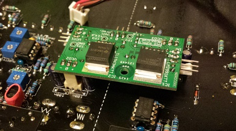

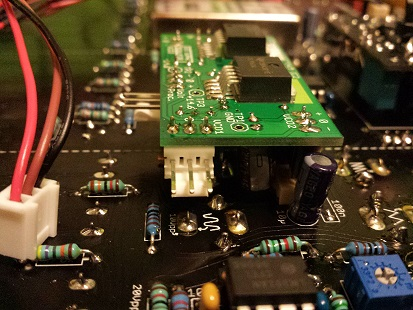

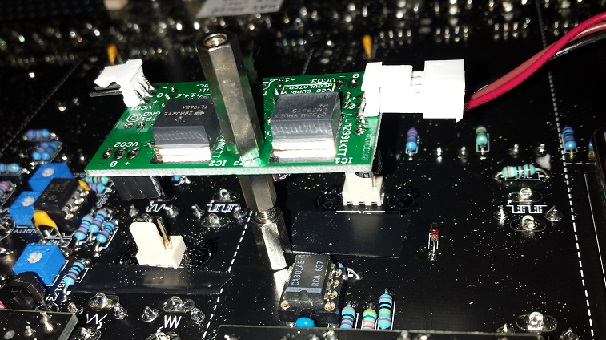

## **Issue: not all LED´s are working**

**Solution:**turn  the Trimmer LED- trimmer in the left bottom corner  (frontpanel view)😉

(in my case LEDs dont glow in VCA section, otherwise connect the 470R to right (issue occurs by using Hum bug fix, in result no ground for LED´s in noise and left amp section )

**LED Dimming Fix:**

due to section by section LED-Fader power consumption is not balanced - you cant dim the TTSH LEDs to a common balanced LED brightnessRegarding the LEDs: due to the uneven length of the LED chains there is only one dimmer setting possible, where all are equal bright - if the resistors are properly calculated.

from muffwiggler you can order or build a own pcb or build your own:

[ttsh\_led\_resistor\_182.rar](assets/ttsh_led_resistor_182.rar) (BRD file)

[http://www.muffwiggler.com/forum/viewtopic.php?t=116543&postdays=0&postorder=desc&highlight=led&start=60](http://www.muffwiggler.com/forum/viewtopic.php?t=116543&postdays=0&postorder=desc&highlight=led&start=60)

**Idea:**

[http://www.muffwiggler.com/forum/viewtopic.php?p=1566660#1566660](http://www.muffwiggler.com/forum/viewtopic.php?p=1566660#1566660) 

**pics of all locations:** [ttsh-leds.zip](assets/ttsh-leds.zip)

**Solution:**
Fixing the dimmer to dim all LEDs uniform requires some effort:
- the longest chain with 5 LED must be split. (Two traces to cut, two wires to solder. Resulting in two chains with four LEDs instead of one 5 and one 3. )
- all chains shorter than 4 LEDs get one or two additional orange LEDs in row to the resistor, so all are 4 LEDs long.
- all resistors get the same value (200 to 240 Ohms)

Replace the 1kOhm base resistors (LED-R3, LEDR6) with 100 Ohms. (They are not needed (straight wire would be ok), but having a resistor enables you to measure the base current and gives some fault protection. 1k gives nearly 1V drop, too much for proper current setting with resistors. )

So now all rows have the same current, at \*all\* dimmer setting (not just at one).
The current can be adjusted to nearly full brightness of the LEDs. (16mA or so. )
The dimmer can be set to all LEDs off.

**Traces to cut:**
[http://dl.dropboxusercontent.com/s/birte0zg922kt22/ttsh-cut-leds.jpg](http://dl.dropboxusercontent.com/s/birte0zg922kt22/ttsh-cut-leds.jpg) 

**Wires to solder:**
[http://dl.dropboxusercontent.com/s/u0igpajfoh54o27/ttsh-wire-leds.jpg](http://dl.dropboxusercontent.com/s/u0igpajfoh54o27/ttsh-wire-leds.jpg)

## **VCO2-VCO3 Bleed**

**Issue:  VCO3 is modulated by VCO2, due to interferences of 2 traces (on the pcb 2 traces run very close)**

**Solution:**

**cut the orange trace near 15N cap and vco3 Submodule header on pcb, run a shielded cable like RG174 from 15N to VCO3 submodul.**

**wire a ground to shielded cable shielding**

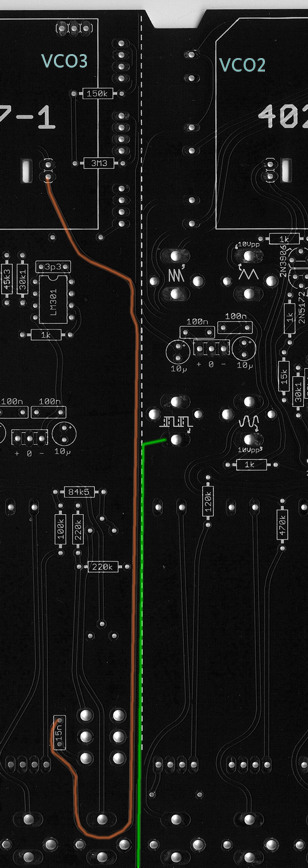

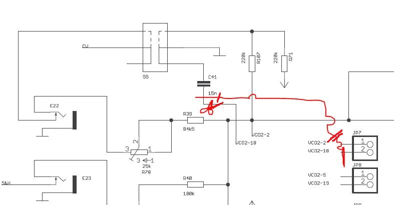

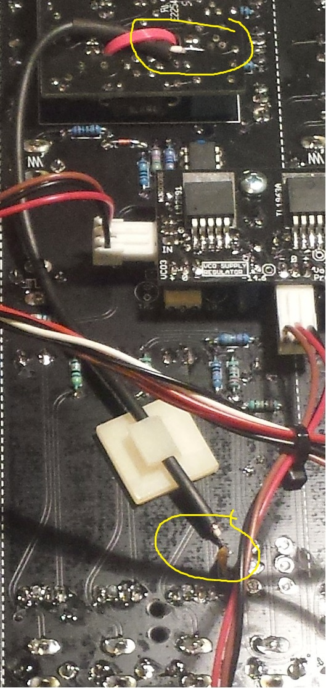

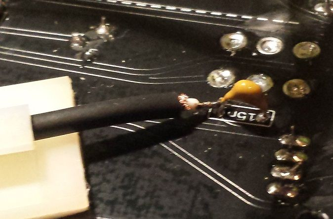

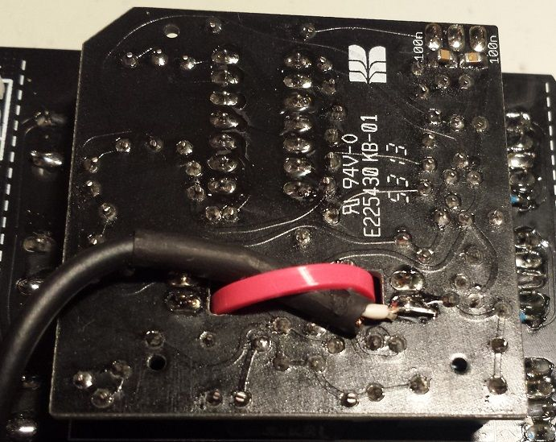
