# TTSH rev2 build guide

> ### Projecttitel:TTSH rev2 Build guide
>
> ### Status: `finished`
>
> ### Startdate: 13 Nov.2014
>
> ### Duedate: 22.Jan. 2015
>
> update: 03.February
>
> ### Manufacture link: DSL-man.de
>
> **original TTSH rev.2 build guide should be updated in next days here:** [http://build.thehumancomparator.net/](http://build.thehumancomparator.net/)
>
> **Muffwiggler build thread**: [https://www.muffwiggler.com/forum/viewtopic.php?t=130493](https://www.muffwiggler.com/forum/viewtopic.php?t=130493)
>
> **further here:** [http://electro-music.com/forum/viewtopic.php?p=407150#407150](http://electro-music.com/forum/viewtopic.php?p=407150#407150)
>
> **check the** [rev.1 build guide for more documents](../ttsh-rev1-build-guide/index.md)
>
> **Schematics:** [http://thehumancomparator.net/wordpress/wp-content/uploads/2014/05/ttshv2schematics.pdf](http://thehumancomparator.net/wordpress/wp-content/uploads/2014/05/ttshv2schematics.pdf)

**Original build guide backup:**

[TTSH-BUILD.pdf](assets/TTSH-BUILD.pdf)

**Release notes:**

The second PCB release  aka v2 release was released February 2015, the naming of v2 is related to the second sale from zthee, its not the same as zthess internal releasenumbers.(v7.2)

This Description is for Builder with experience in parthandling and solderjobs -   otherwise check: [http://build.thehumancomparator.net/](http://build.thehumancomparator.net/)

**Changes between first Version and rev.2:**

- Powersection, two 1 inch voltage DC-DC converters, embedded powerregulators like nordcores pcb addon on rev1 , 3x SMD inductors/chokes and more

- Amplifier : new design without cooling, other Amplifier Transistors and some other parts in this section

- LED Driver redesign

- multiples on pcb

- speaker holes

- switches: you get with the pcb kit few small pcbs with - this are used like a washer for the switches, in result switch mounting is easier as in TTSH rev.1 (pics on my website)

- some minor fixes

**This Guide is only for DIY Guys with experience,** i´m not responsible for defects or usage issues.

**short:   dont use the onboard powersupply due to EMV issues - the DC\_DC section bleeds in the VCF in result of high frequency tones**

**check the**[**TTSH 230V/110V Powersupply**](ttsh-230v-110v-powersupply/index.md)**page**

1. solder all SMD parts (2x3 100nf on vco pcb, 3x chokes, 2x power regulator), clean this area after soldering if needed. (is part from step 4)
  (its very usefull to add some/enough soldercore to the soldermask - place the part on it and warm up/heat the part )
2. mount 5 spacers to the pcb in order to have enough space for the resistor legs between your desk and the pcb.
3. sort all the bags containing the resistors after the range:  1R -999ohm,  1k - 9,9k, 10k - 99k, 100k -999k, 1M - 22M,  sort all caps to MLCC and electrolyt caps too  -    it makes things easier

**for internal 110V/230V powersupplys only (like powerone hbb1.5/haa0.8)**[**see here**](ttsh-230v-110v-powersupply/index.md)

1. mount the powersection parts, power input header (white 2pole MTA156), the 3 SMD chokes, 2x Voltageregulators ICS resistors, caps.. (the both murata /traco converter after SMD JOB)

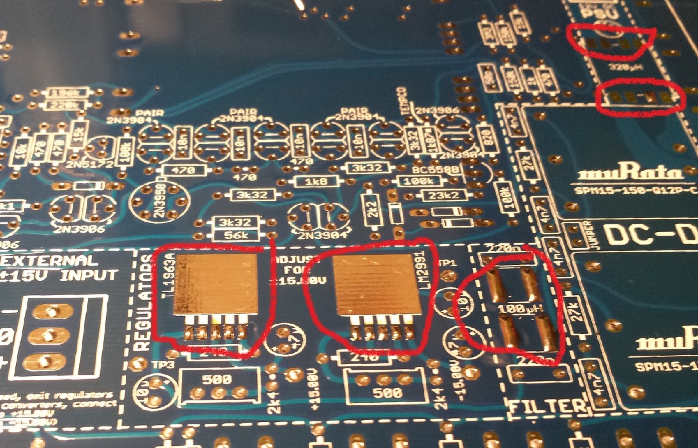

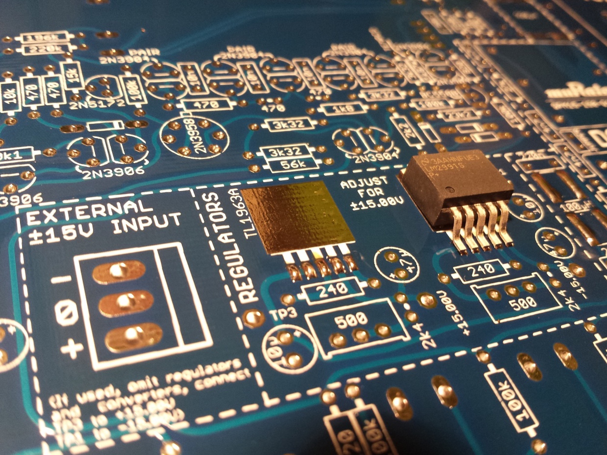

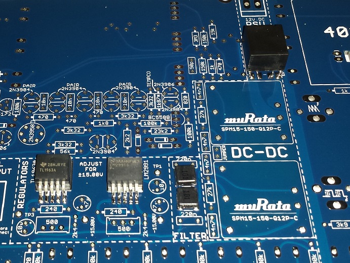

1. ~~mount the both DC-DC converter (murata  - black square)~~
2. ~~make a  powercable with the 2,1mm pc jack (make sure you run a diode test with the 2,1mm jack - one of the poles is the switch, you dont need them)  be careful !! (make sure your powersupply/wandwart have the positive 12V inside and minus at the outside of the plug.~~
3. **~~add a jumper- bridge between~~**~~the both murata dc-dc adapter - you find a marking on pcb (its for grounding)~~
4. ~~before you connect the wallwart psu to the jack/plugs of the pcb,  test the 12V DC polarity on the 2pol orange jack.~~
5. ~~connect the orange jack to the pcb header andplug in the wallwart~~
6. ~~test the -15V/0/+15V output on the PCB, adjust with the multiturntrimmer to +/15V the value (hopeful you have not the cheapest DMM and have 10% tolerance)  measure between ground and -15V,  ground to 15V  (dont use TP1/TP3)~~
7. > **Info**
  >
  > only, if you measure -15/15V  you can continue building, otherwise you'll likely destroy all trannys, ics and other parts..
8. build all 3 VCO Subboards - otherwise you'll have trouble with looking for the parts of the main pcb, this is strictly recommend  (you start with resistors, caps, ic sockets)  tempco and trannys are not needed yet.
  **IF YOU WANT ADD LATER the SYNC Option - dont cut the leads short** - otherwise its hard to solder later the addional cables, parts to the SUB VCO pcb.
9. **MAIN PCB** at first only one side of the pcb !!  use at beginning the fader side  with few resistors (47k, 220R) dont fit the both 100k, 1M resistors on left hand,  it makes things easier later - **solder the handful** resistors from both pcb sides.
10. turn/flip pcb and start the pcb side with most components
11. at first fill the resistors in order to spot any leftover resistors.. then go to the next value.
12. place all 100K resistors
13. place all 1R 10R, 100R , 1k, 10K 1M resistors    22R,220R,470R, 330R,3k3, 33k,330k 3m3,  470r, 4k7,47k, 470k, 4m7,   680R, 6k8, 68k, 68k,  820R, 8k2,82k  you can fill the values like  69k1 or 33k2, 54k3 later...
14. **LED DRIVER Section (front panel pcb side): you dont need the TL071 and the 2x100K resistors, 1x1M resistor, 1x 1uF cap - but bridge pin 6 to 7 of the TL071 socket**
15. turn the pcb, cut the legs a bit shorter in order to be able able to solder them
16. solder this pcb side and cut the legs
17. put all the resistors on this side of the
18. turn the pcb cut the legs, solder the reistors, cut the legs short
19. fill the pcb with all ceramic caps (MLCC)  like 3p3, 5p, 10p, 20p (22p), 33p, 47p, 100p, 2n2, only MLCC caps not filmcaps here..
20. solder the ceramic caps from the top, if the cap touches the pcb - put a small pice of cable (isolation) between pcb and cap to have enough space for soldering
21. turn the pcb, solder the caps and cut the legs short
22. turn the pcb again and put the few filmcaps in place step by step - it's easier to place the filmcap and bend the leg on the other side of the pcb - so that the cap doesn't fall off  -  solder the filmcaps from the backside and cut the legs.
23. put the ic sockets in place step by step - maybe you have some help from someone fixing the sockets
24. now take a break - if you haven't done before 😉
25. put all diodes and trannys in place ..    for MJE172/MJE182  fit the rearside to to the white stripe on pcb  (rearside is opposite from the text mark side),  for matched pairs see pics at bottom gallery
26. put all the LM301 in the IC-sockets
27. build the VCO header connection for all 3 VCOs..  (its easier to place the header together, place it to mainpcb and fit the sub pcb on it, solder them on sub pcb , later on mainpcb (disconnect the headers while soldering)
28. unmount the 25-30mm spacers (mounting stands) and replace them with the final 12mm spacers and screws..
29. add the 8x 12mm spacer for the Speaker mounting, set screws from the frontpanel (the speaker mounting and wiring later
30. solder all faders, begin with **1** solderpoint on every side, put the frontpanel on the pcb and check the fader orientation. - alternative: bend one leg on each side and solder one point only
31. check the orientation
32. finally solder all the faders..
33. Jacks: solder on each corner 1-2 jacks, and 3 in middle, place the panel and then solder them
34. then place all jacks, put the panel on top and mount the nuts on the jacks in the corners, then turn the panel, now you can solder all the jacks..
35. switches - the TTSH rev.2 has separated tiny switch pcbs, use this like a spacer - in result the height of each switch fits better in the panel, dont forget the GATE pushbutton
36. add the speaker to the pcb - set screws to the spacer behind the pcb, add the switched Stereo Headphone jack and run the wiring
37. Speaker wiring
38. → siehe
39. if you want test the TTSH with speakers but without the headphone jack wiring add a jumper to TN/ T  or RN/R otherwise your speaker won't work
40. initial check :  disconnect all sections,  check the voltage near DC-DC adapter with a rectifier test between all rails to check for shorts,  stop here if you found a failure ans start troubleshooting
41. test and calibrate the TTSH - good luck

Pictures of a rev2. (7.1)

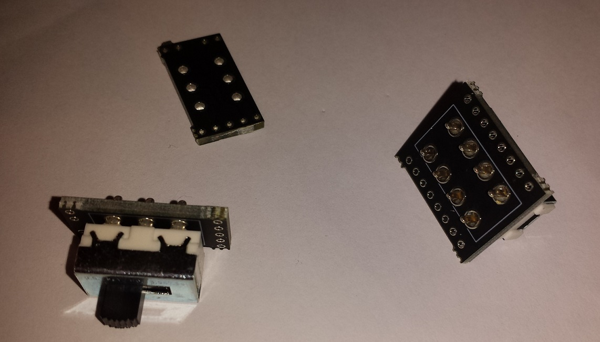

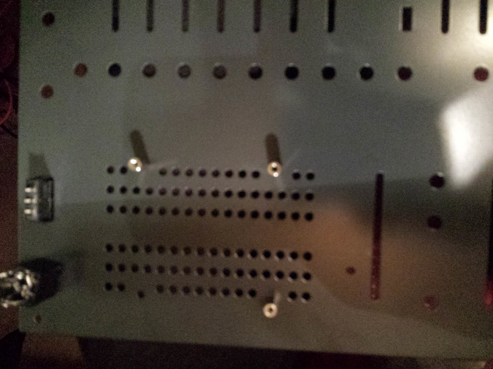

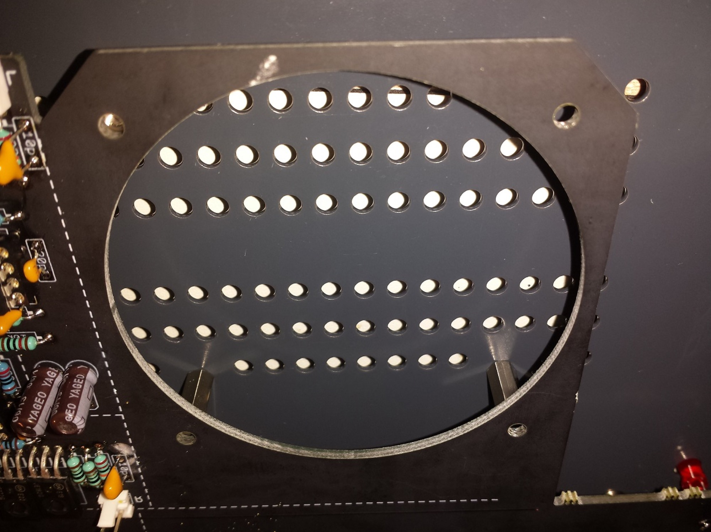

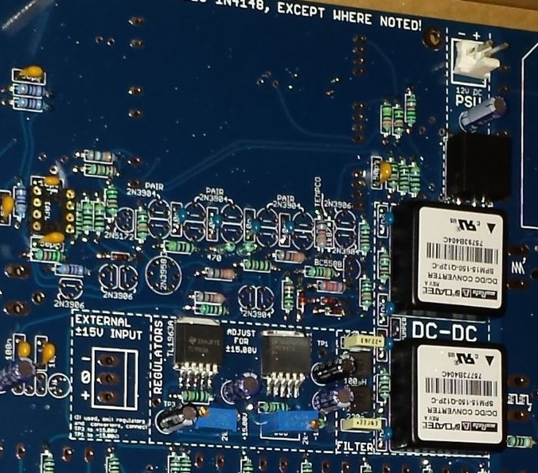

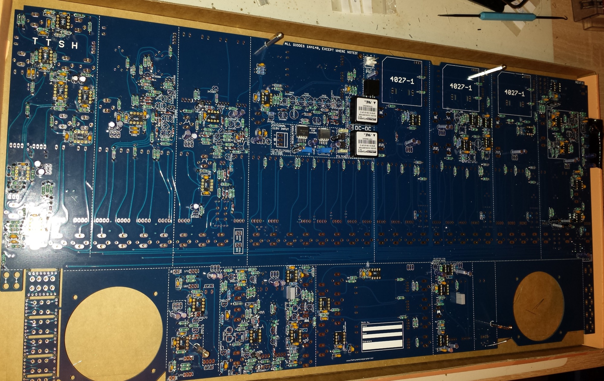

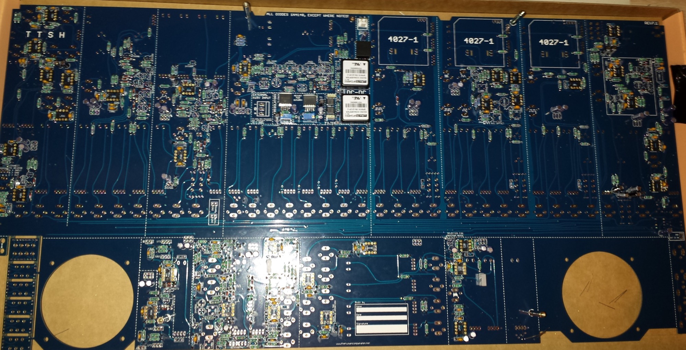

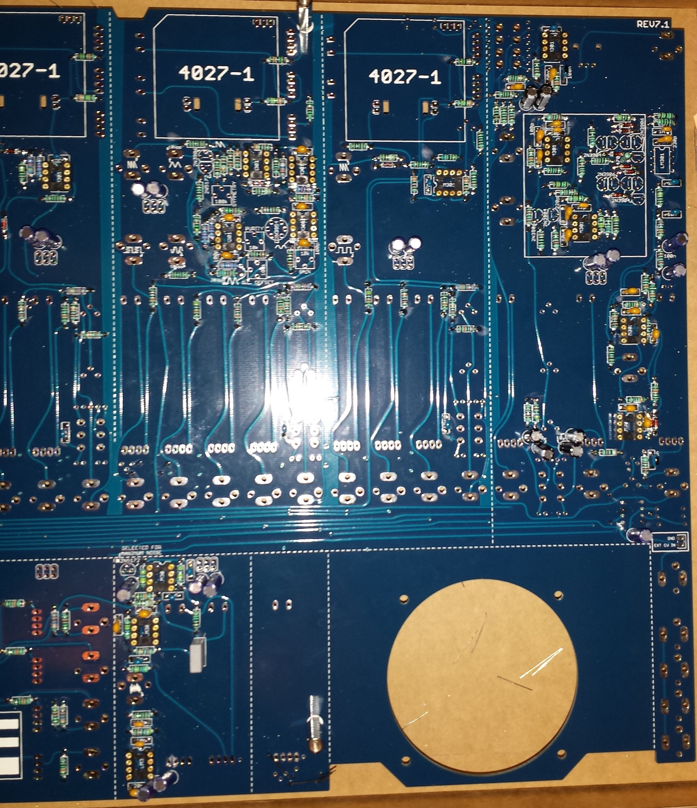

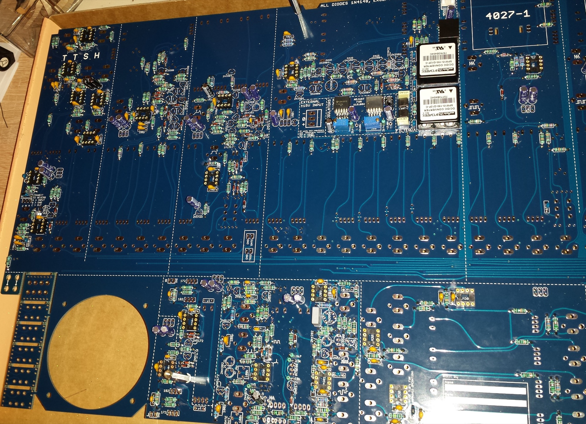

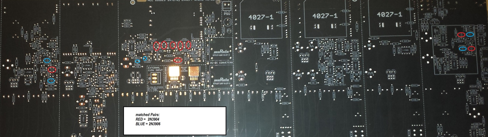

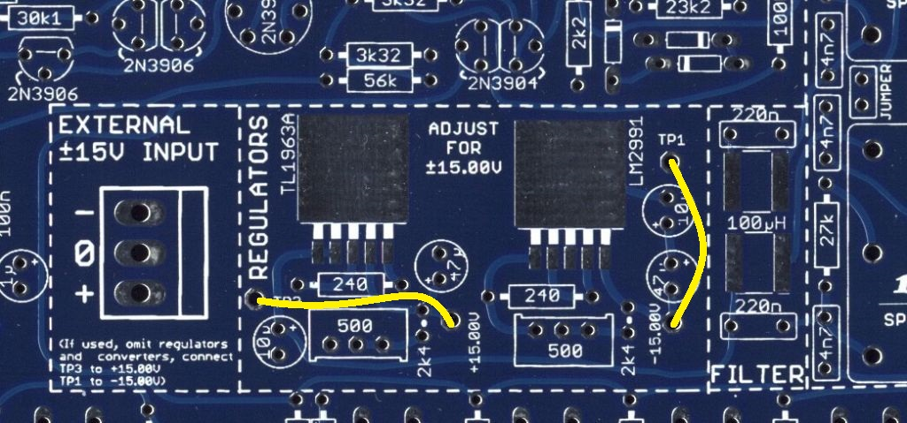
