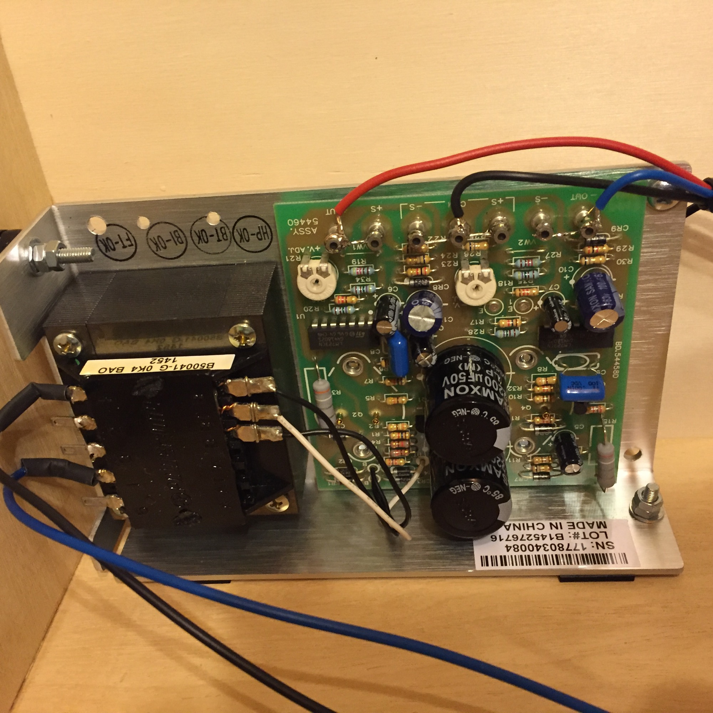
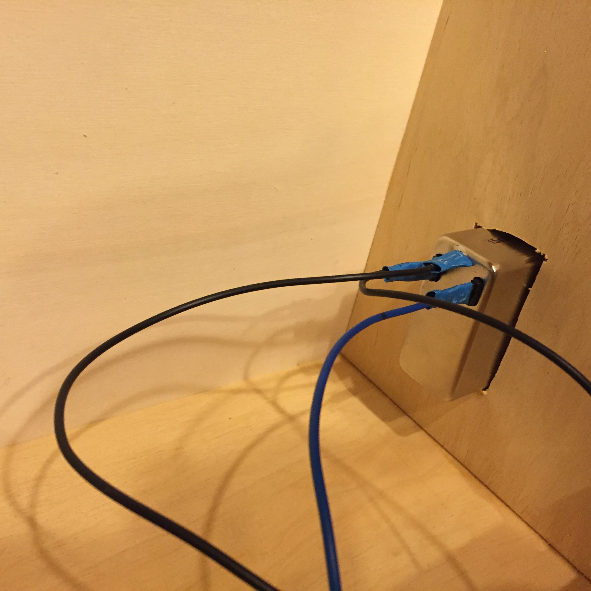
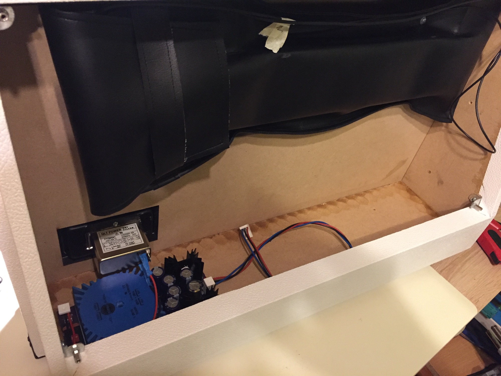

# TTSH 230V/110V Powersupply

**This page is only for me 😉**

i dont support Main Power handling (ich supporte keine 110V/230V Basteleien)

in case of usage of 110V/230V powersupplys dont add the parts for the onboard regulator (TTSH rev.1+2)

use the frontpanel power switch for the LED driver TL071 socket to switch the LEDs on/off.

make sure you have a Main current fuse for the powersupply, typically i use IEC power inputs with linefilter and double fuse.

use rubber feeds otherwise the case "swings with the transformer frequency", you can hear it in the big ttsh case like a speaker.

tip:  by usage of a internal 110V/230V psu - mount the psu in left corner and reverb tank on right/top corner with in/outputs to top - or you get a massive hum in reverb.

mount the psu on plastic/rubbers - because the empty case amplified the psu noise/hum/vibration.

> **Info for users with embedded switched Murata/TDK.. regulators:**
>
> (if you have added the both switched regulators, desolder the 220nF caps, 100uH caps)

**For new build: (rev.2 aka 7.x pcb version)**

1. dont add the inductors, 47uf cap, 240R, 2k4, 4n7caps, 27k, voltage regulators, trimmer
2. you only need to add: 3pin MTA156 header,  run wires between TP3 and +15V and a Tp1 and -15V (see picture), (otherwise the Fader LEDs dont do his job 😉 )

**for condor/powerone hbb1.5 powersupplys:**

cut VW1 and VW2 on pcb, run wires at the output included sense

picture shows  230V usage (Mains Input on transformer is different for 110V AC)

measure the 15/0/-15V before you connect it to the TTSH. if needed use the psu pcb trimmer to change it to the correct value,

recalibrate your VCO V/oct and VCF 1V/oct if needed.

**for condor/powerone haa0.8**

only the transformer input 1+4 or 1+5 (for 230V) bridge the 2+3 pin, no trimming needed, measure the output

> **Tipp**
>
> the usage of rubber feets minimize some vibrations from the transformer.
>
> mount the reverb tank at top with in/output orientation at top or you get some hum from the PSU.
>
> mount the PSU only on the left case side - on the right side is the reverb input and its very sensitive of magnetic fields.

**Altitude´s PSU:**

[https://www.muffwiggler.com/forum/viewtopic.php?t=130814&postdays=0&postorder=asc&start=0](https://www.muffwiggler.com/forum/viewtopic.php?t=130814&postdays=0&postorder=asc&start=0)

BOM: [https://docs.google.com/spreadsheets/d/1Uzok7ukMIwXIj6s7ttx5T3A1coEmdKRUpbRWDNm\_sHY/edit?usp=sharing](https://docs.google.com/spreadsheets/d/1Uzok7ukMIwXIj6s7ttx5T3A1coEmdKRUpbRWDNm_sHY/edit?usp=sharing)

or Mouser LINK [https://www.mouser.com/ProjectManager/ProjectDetail.aspx?AccessID=2fb9871cb1](https://www.mouser.com/ProjectManager/ProjectDetail.aspx?AccessID=2fb9871cb1)  

dont forget to buy the Toroid [https://www.digikey.de/product-detail/de/talema-group-llc/70083K/1295-1014-ND/3881427](https://www.digikey.de/product-detail/de/talema-group-llc/70083K/1295-1014-ND/3881427)    Talema 70083K

|   |   |   |   |   |   |   |   |   |   |
|---|---|---|---|---|---|---|---|---|---|
| Qty3 | Value | Device | Package | Parts | Description |   | Digikey | Price (USD) | Ext. Price |
| 1 |   | KK-156-2 | KK-156-2 | AC | 156 HEADER |   | A1971-ND | 0.19 | 0.19 |
| 1 |   | 2KBP | 2KBP | B1 | RECTIFIER |   | 2KBP10M-E4/51GI-ND | 0.78 | 0.78 |
|   |   |   |   |   |   |   |   |   |   |
| 6 | 3300 uF | CPOL-USE7.5-16 | E7,5-16 | C1, C3, C4, C5, C6, C7 | POLARIZED CAPACITOR |   | 565-2000-ND | 2.06 | 12.36 |
| 2 | 0.1 uF | C-US025-024X044 | C025-024X044 | C2, C10 | CAPACITOR Ceramic |   | BC1148CT-ND | 0.44 | 0.88 |
| 2 | 1 uF | CPOL-EUE2.5-6 | E2,5-6 | C8, C12 | POLARIZED CAPACITOR |   | 493-12827-1-ND | 0.25 | 0.5 |
| 2 | 10 uF | CPOL-EUE2.5-6 | E2,5-6 | C9, C11 | POLARIZED CAPACITOR |   | 493-1144-ND | 0.22 | 0.44 |
|   |   |   |   |   |   |   |   |   |   |
| 2 | 240R | R-US\_0204/7 | 7/1/0204 | R5, R7 | RESISTOR |   | 237XBK-ND | 0.1 | 0.2 |
| 2 | 1K | R-US\_0204/7 | 7/1/0204 | R4, R6 | RESISTOR |   | 1.00KXBK-ND | 0.1 | 0.2 |
| 2 | 10K | R-US\_0204/7 | 7/1/0204 | R3, R8 | RESISTOR |   | 10.0KXBK-ND | 0.1 | 0.2 |
| 2 | 2K | 3386-W | 3386W | R1, R2 | Timmer PV36W |   | 490-2880-ND | 1.51 | 3.02 |
|   |   |   |   |   |   |   |   |   |   |
| 4 | 1N4002 | DIODE-D-7.5 | D-7.5 | D1, D2, D5, D6 | DIODE |   | 1N4002-TPMSCT-ND | 0.11 | 0.44 |
| 2 | 2AMP | TR5 | TR5 | F1, F2 | FUSE |   | WK4257BK-ND | 0.7 | 1.4 |
| 1 |   | MTA04-156 |   | J1 | 156 4 pin Header |   | A1972-ND | 0.2 | 0.2 |
| 1 |   | MTA03-100 |   | J2 | 100 3 pin header |   | A19470-ND | 0.2 | 0.2 |
| 2 | 529XXXXXXXX | 529XXXXXXXX | 529XXXXXXXX | KK1, KK2 | HEATSINK TO-220/218 |   | HS350-ND | 1.43 | 2.86 |
| 2 |   | LED3MM | LED3MM | LED1, LED3 | LED |   | 160-1142-ND | 0.33 | 0.66 |
| 1 | L01-50VA | L01-50VA | L01-50VA | TR1 | TOROID TRANSFORMER |   | 1295-1014-ND | 39.58 | 39.58 |
| 1 | V80212MS02Q | V80212MS02Q | V80212MS02Q | U$5 | Voltage Select Switch |   | CKC3001-ND | 4.09 | 4.09 |
| 1 | LM317 | LM317TS | 317TS | U1 | VOLTAGE REGULATOR |   | LM317TFS-ND | 0.71 | 0.71 |
| 1 | LM337 | LM337TS | 337TS | U2 | VOLTAGE REGULATOR |   | LM337TFS-ND | 0.71 | 0.71 |
|   |   |   |   |   |   |   |   | Total | 68.91 |

## **Gallery**

no earth wiring for TTSH in Picture 1, but its needed for powerone psus.

