# TTSH rev3 build guide

> #### Status: `finished`
>
> #### Startdate: 21.Dec.2016
>
> #### Duedate: 31.Dec.2016
>
> last update 06 March 2019 Mouser BOM project updated
>
> 

> 
Version History: Click here to expand...

>
> update 12.Jan.2017 Mouser Link updated
>
> update 13.Jan. 2017  Major bug found
>
> update 15.Jan. 2017 Excel list Slider quantity corrected
>
> update 16.Jan. 2017 Major bug update for jacks in total 3 jacks.
>
> update 18.Jan.2017 BOM excel list - added a "approved row", website improvements
>
> update 26.Jan. 2017 multiturn trimmer for v/oct improvement (optional)**,**Noise transistor bug/improvement added from rev.1/2 guide,
>
> update early february Mouser BOM updated (bypass vco capacitors, VCF4072 capacitors.)Excel list updated with switches.
>
> update 19 Feb 2017:known Issues - clock/s/h resistor
>
> update 20 Feb 2017 added a quick build guide for builders with TTSH experience
>
> update 03 March 2017 known Issues updated, Reverb connector
>
> update 06 March 2019 Mouser Bom project updated
>
> 

>
> #### Manufacture link: [http://thehumancomparator.net/](http://thehumancomparator.net/)

due to changes in my webhosting (rootserver) costs for RAM/Backup and my worktime in Adminstration of the Server & Web Application Server it would be very helpful to use my paypal gift function, thank you

<form action="https://www.paypal.com/cgi-bin/webscr" method="post" target="_top">
<input type="hidden" name="cmd" value="_donations">
<input type="hidden" name="business" value="percysworld@web.de">
<input type="hidden" name="lc" value="GB">
<input type="hidden" name="item_name" value="DSL-man">
<input type="hidden" name="no_note" value="0">
<input type="hidden" name="currency_code" value="EUR">
<input type="hidden" name="bn" value="PP-DonationsBF:btn_donateCC_LG_global.gif:NonHostedGuest">
<input type="image" src="https://www.paypalobjects.com/en_US/i/btn/btn_donateCC_LG_global.gif" border="0" name="submit" alt="PayPal - The safer, easier way to pay online!">

</form>

> **Info**
>
> **This guide is complete yet ( last update on 18.Jan.2017)**
>
> **please check my**[**rev.2 build guide**](../ttsh-rev2-build-guide/index.md)**and**[**hardcorebuildguide**](../ttsh-rev1-build-guide/ttsh-hardcore-builders-guide/index.md)**,**[**gatebooster**](../../ttsh-mods/ttsh-gatebooster/index.md)**pages, that gives you more infos and knowledge.**
>
> **the TTSH project isn\`t for beginners !**
>
> **Feel free to**[**register a account**](https://www.dsl-man.de/signup.action)**for free, you can comment, export pages, you stay informed with pageupdates by email.**
>
> **send messages to me and other users with the share page function ( in top right corner)**
>
> **you can send me a message if you want edit my pages, i´m looking for supporters.**
>
> **further i´m looking for authors too,****please contact me**

**Table of Contents**

### Trusted Builders:

| **Name** | **Region** | **Contact** |   |
|---|---|---|---|
| Fuzzbass | USA | fuzzbass "at" verizon.net |   |
| Elmigel | USA | Pete.hartman "at" gmail.com |   |
| Dave.H | USA | ishkabbible "at" gmail.com |   |
| LED-man | Europe/worldwide | check my Impressum |   |

### Schematics:

[http://thehumancomparator.net/wordpress/wp-content/uploads/2014/05/TTSHv3Schematics.pdf](http://thehumancomparator.net/wordpress/wp-content/uploads/2014/05/TTSHv3Schematics.pdf)

**you find the known erros/issues in "the tabs on top"**

### rev.3 Build Guide

Build guide -  Click here to expand...

This guide is for users with experience in SDIY, you need a scope and a frequency counter, DMM/DVM/LCR-Meter)

i dont share infos about polarity of capacitors, this basics skills are required, otherwise feel free to ask me for a assembly service. (check the trusted builder list)

please use a fume extractor.

its needed to solder 6 SMT caps in 0805 format and 2 SMT power regulators.

this guide is a best practice guide, i´m not responsible for failures/malfunctions/defects.

1. lets start with the powersupply board - add all needed parts on the pcb, start with the two SMT power regulators.
  there is one missing part (a dual choke) - please use wire links here or resistor legs
  turn the 2 pol MTA header as described in the picture
  if needed - wash the pcb carfully on the solderside
  testing/trimming: use a 18-24V DC powersupply for input and set the output to 15V/-15V by usage of the both trimmers
  **measure between -V and 0  and +V and 0**
  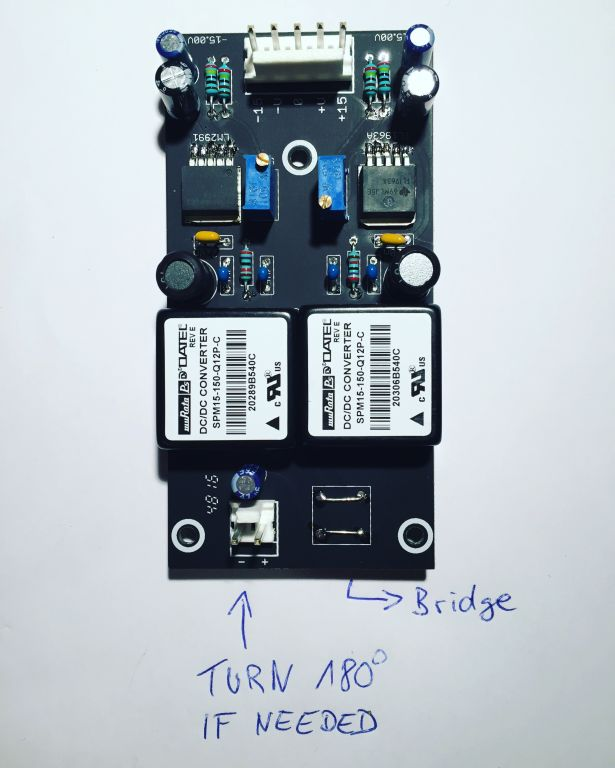
2. Mainboard PCB - place all IC-Sockets ( tin one ic socket from top, place the ic socket and heat the ic socket pin - the socket drop in place
  on the rear side of the PCB is for the LED driver a ic socket - we dont use this one - don't solder a ic-socket here ! see step14
3. best practise - begin with the "most use values" and end with the value range Mainboard PCB - start with 100K resistors, 10K, 1K, 1M, 100R (reverb), 10R (Amp) 10M (top right)
  if done - 47k, 4k7, 470K, 4M7, –   22K, 220K, 220R, 2M2, 33K, 3M3, 330K... — 30K1, 680R, 68K, 68K1, 680K...  ..... and all other
  **please remember:** on solderside are few resistors too - on VCO 4027 boards and filter boards too - its your choice to leave it for later or assembly it yet too (i prefer later)
4. Mainboard PCB - place all rectifiers 1N4148
5. solder from top all parts
6. cut the resistor and rectifier legs from bottom side
7. place all MLCC caps and solder from top
8. place all polyester/polypropylene caps - bend the legs from top
9. add all transistors in place and solder one pin from top -(except the 2N3954, both 2N3958 - if you cant test this, use a milled IC-socket and cut the pins out - use this as socket)
10. turn the pcb and solder all pins. (no switches, no fader, no jacks, no pot, no trimmers)
11. you find on solderside few resistors - but take a look at step 14 - you don´t need the 3 resistors for the LED driver ( LEDs works too)
12. wash the pcb 2-3 times if needed, i use Ispopropylen alcohole
  - make a breaktime/pause yet - the pcb needs time to dry
13. if you don't need a break time/pause - assembly the filterboards and 3 VCO 4027 boards - wash the pcbs too, make sure you use flat 10uF electrolyte capacitors, use c0g, polypropylen or silvamica for the 680pF cap,  **don\`t mount the connectionsheaders yet**
14. on the PCB solder side, there is ic socket for the LED driver (near the multiples) its needed to bridge with a resistor leg the middle pins
  on TTSH V2 and V3, you can easily modify the LED system so as to trim the LEDs all the way of off. Replace the 3k3 resistor located next to the TL071 pads to a jumper.  Tested. 
  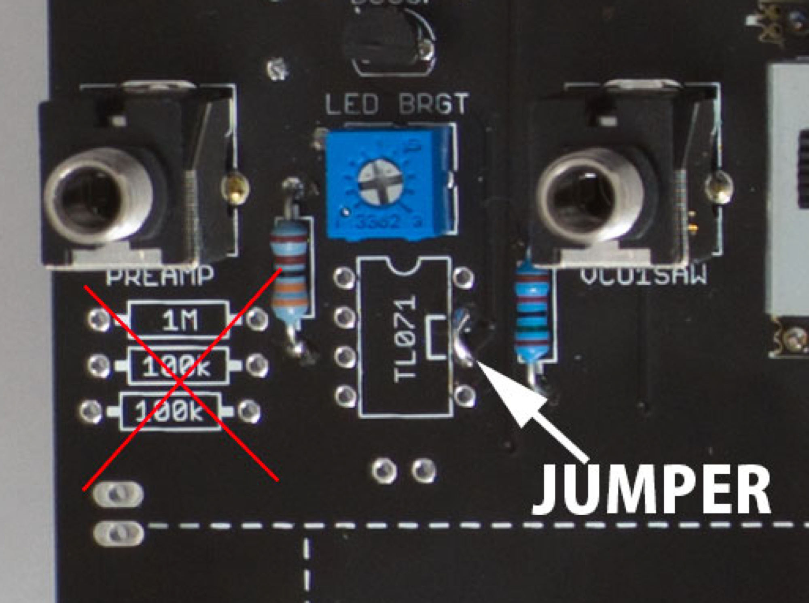
15. Mainboard pcb: its time to add all other parts on the pcb -  i prefer multiturn trimmers for the VCO V/oct trimmers  20K or 25K, but remember this can´t mounted on the frontpanel pcb side due to sizing, you have to open your TTSH for trimming the VCOs,   begin with trimmers, faders - for faders keep attention on correct pcb side,  best practice for faders:  turn the pcb upwards on your desk add 4 faders in place, one hand holds the faders with other hand bend the faderpins with a flat screwdriver,  solder all faders,  add the Gain pot on top and solder them.
16. add the header/sockets for VCOs, Filtercard - best practice: mount each header in socket - put them in place on the pcb - add the vco pcb on top and solder at first on top (sub vco pcb to header)  not the header to mainboard pcb.
  then start the soldertask for the other side.
17. check on your pcb other parts:  you need to assembly few 2pol, 5pol MTA headers (gate/trigger/power) solder in the RCA jack for reverb (see known issues for wrong silkscreen), you have to add a 3 pol MTA header to powering the optional [Gatebooster](../../ttsh-mods/ttsh-gatebooster/index.md)and/or [TTSH sync board](../../ttsh-mods/ttsh-mod-vco-sync-option/index.md) , on each section you find 6 pol holes.
18. now its nearly done - doublecheck all solderpoints, missing resistors,caps..
19. add the 13x 12mm spacers for speaker to pcb, dont fix it very strong - we need to align this in step 22
20. you find on the pcb on left bottom near the speaker hole switch adapter pcbs, cut them out and place they behind the switches
  
  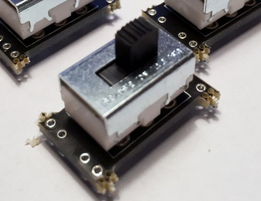
21. setup all 81jacks in place, don\`t solder the jacks yet
22. place the frontpanel on the pcb/spacers - fix it with screws - if needed align the spacers
23. add on each corner a washer and nut to a jack and at the bottom/near of the voltageprocessor
24. at this time you need four hands if possible.. to turn the pcb without loosing jacks
25. solder at first the jacks from step 21
26. check the switch positions, align it and solder 1-2 pins (middle pins), check again the positions, if needed correct it.
27. if the alignment of all parts are fine, solder all switches and jacks
28. if needed clean with eartips and isopropylene the solderpoints of silder/switches/jacks
29. add the 3 VCO 4027 modules and one filtercard in place.
30. time for wiring: speaker wiring/headphone,
  → siehe
31. unmount the panel,  add 3 long spacers (20-50mm to the 3 holes near voltage processor - the stands are used for the powersupply yet - mount the psu pcb on top), remount the panel
32. wire the power-switch between + line and the powersupply pcb input

for power between power supply and mainboard  - double-check the polarity,

### rev.3 Quick build guide ( thanks to @Autor aka fuzzbass)

this guide is only for builders with TTSH experience, dont try it if you build a TTSH before, the guide contains a BOM with partnumbers too.

[V3 quick build bom.xlsx](assets/V3-quick-build-bom.xlsx)  (right click to "save as")

### TTSH Trimming - calibration

Mehr anzeigen

→ siehe

### Troubleshooting knowledge

i ran in some difficult errors in some TTSHs, here are my experiences

for unknown issues/Errors check this page: [useful Documentation for Troubleshooting](../../ttsh-release-rev-2/useful-documentation-for-troubleshooting/index.md)

| **Knowledge number** | **symptom** | **Probable error source** | **Probability of occurrence** | **pre check** | **testing** | **workaround** | **fix** | **lessons learned** |
|---|---|---|---|---|---|---|---|---|
| TTSH-1 | VCO bleed (usage of frequency slider from one OSC influenced other VCOs frequency or Frequency range isn´t good enough or screaming VCO - weird frequency / instable Frequency | LFO/VCO switch (LF switch) | 80% | insert a stable v/oct signal (doublecheck with other devices your v/oct signal) | press/push/wiggle the LF switch, if you hear or measure a better result -&gt; | heat up the 6 switch pins | normally a resolder/heatup fix the issue | the switch pins must be soldered with other soldercore or better heated/other solder tip. |
| TTSH-2 | all Slider LEDs are off | Trimmer, LED Driver |   | turn on the frontpanel (left hand) the LED trimmer clockwise, check on the frontpanel side on the empty IC socket next that you bridged pin 6+7 and no IC is plugged inside the socket. if not fixed: measure on the 5 pole powerheader all voltages | n/a |   |   | dont forget the jumper/bridge on pin 6-7 |
| TTSH-3 | few Slider LEDs are off | Trimmer, LED Driver | 50% | turn on the frontpanel (left hand) the LED trimmer clockwise, the TTSH LEDs are connected in 6? chains and in each chain are all slider LEDs in series - so you must check the correct LED polarisation (you can see the cathode/anode without demounting) |   |   | swap the LED to correct orientation | dont trust machines/roboter |
| TTSH-4 | all VCOs dont work | VCO 4027 boards | 10% | are the VCO subboards correct mounted ? (check the board connectors) are the CA3046 ICs inside ? check the soldering of the board connectors |   |   |   | solder all VCO conenctor pins before mounting the silders, add the CA3046 while mounting the connectors to the subboards |
| TTSH-5 | cant get a VCO sine wave in trimming/calibration process. (you get only a triangle) | VCO-2 section | 80% | check OP-amp orientation check J-FET (2N3954) instead 2N3958 | oscilloscope shows at the TRI out a Triangle - if not fix it before. |   | check the symmetry at first for the triangle, use gain to setup 10v then use the offset to bend the triangle spikes - they must form a corner in combination with purity. setup again 10v. its not a easy job - try it again - the trick is the combination of offset and gain not the purity ! | before you swap the 2N3954 try other ways as before by trimming the 4 trimmers , many guys swapped the working jfets.. |
| TTSH-6 | ttsh works as a drone synth (by usage of cv/gate - the ttsh plays  always sound instead of note on/off control) |   | 80% | check your silder settings - at the VCA output mixer - only VCA output instead of VCF or VCF and VCF. |   |   |   | read the usermanual |
| TTSH-7 | by usage of the reverb function, a hum/noise occurs |   | 80 | see known issues - in/out silksceen is wrong check your noise is off 😉 check the wiring |   |   | use **double or triple shielded** cable with good RCA connectors, not the Synthcube cable "solution" the reverb distance must around 10cm or more from pcb to minimize the risk of EMV to the tank. check the grounding of signal input in the reverb, input and output must be grounded. check the cable with a rectifier test, check the soldering of the RCA connectors on the ttsh pcb. make sure you have the correct reverb type (grounding and impedance) | reverbs are very sensitive for EMV\* |
|   |   |   |   |   |   |   |   |   |
| TTSH-8 | ADSR Release time opens the VCA and at 20fader way, the releasetime is too long |   | 50 | check all parts for correct value, check my [pictures](ttsh-rev-3-build-pictures/index.md) subpage |   |   | replace the 2N5460 or 2N4392 | test all trannys before soldering |
| TTSH-9 | sound from speakers - without OSCs enabled/installed |   | 30 | if the 10R resistors in the Amplifiers are hot or the MJE172 are hot, check the orientation of the MJE172 - the unlabeled side is at the white marker from the PCB. AND you have a short or defect opamp on your TTSH, which blows your MJE172 and the 10R resistors within 30seconds. you have to use a Bench power supply with current limiter, otherwise you freeze again the MJE172. you can cut at the 1UF elks the 6 pol power header - and connect it later with PC jumpers or use resistors legs to bridge the -15715V rails. | 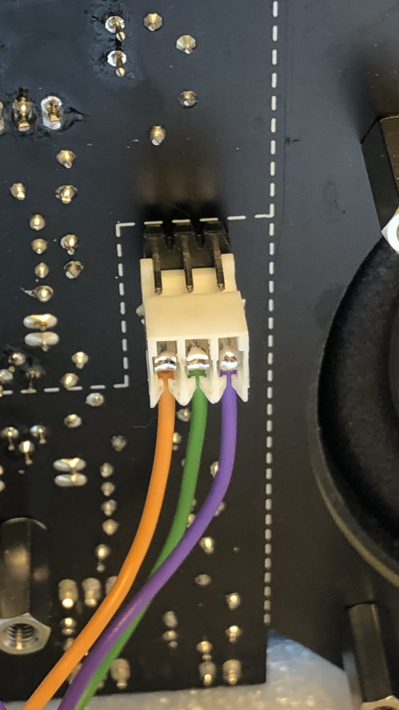 |   |   |   |
| TTSH-10 | power separation - in case of POWER FAILURES or shorts |   |   | use a Labor bench with current limiter. |  |   | separate the Sections, by cutting the traces. 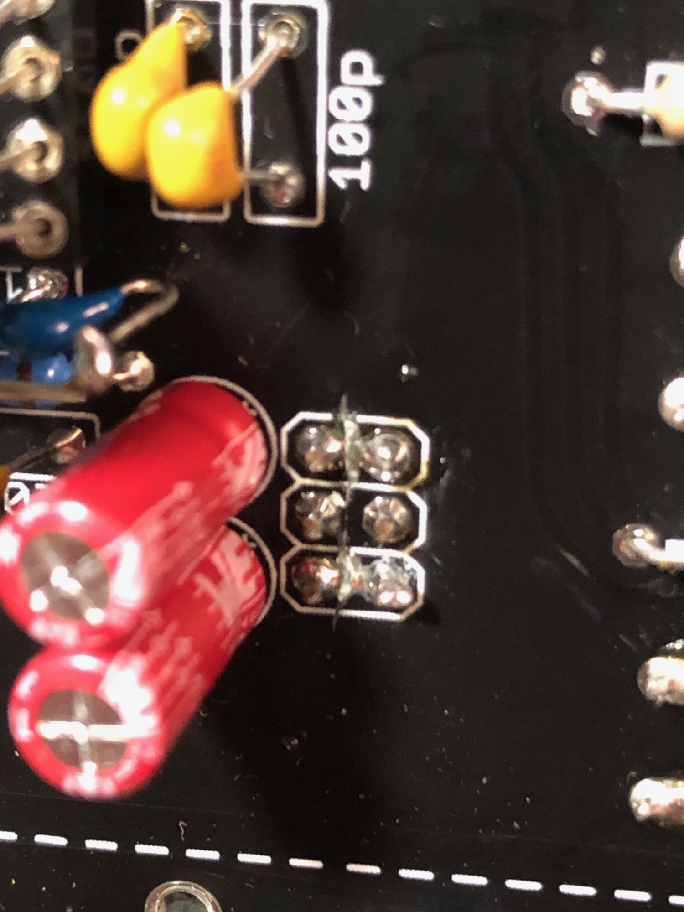 |   |
| TTSH-11 | reverb doesn't work BL2AB3C1B |   |   |   | connect a cable from the black cable from left to the black cable on right side |   | 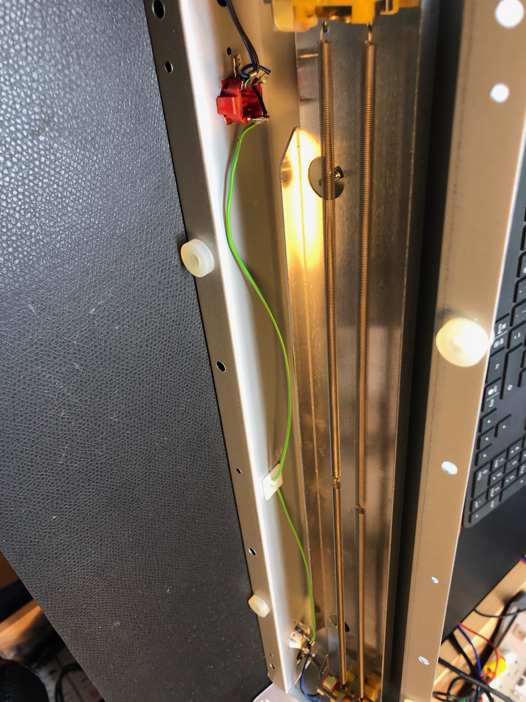 |   |

### Best Practise:

| **ID** | **TIP** | **reason** |
|---|---|---|
| 1 | when you have finished the build, move 2-3 times every slider | often the sliders cause some issues, they hang - only when you have moved the sliders 2-3 times they start to normal work |
| 2 | use Anti Rotating washers for the 5 nuts at the component side of the PCB |   |
| 3 | do not trust every information regarding an audio path upgrade or subs. for the LM301 | you can always use: LM101, LM201 too - they have a better temp. stability than a LM301 they are also available in SMD package and works great. if you want an audio path upgrade, contact me and you get an offer. I do not share my secrets because some companies copy this ideas for his cheap clones. I spend few days and a lot of money in testing different opamps (which mostly need addional part changes on the pcb) |
| 4 | MODIFICATION | **"Essential"** Gatebooster Mod. VCF decoupling 1uF or more **"my standard"** Essential plus: Electronic switch mod AR MOD ADSR Switch Audiopath upgrade 1% matched capacitors in VCF 1% 680pF Styrene in VCO High temp. drift OPamps in VCO **Highend:** Essiontial plus "my standard" plus: Waveshaper MOD with subosc. some additional part changes -  PSU passive cooling blocks Balanced driver with XLR |
| 5 | why not install the MIDI mod ?? | you have a half modular system - a intern MIDI gives you only the option to connect internal 2 CV connections. if you use a Kenton MIDI Standalone Interface (PRO SOLO MK2 or 3 etc ) - you can  patch to every jack you want ! like the Ringmodulator or VCA etc... |
| 6 | why not install the VCO SYNC option ? | the mod isn't very easy for beginners or amateurs, the most users have problems with soft sync (when the SYNC is off) and many users blown the VCO SUB boards Transistors, which are not easy to replace. ( I have spare pcbs ) and if you install the Waveshaper board your risk of some VCO/EMV bleeds  are bigger than before. The main reason is the sound, there's not a big difference in sound between a Ring MOD sound and a SYNC sound (in the arp2600) |

### Gallery

check also the [**rev.3 buildguide pictures**](ttsh-rev-3-build-pictures/index.md) with HQ pictures ( thank you @Autor)

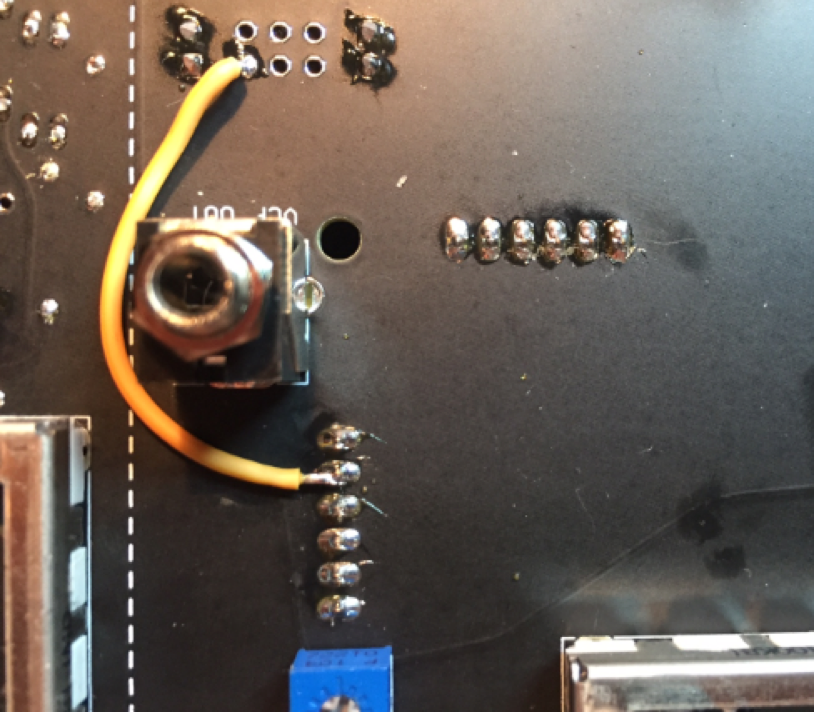

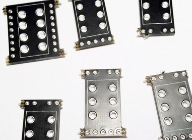

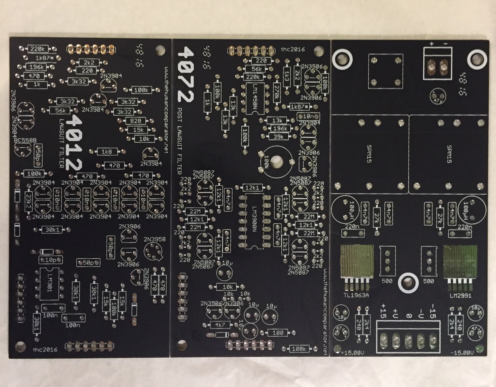

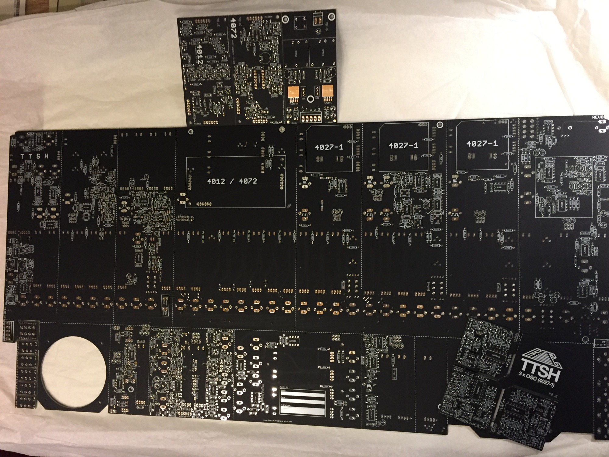

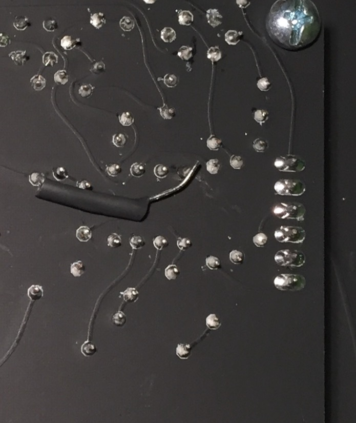

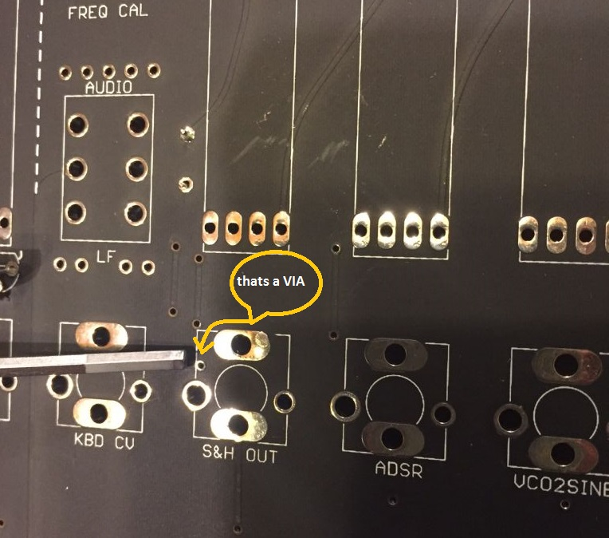

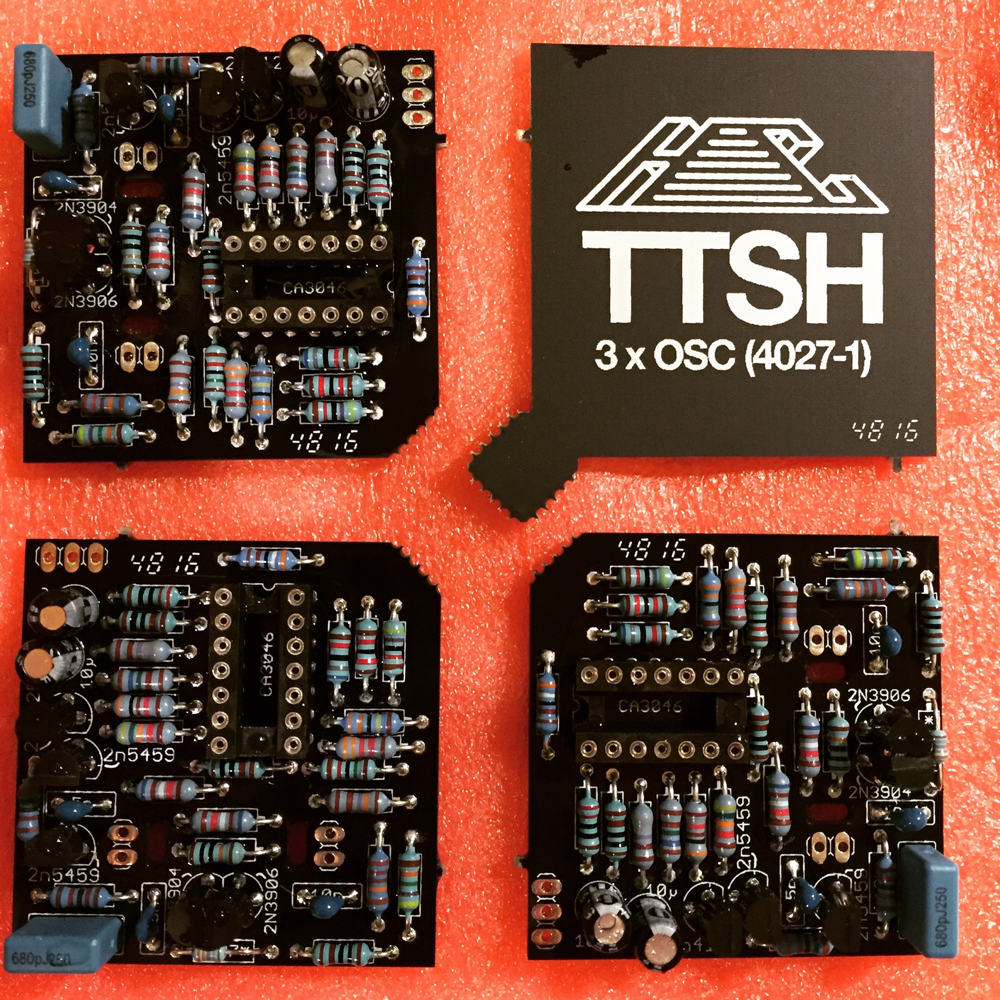

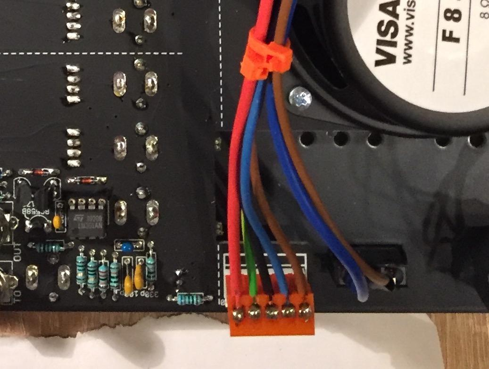

**Stats**
