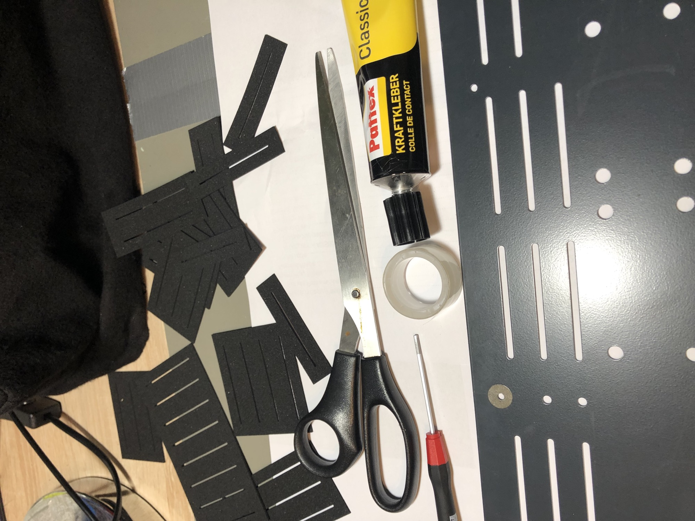
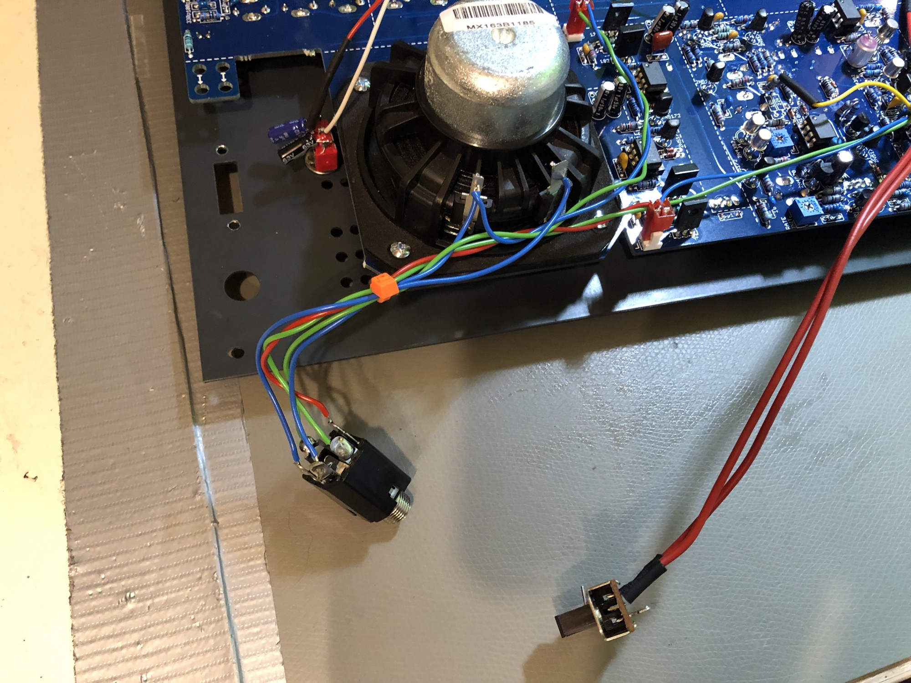
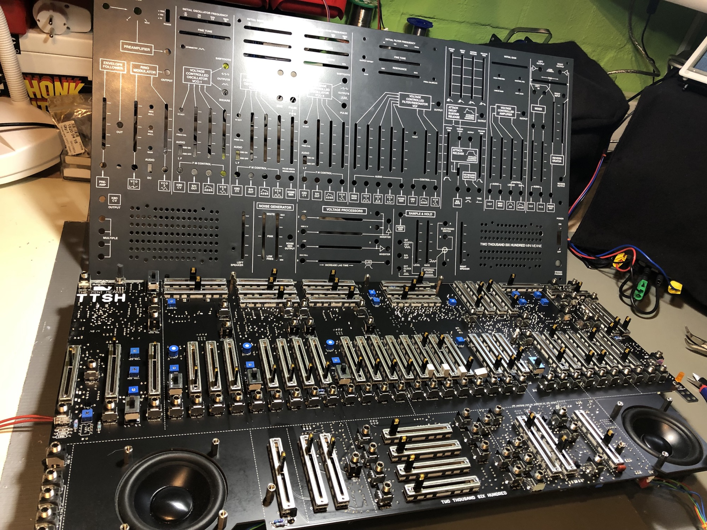
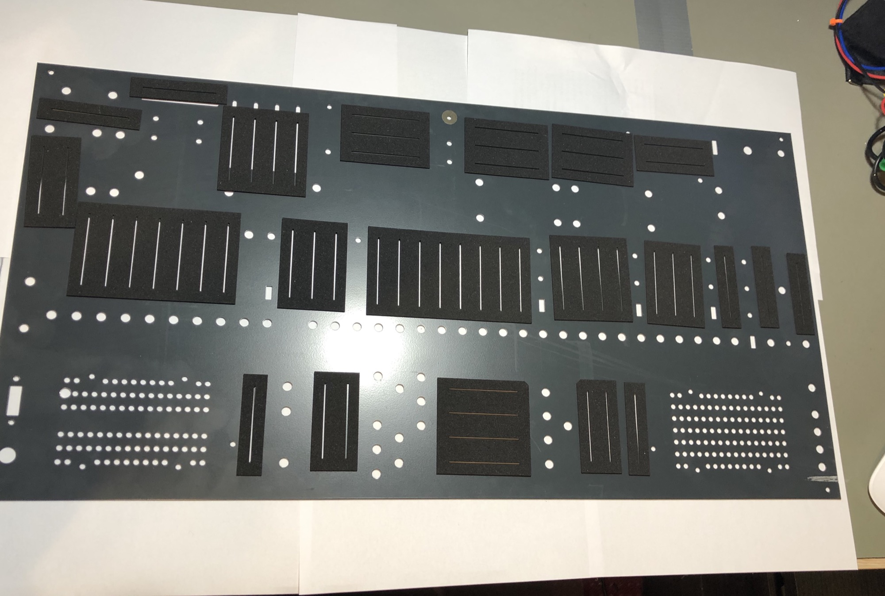
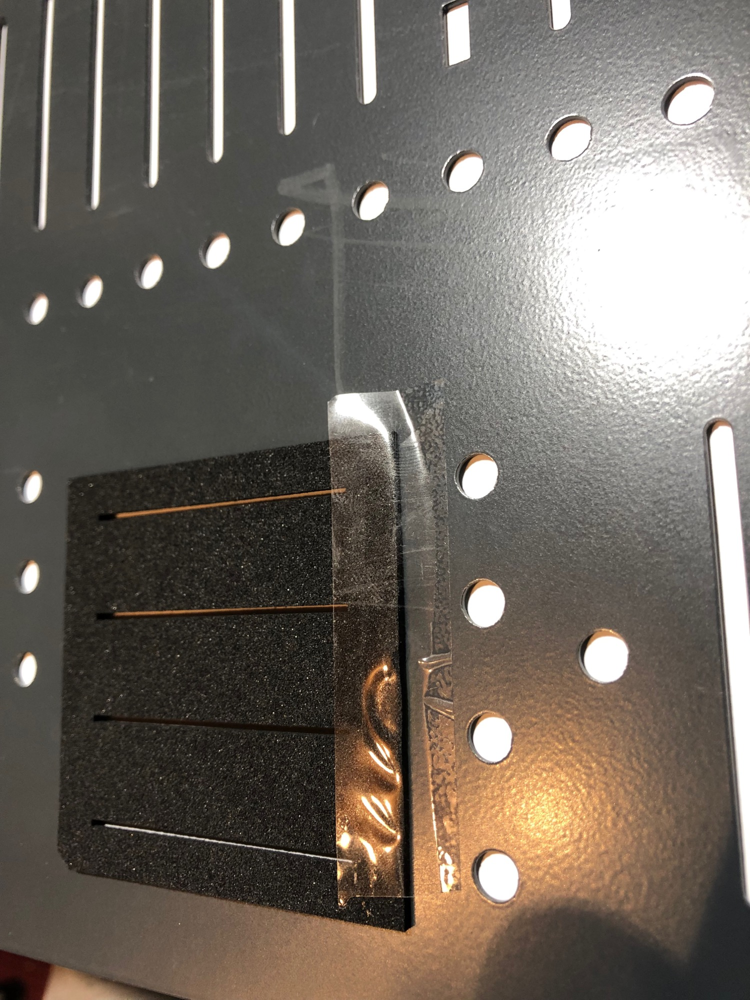
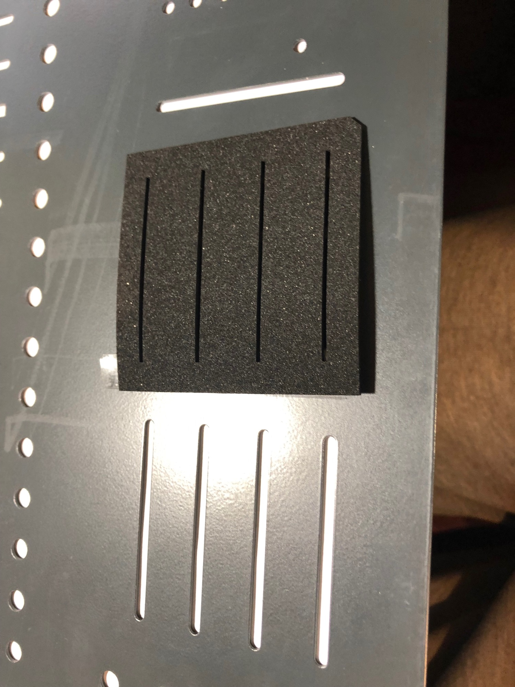
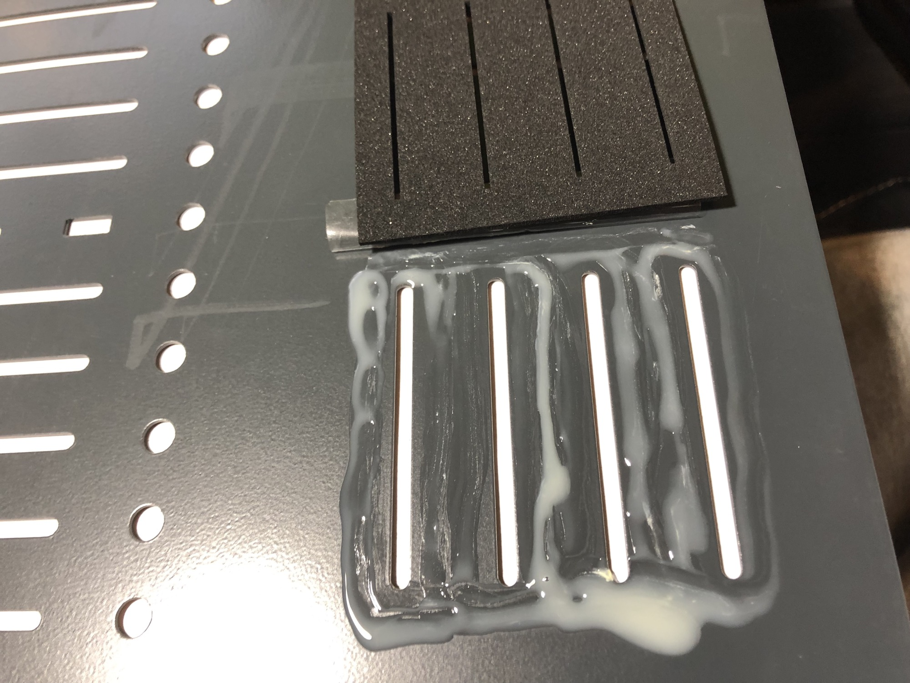
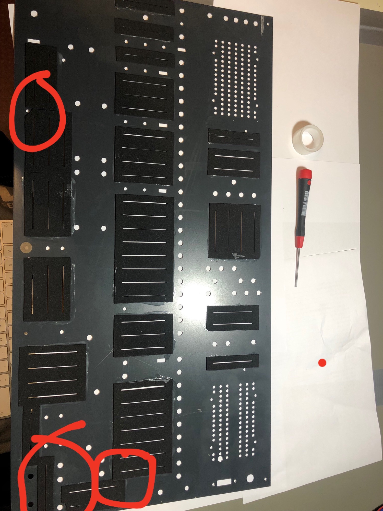

# TTSH Dust Cover Installation

## Dustcover Source:

[http://synthronics.de/dust-covers-ttsh-arp-2600](http://synthronics.de/dust-covers-ttsh-arp-2600/)

## What you need:

TTSH rev.1 - rev.3

- a big table
- Hex Screwdriver - i used on my builds hex 3mm screws
- Screwdriver - philips (P2-P3)
- ringspanner for the jacks M8- soldering station to remove the power switch wiring
- glue -  power glue (not the paper glue)
- a scissors
- tape - (removable)
- tube shrink
- a pig paper or a clean carton to put the panel on it (TTSH Panel size or bigger) - no bubble foil !!!     I explain later
- isoprop - to clean parts where you accidentally attached glue
- water to clean your hands

### lets start:

doublecheck the dust cover protection mats, the total amount, check for defects.  

the set contains:  21 mats

put your TTSH on a table,

unplug power and remove all patchcables

remove the froontpanel screws on the corners (4 in total)

carefully remove the assembled pcb and panel from the case - its good to have a second person who can assist-

its easier to turn the ttsh to the front and hold the preamp gain knob and insert a big screwdriver in the headphone jack (carefully) that you lift the device outside.

remove the power supply cables

remove the power switch (desolder both pins from the switch)

remove the headphone jack (remove only the nut on front - hold with the other hand the jack - otherwise the jack turns around and the cables can be broken

Optional: if you have installed Mods like: ADSR switches, Sync or waveshaper - remove the wring as needed - mostly only the switch nuts from the front panel)

put the TTSH flat on the table                                                        

remove the 13 screws from the front panel

remove the pushbutton cap (lift off)

remove the 81 nuts and washers

**double check that all screws and nuts are removed - otherwise you break the jacks !!!**

lift off the front panel from the PCB

put the frontpanel- downwards on a clean table - better to use paper our a clean carton otherwise glue can drop behind the panel glue together with your table - an amazing decoration 😉 

**while you do this modification** - think about that:  your TTSH is open again - so its easy to install modifications or do some bugfixes if needed  !!   see here: [TTSH Mods](../index.md)

**Let´s start glueing**

we start with the bottom row.

you need to sort out the correct mat for each slider section.

put one mat on the slider, use a piece of tape and put it on the top as shown in my picture.

check the distance to jack holes or panel mount holes

the VCO1 mat needs to be cured at one corner.

reverb mixer one corner for the right input jack.

turn the panel and check the orientation or bring it in this way.

flip the mat (while the tape holds it on side)

   

add glue on the front panel - but not too much or close on the slider slot.

turn back the mat on the glue, turn panel and check the orientation - move it to correct place.

remove the tape asap, and add some glue on the side if needed, remove with a kitchen paper or ear tips unwanted glue on the panel or use isopropanol.

(later if you figured out how you align the mat, you can try without a tape)

**PLEASE NOTE:**

in the VCO section is the mounting hole for the metalspacer, cut a corner from dust mat.

in the ringmnod section are 2 mats too close, cut them shorter 2-3mm until they fit.

thats all.

let it for one day in a warm room.

**put everything back:**

assembly all together,

solder the Powerswitch middle and bottom pin - use tube-shrink

> **WARNING**
>
> i´m not responsible for any damage.
>
> make sure you have enough fresh air in the room while you prepare the glue task.
>
> Don't sniff the glue 😄
