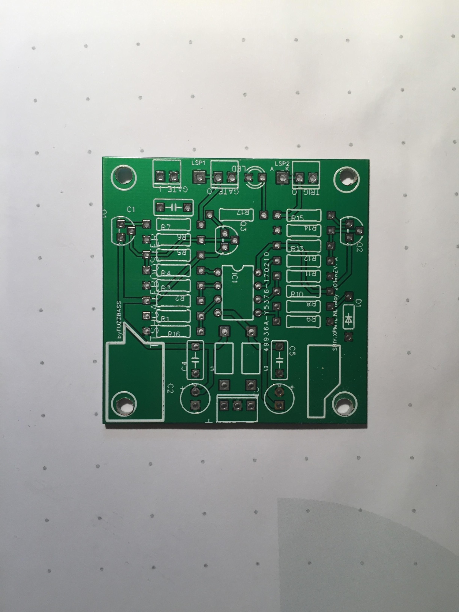
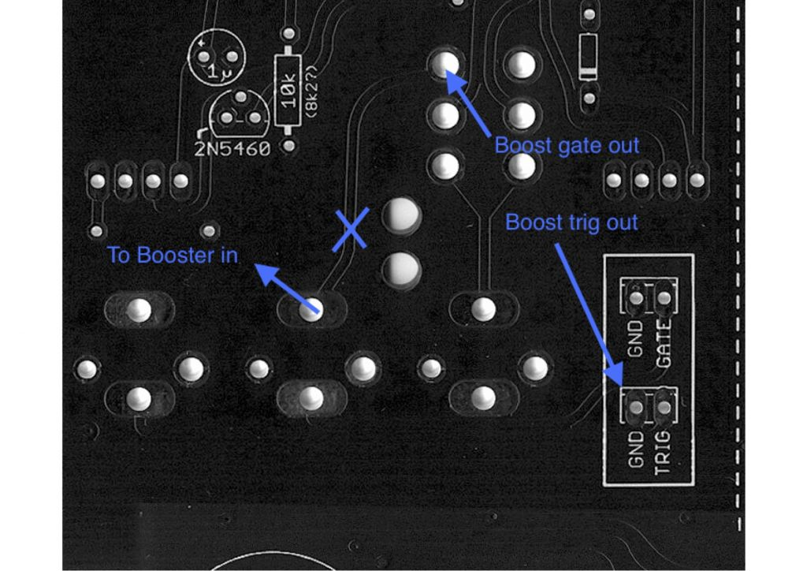
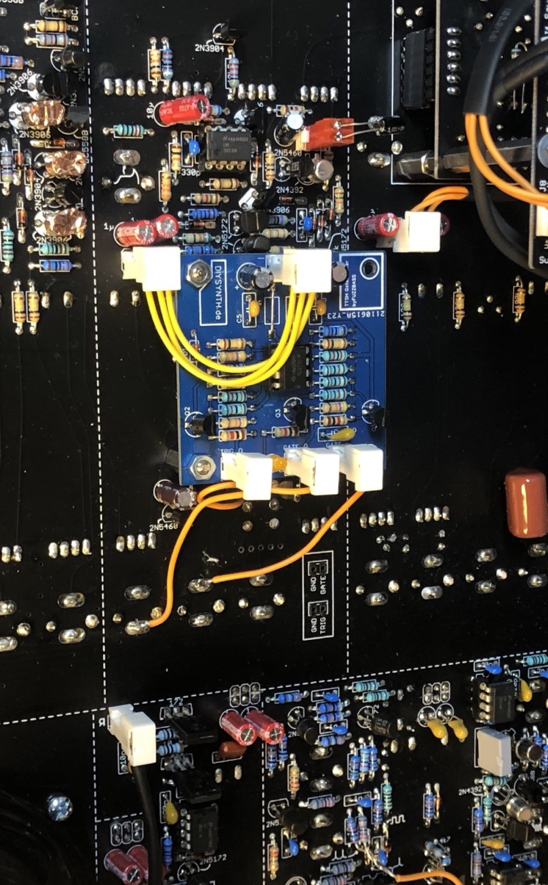
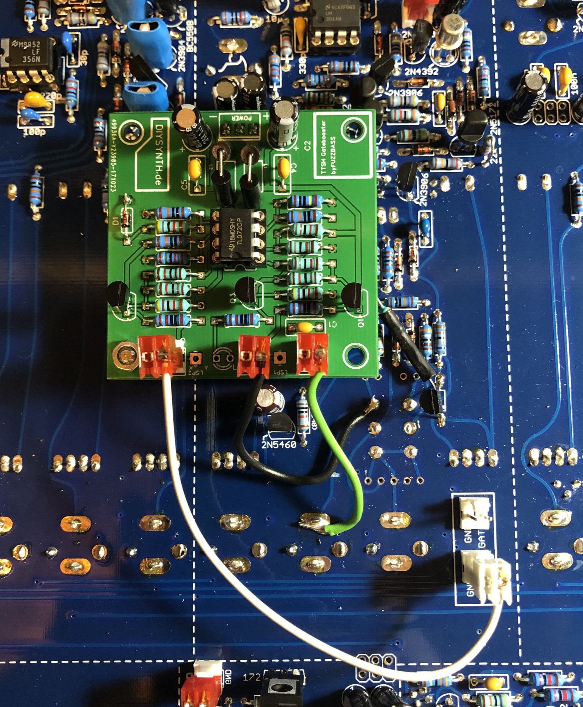
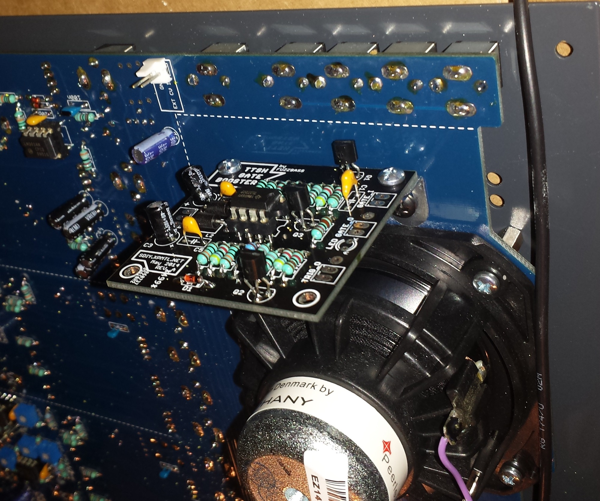
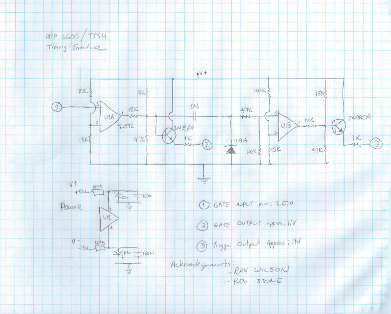

# TTSH Gatebooster

**The TTSH needs  a Gate AND Trigger signal with 10/11Volts, otherwise it wont work as designed with external GATE Signals only.**

**here was the idea born:**

[http://www.muffwiggler.com/forum/viewtopic.php?t=112720&start=0&postdays=0&postorder=desc&highlight=ttsh](http://www.muffwiggler.com/forum/viewtopic.php?t=112720&start=0&postdays=0&postorder=desc&highlight=ttsh)

**i offerin my shop the bare pcb and the assembled Gatebooster version:**

**[https://www.diysynth.de/?cat=c2\_Pcbs---Panels-pcbs-panels.html](https://www.diysynth.de/?cat=c2_Pcbs---Panels-pcbs-panels.html)**

****

> **Hinweis**
>
> in case of  the **version with midi implant** connector, connect a 1M resistor from ground to Pin3 of TL072

**preferred  Solution:** 

use a screwdriver or other sharp tool to cut a trace  - marked with a blue X in the bottom picture. (dont drill a hole - its a 4 layer pcb)

Connect the gatebooster input with a cable from the GATE Input jack from the ttsh.

connect the the TRIG header to the TRIG on the gatebooster.

You don´t need the GND pins ! (except for power)

Install a 3 pinheader in the 6 pol pinholes on bottom of the 2x 1uF electrolyte capacitors in the ADSR section and put the gate booster pcb power input on this 3 pin header.

the pcb sit on top of the IC from the AR section. make sure your gate booster pins don't touch any other parts. if needed install a 10mm or 12mm metalspacer as shown in my picture (on left bottom hole only)

**other solution for external usage**

**This Solution use 3 jacks of the multiples:**

drill 2 holes in the pcb and mount brackets with woodscrews,  cut the TIP/HOT traces for 3 jacks at multiple connectors , use one ground (you dont need 3 grounds) connect the cables (gatebooster input, gate output, trigger output)

connect the gatebooster power from a module section (there are 6 solderholes, 2x3 rows - test with a voltmeter the voltage output/polarity)

**Theory:**

[TTSH\_GATES\_BOM.pdf](assets/TTSH_GATES_BOM.pdf)

[TTSH\_GATES\_BOM.pdf](assets/TTSH_GATES_BOM.pdf)

[TTSH\_GATES\_Schem.pdf](assets/TTSH_GATES_Schem.pdf)

[TTSH\_GATES\_Schem.pdf](assets/TTSH_GATES_Schem.pdf)
