# TTSH Midi Implementation

> **Achtung**
>
> ### warning
>
> This modification isn't easy, my guide is a best practice guide.

**what you need:**

the Midi device/pcb assembled 50€ plus shipping

[http://www.midi-hardware.com/index.php?section=prod\_info&product=MIDimplant](http://www.midi-hardware.com/index.php?section=prod_info&product=MIDimplant)

1x special gatebooster: around 10€

[https://www.diysynth.de/advanced\_search\_result.php?categories\_id=0&keywords=gatebooster&inc\_subcat=1](https://www.diysynth.de/advanced_search_result.php?categories_id=0&keywords=gatebooster&inc_subcat=1)

(ask me, i can organize it)

some pcb headers male/female

Midi connector 

cables for wiring around 3m in total (with gatebooster)

4x 18K

1x 82k

2x 1K

3x 100k

3x 47k

1x 15k

2x 10uF electrolyte cap.

2x 100nF MLCC

1x 330pF C0G MLCC Cap.

1x 1N4148

2x 2N3904

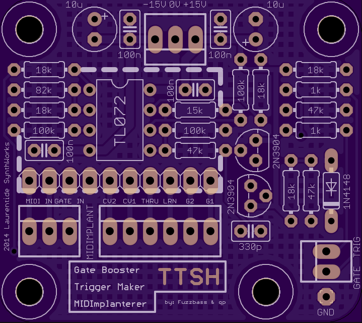

**Build guide:**

Midi Implant Userguide:

[midimplant38usman19.pdf](assets/midimplant38usman19.pdf)

1.assemble all parts on the gatebooster, except the headers.

2.solder as shown in my pictures some headers for midiimplant on the gatebooster pcb, i prefer a adapter with male/female headers to remove the midi pcb from gatebooster (for repairs or testing) 

3. start the wiring task for the midi connector - mount it in the case - then solder the cables (or you run later in trouble when you try to build in the midi connector in the case - the connector must be built in from front.)

pin 3 and 5 of the midi jack is the signal what you have to connect with the 3 pol header (from left pin 1 and 2 ) on the gatebooster pcb, the third pin is for gate input from TTSH.

4.

> **Info**
>
> the KBD Out jack switch pin must be isolated from the pcb trace: (TTSH REV 2-3-4) (ON REV1 is no Switch pin connected on the PCB, you can connect the switch pin directly there, on the pcb)
>
> the KBD CV JACK: connect a cable to switch pin, without making a connection to the KBD Cv out PCB pin:
>
> 
>
> 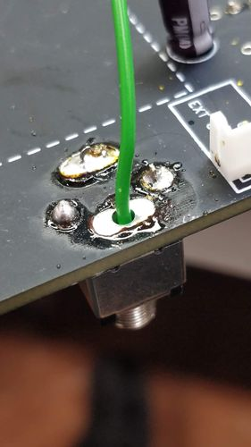
>
> 

5. connect 3 cables to the GATE/S-H section (AR/ADSR)

MIDI PCB GATE OUT (pin 10 is the last on right side) to GATE JACK Switch Pin

GATEBOOSTER INPUT (pin3) to GATE JACK TIP or use the MTA header (GATE)

GATEBOOSTER OUTPUT (GATE) to the SWITCH (clock/SH) upper left pin

GATEBOOSTER OUTPUT (Trigger) to the MTA Header TRIGGER

cut the trace between GATE INPUT jack and the SWITCH (clock/SH)

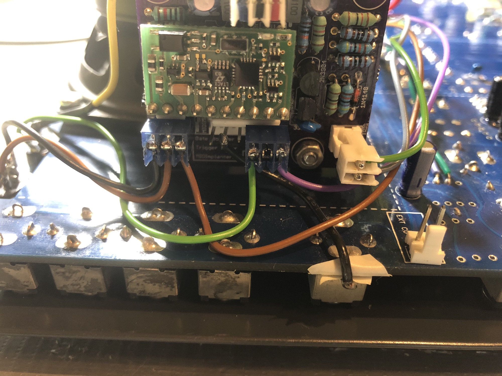

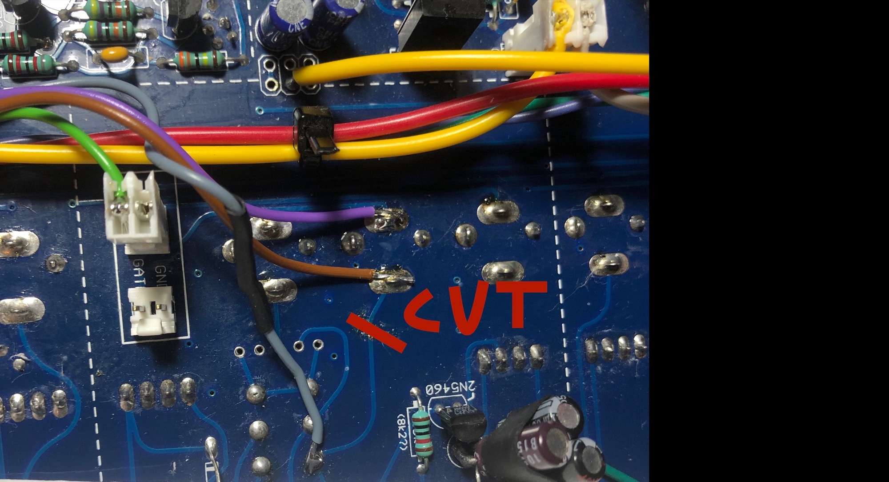

MIDI connector wiring:

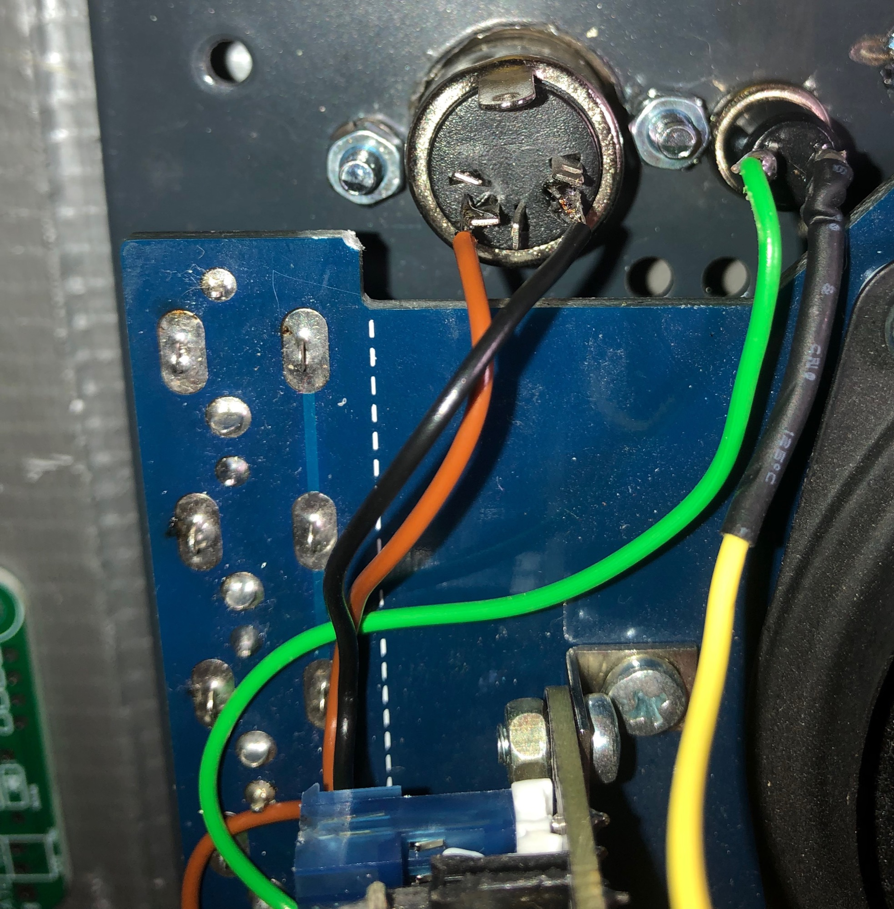

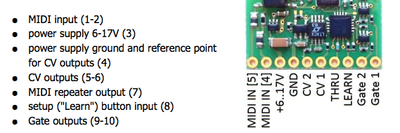

**usecase description:**

**usage of MIDI:** the midiimplant creates a 5V Gate signal,  this goes thru the gate jack switch to tip pin - this is connected to the gatebooster input, the gatebooster boost the 5V to 10V and create a addional trigger signal,

the boosted gate output is connected to the s/h switch and trigger the ADSR when the Clock switch is selected for GATE,  **by usage of clock as triggersource (set the clock-gate switch to clock)**: no signal from gatebooster is feeded in AR/ADSR.

**usage of external gate signals:**

a external gate (5v) is connected to the gate input, the gate signal from tip pin runs to the gatebooster input, the booster change the 5v to 10v and runs thru the boosteroutput to clock switch (ADSR input) the triggersignal is connected as before to trigger input for AR.

6. for testing/learn function add a pushbutton to midiimplant -  wire the pushbutton between ground an LEARN (LRN)

7. power wiring.. on the ttsh mainboard are on each section 6 pcb "holes" this is power, check with a voltmeter for -15v/GND/15v and run cables to the gatebooster power input (near the 10uf electrolyt caps) 

DONT run the powerwiring to midiimplant header.

8. approved/tested ✅

further you need to know:  by calibration of the TTSH with external CV Input, disconnect the Kbd CV header.

**Gallery:**

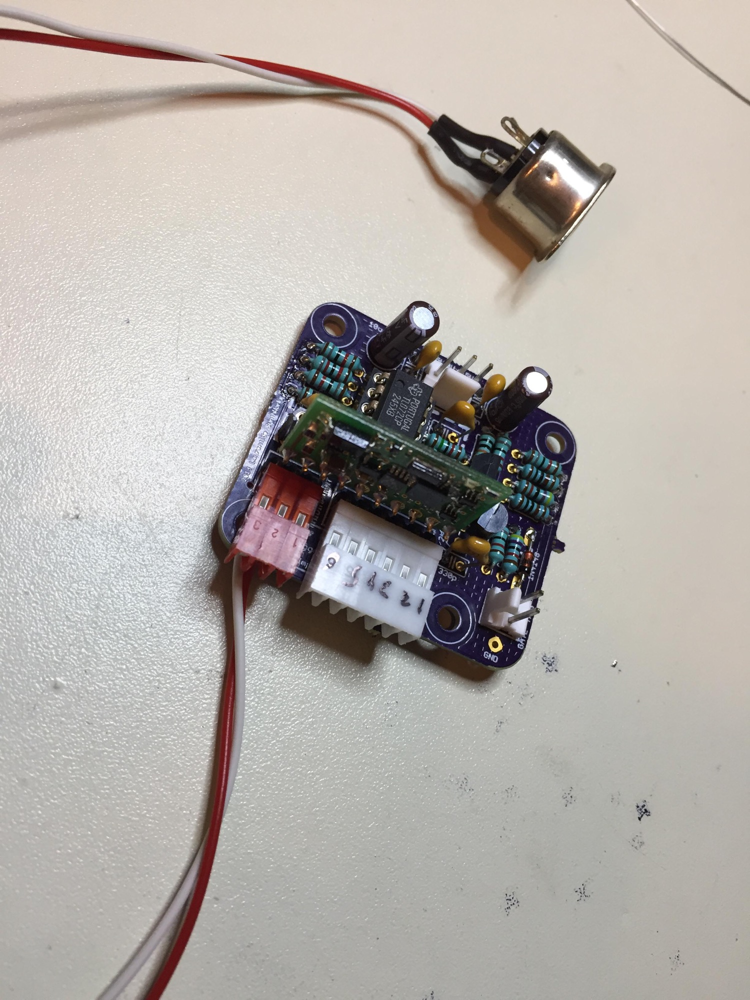

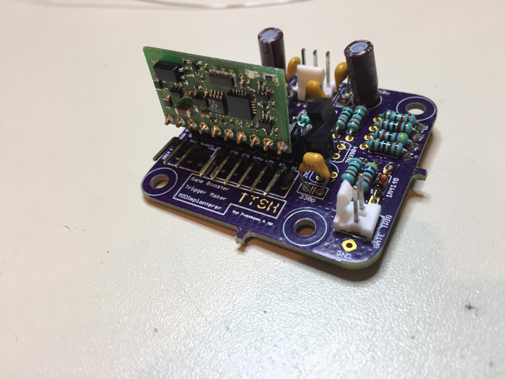

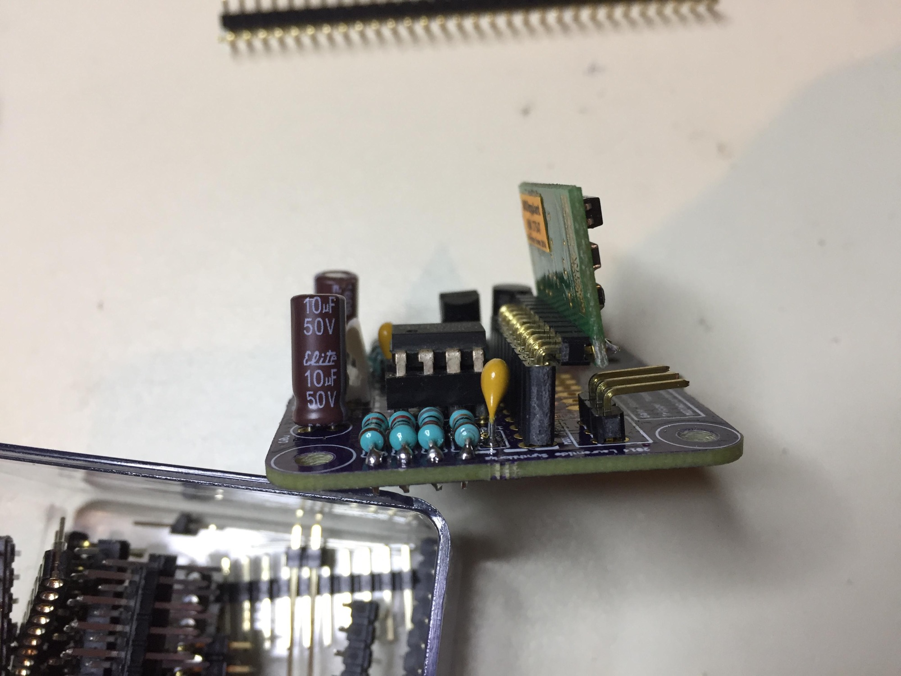

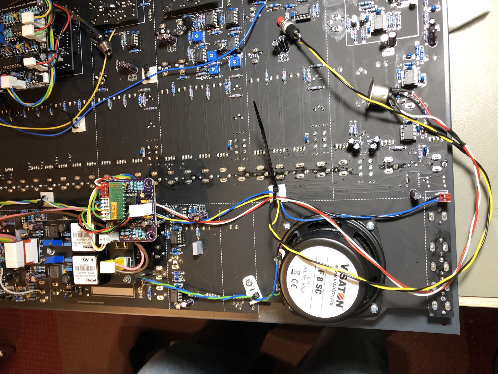

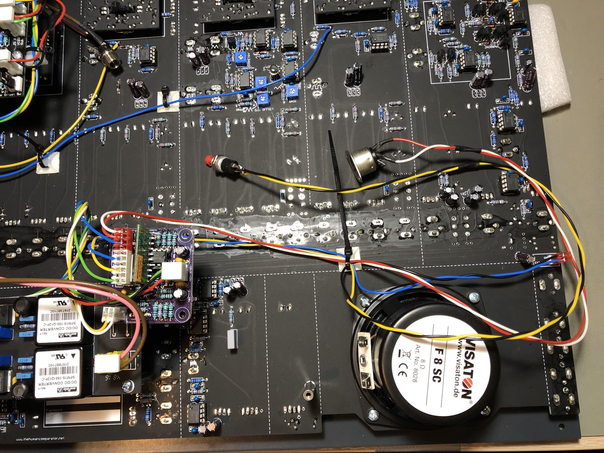

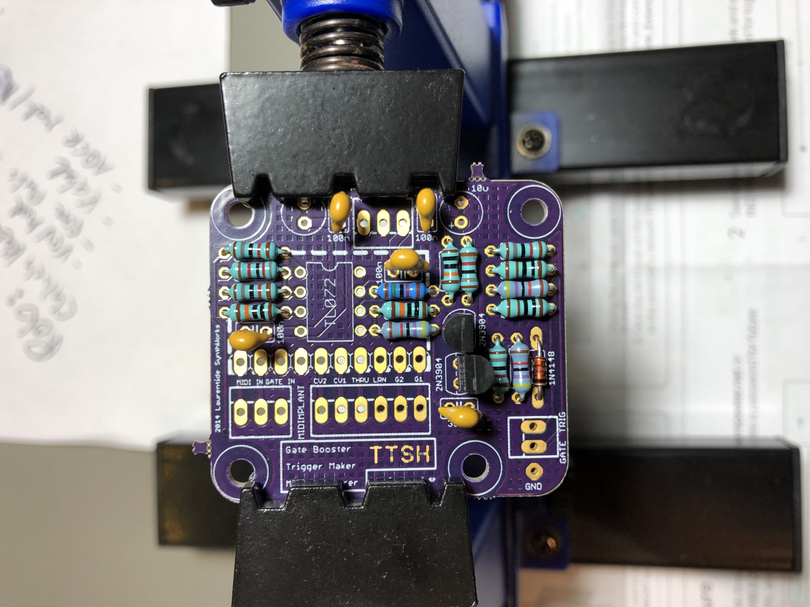

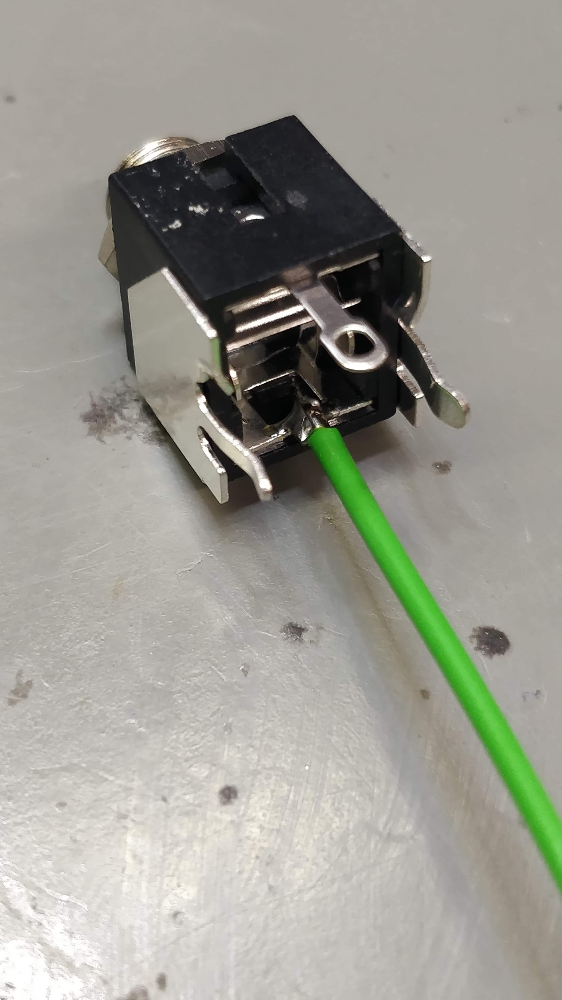

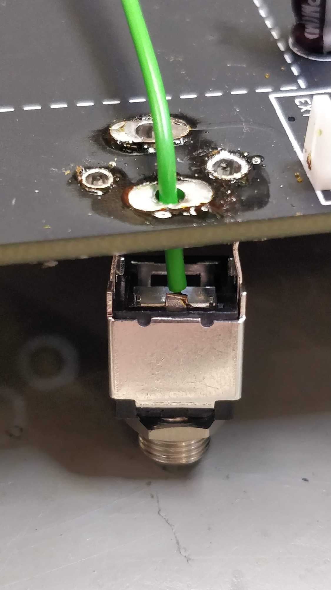

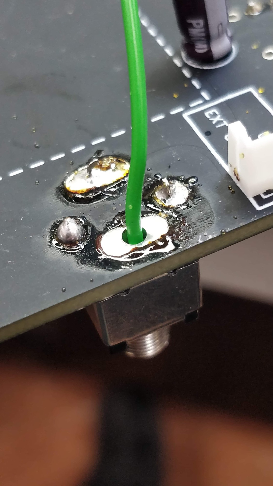

