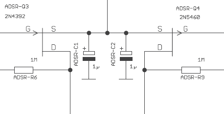
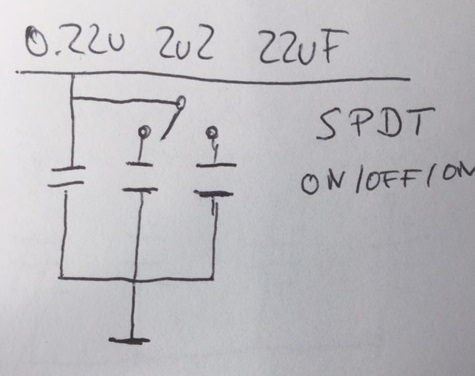
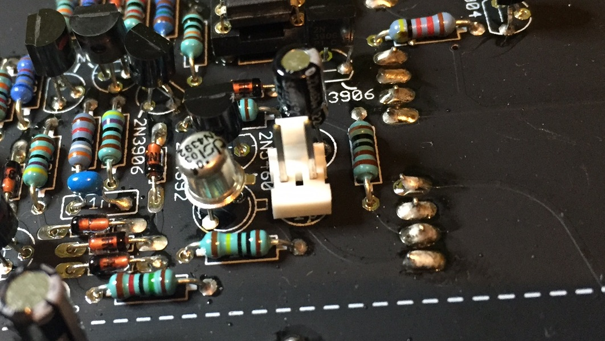
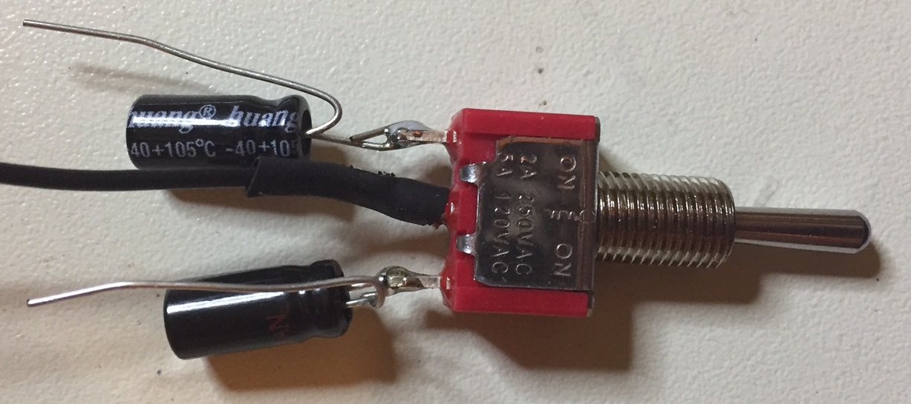
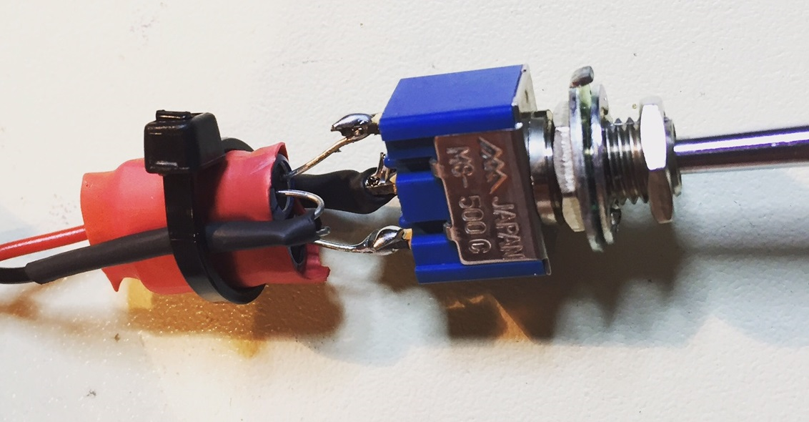

# TTSH Mod ADSR Timing

> **Info**
>
> this Mod was tested and works great

**ADSR:** ADSR C1, C2 are replaced with a single .22u cap, and its (+) terminal is tapped to a SPDT on-off-on switch that will connect to (+) terminals on either a 22uF or 2.2uF cap in parallel with the 0.22uF cap. These cap values provide a wide range, the range can be contracted by adjusting the value of the smallest and largest cap in the trio. The tricky part is building a little tree with the three caps, all their (-) terminals common, and putting that into the original cap location. A simplified (possibly more elegant) version of this might address only the specific deficiencies (AD being too long, ADSR being too short).

**original TTSH**

**Modded TTSH ADSR** (C1 replaced with 0.22uF , C2 removed for a MTA100 header )

(1,5UF, 15UF, in combination of 150nF works too)

**PRACTICE:**

1. **use for C1 or C2 a 0.22UF electrolyte cap instead of 1uF**

2. for a easy connection use a MTA100 header to connect later the capacitor switch, **mark/label the positive pin with a pen**

   (switch between 2.2UF and 22uF with a ON-On switch, it works with a ON-OFF-ON switch too (preffered) - then you only have the 0,22uF cap active when the switch is in OFF position)

3. build the switch with caps like this, important: use cable shrink to isolate the cables.

connect both positive capacitor ends together and connect this to the MTA100 header (positive), the middle pin is ground and connected to the MTA header ground.

## optional AD- RANGE Switch (never used by me)

**AD**: C69 is replaced with a .1u cap, and its (+) terminal is tapped to a SPDT on-off-on switch that will connect to (+) terminals on either a 10u or 1u cap in parallel with the .1u cap.
