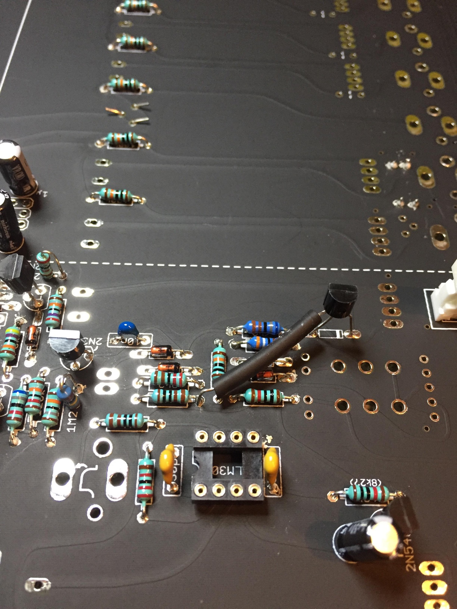

# TTSH Mod AR Envelope

> **Project**
>
> ### Projecttitel:TTSH Mod AR Envelope
>
> ### Status: `approved`
>
> ### Startdate: 22 October 2014
>
> ### Duedate: 2014
>
> ### Manufacture link: [http://www.muffwiggler.com/forum/viewtopic.php?t=98954&postdays=0&postorder=desc&start=360](http://www.muffwiggler.com/forum/viewtopic.php?t=98954&postdays=0&postorder=desc&start=360)
>
> (page 199 )

> **Info**
>
> this mod works in TTSH rev.1, rev.2, rev.3  ✅
>
> tested by me ✅

copy from muffwiggler (user nordcore)

A Modification for the people who are not so much into that "holy original" thing...

 Just checked the envelopes with the scope. The AR is pretty slow at the rise (around 7ms rise time), and pretty fast on the fall time.
 That is as designed - but I just don't like it.
 If you have such short envelope times as the ARP has (with its 1uF cap), than they should be capable of having a short attack.

With this modification you might increase the AR cap slightly (to 2.2uF) to get some longer times and still keep the fast settings possibility. (It will still be faster than original in the fastest setting. )

It is adjustable back to what the original timing was, just move the fader up a bit. So no jump from "next to zero" do "several ms as soon as slider is moved" as you often have on synthesizers with 10uF envelope caps.

add a 2N3904 instead of 1n4148

 connect the 2N3904 collector with a 1k resistor to +15v

base and ermitter instead of 1n4148 holes  /see picture

isolated resistor inside of the cable shrink

from: nordcore

