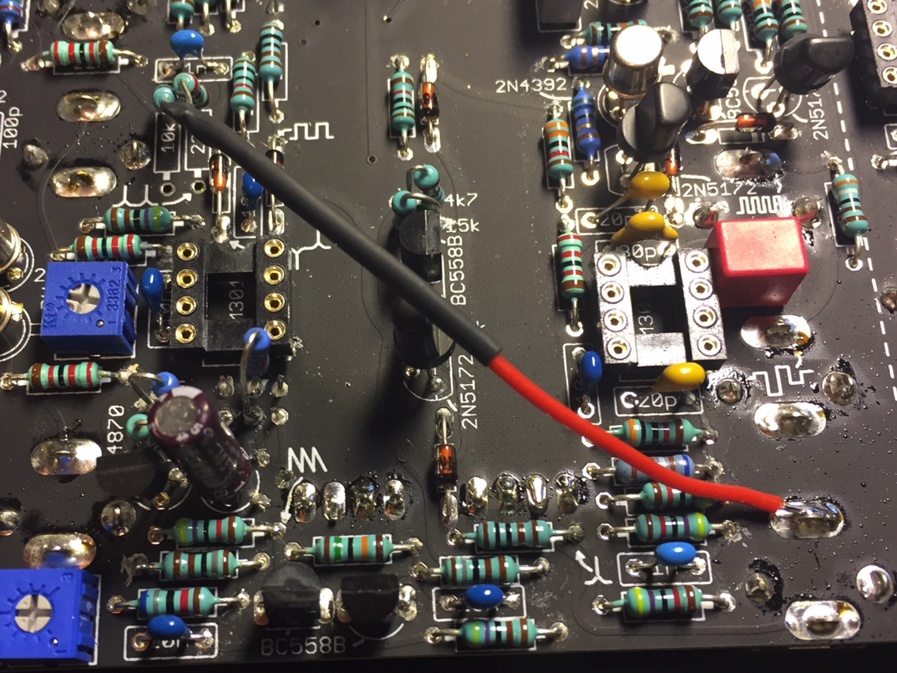
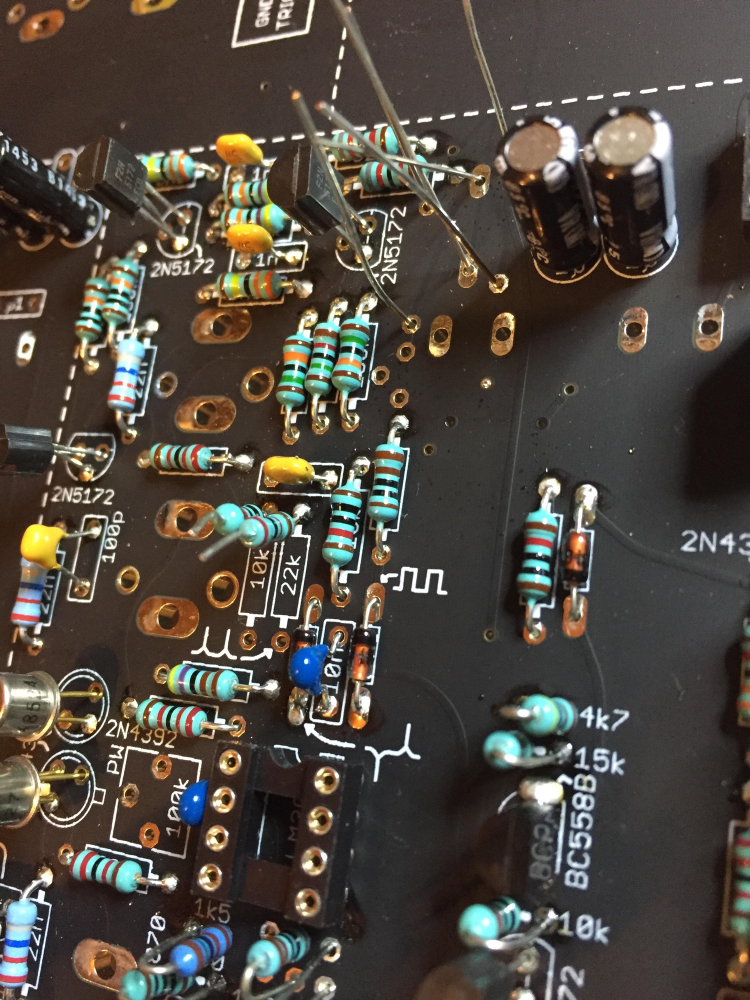

# TTSH Mod Electronic Switch Clock Source

Creation Date: 20 Feb.2017

update 03 March 2017

This Modification was shared by @fuzzbass, thank you Tony

**Description**

The Electronic Switch mod allows you to flip the switch using whatever clock source is introduced to the S&H. Standard, the Electronic Switch follows the Internal Clock, and it is hard wired to the tip-normal pin of the External Clock In jack, which is to say, hard wired to the Internal Clock. Inserting a plug into this jack does not break the connection.

The mod reroutes the clock connection to the Electronic Switch to the Tip pin of the External Clock In jack so the switch can flipped using an alternate clock source. When no plug is inserted into the External Clock In jack, the Electronic Switch functions normally.

Since the Electronic Switch is a /2 divider for incoming clock signals, performing this mod allows you to toggle the Switch with an audio signal to produce a square wave sub oscillator, with some limitations. The audio signal is introduced to the External Clock In jack, and +10V is brought to one of the A or B jacks of the switch from the first voltage processor. The sub oscillator output, which will have +5 DC offset, is taken from the C jack. The slew rate of the Electronic Switch is not great, and the output level of the sub oscillator will start to drop off at around 440hz.

The other limitation is that while this patched, the S&H will also be running at audio rate. This might not be a limitation at all however. If you slightly detune a second audio source and patch that into the S&H in, you can get bit reduction effects.

**Procedure:**
The good news is that if you already have your PCB and Panel put together, you don't need to separate them or cut traces to perform this mod.

Unfortunately, the image I have is not very good, so I'll try to describe it as best I can.

On the Internal Clock page of the schematic, at the common point between R376 (22k) and R375 (10k), there is a trace that runs down and makes contact with output of the Internal Clock circuit. Break this connection by lifting one end of both resistors from the board. The ends of these resistors that face the bottom of the board are the ones you lift. You will find these two resistors side by side, below a 1N cap. One of these ends is silkscreened as a test point for the Electronic Clock.

Connect a wire that is soldered to both freed resistor leads at one end, and connected to the tip pin of the External Clock in jack at the other. 

**new picture from LED-man - the 10K and 22K is lifted up on a new TTSH rev.3 build**

