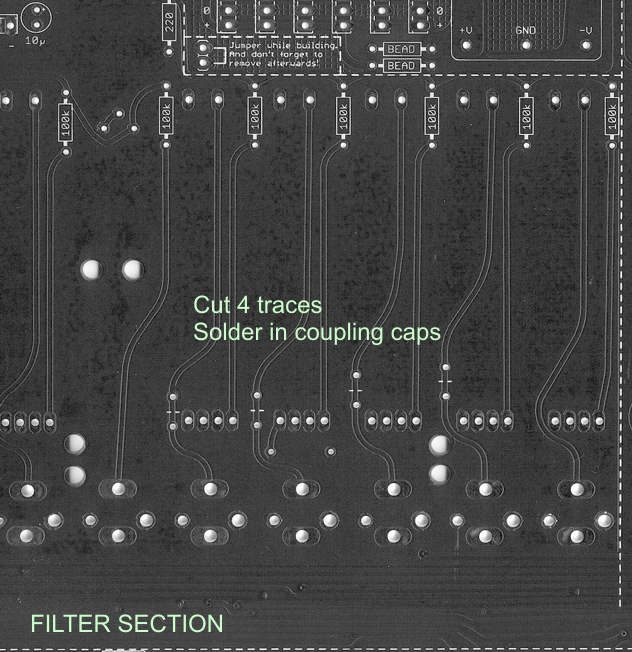

# TTSH Mod VCF Input coupling

Source: [http://www.muffwiggler.com/forum/viewtopic.php?t=98954&postdays=0&postorder=desc&start=100](http://www.muffwiggler.com/forum/viewtopic.php?t=98954&postdays=0&postorder=desc&start=100)

> **Info**
>
> **this MOD works in TTSH Version rev.1, rev.2, rev.3 (pcb version 7- 8.x)**

The filter input is B.A.D. (Broken As Designed)
 It has DC coupled inputs for the VCO outputs and the pulse, square and saw waves have a 5V DC offset.
 There are no coupling caps inside the filter.
 So it is \*designed\* to give a massive \*THUMP\* when the VCA opens.
 If you trim the Filter offsets for minimal thump with these offsets still built in, the best setting depends on the patch...

 Have a look a the PCB, the TTSH has one single mod pre-thought: adding caps to the filter input.

Values can be in range of 470nF to 1uF  bilpolar - I used polyester or polypropylen capacitors

 (Speaking of "making the thing usable": this is one of the changes I would consider mandatory if you want to use an ARP2600 for more than fx sounds. )

