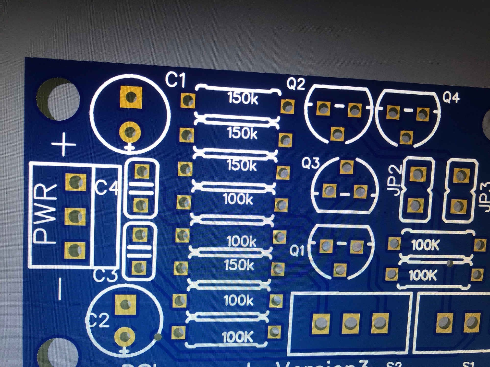
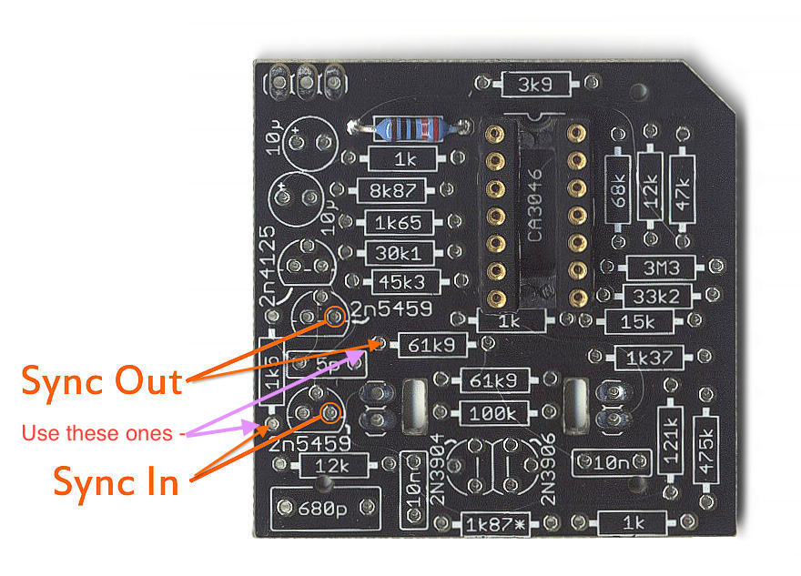
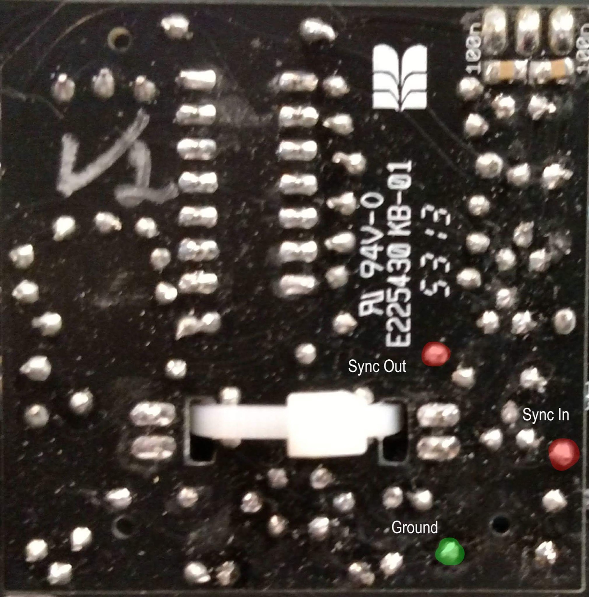
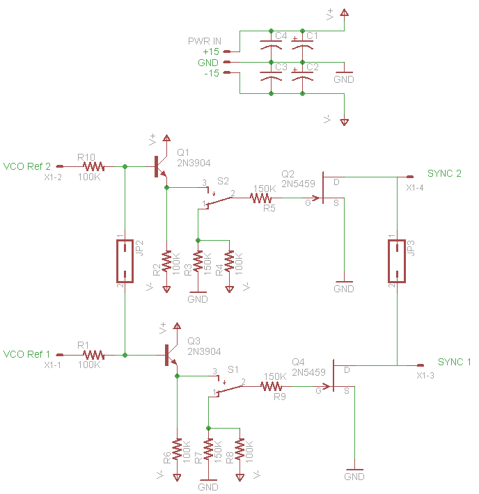
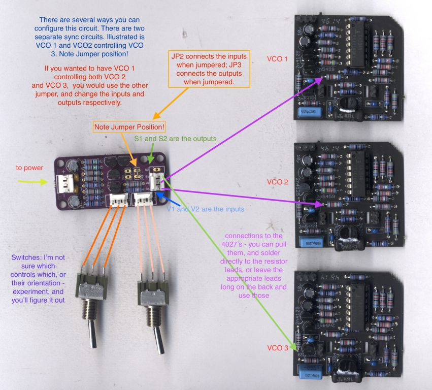
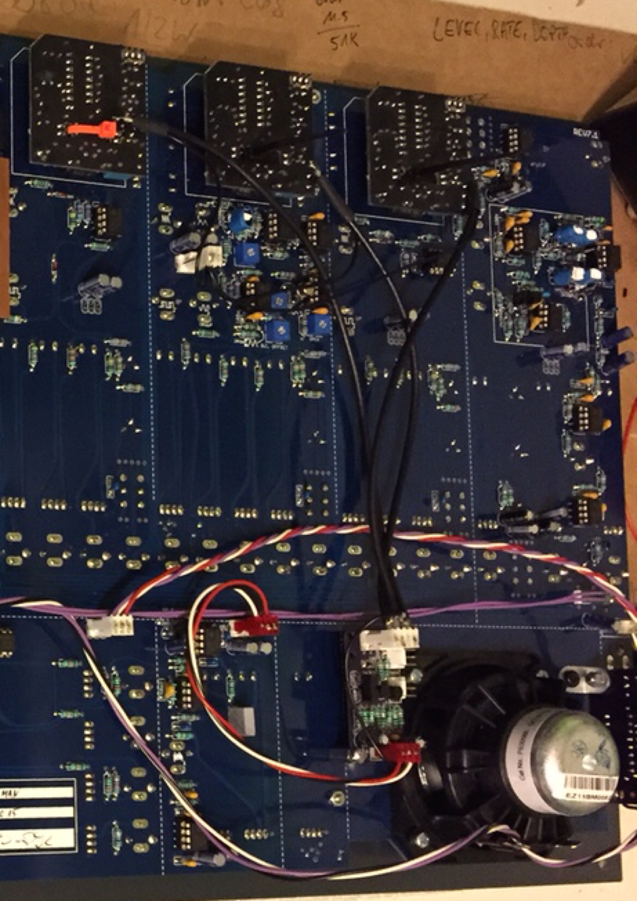

# TTSH Mod  VCO Sync Option

## **TTSH Mod Sync Option**

**from Muffwiggler thanks to all supporters specially "Altitude" and "sduck"**

**i prefer Sync:**  for syncing  VCO 3 to VCO2 and VCO1   jumper (set a bridge) JP2,  V1 = out from VCO3(61k9 resistor), S1 to VCO1 sync input, S2 to VCO2 sync input  (at input = 1k5 resistor)

> **Info**
>
> **This MOD works in TTSH rev.1, rev.2, rev.3 8pcb version 7-8.x)**

> **Achtung**
>
> **its very important  to use shielded cable for VCO I/O connections to the sub vco boards (dont forget to ground the shield ob both sides)**
>
> **About the wiring to switches, do not  twist the cables, otherwise you get softsync issues.**
>
> **don‘t twist the cables for the switches ! or you get some soft sync.**
>
> **its a difficult MOD and there´re few risk to destroy your rare trannys of the VCO Cores  (2N4125, 2n5459, CA3046) if you do it wrong.**

for all users who got my TTSH SYNC PCB, only use the resistor values as shown (the VCO SYNC Version2 PCB use a different PCB designator layout)

| **BOM** |
|---|
| 6x 100k resistors 4x 150k 2x 2N3904 2x 2N5459 2x 100nf X7R bypass cap MLCC 2x 10uf electrolyt cap 3 x MTA100 power header  and jack 3 pin 2x 2pin mta or 1x 4 pin mta header/jack spacers, screws, nuts shielded cables RG174 cables for power, switch 2x switches (UM 3pole) |

**Thanks to Steve (sduck) for sharing this helpful picture:**

---

