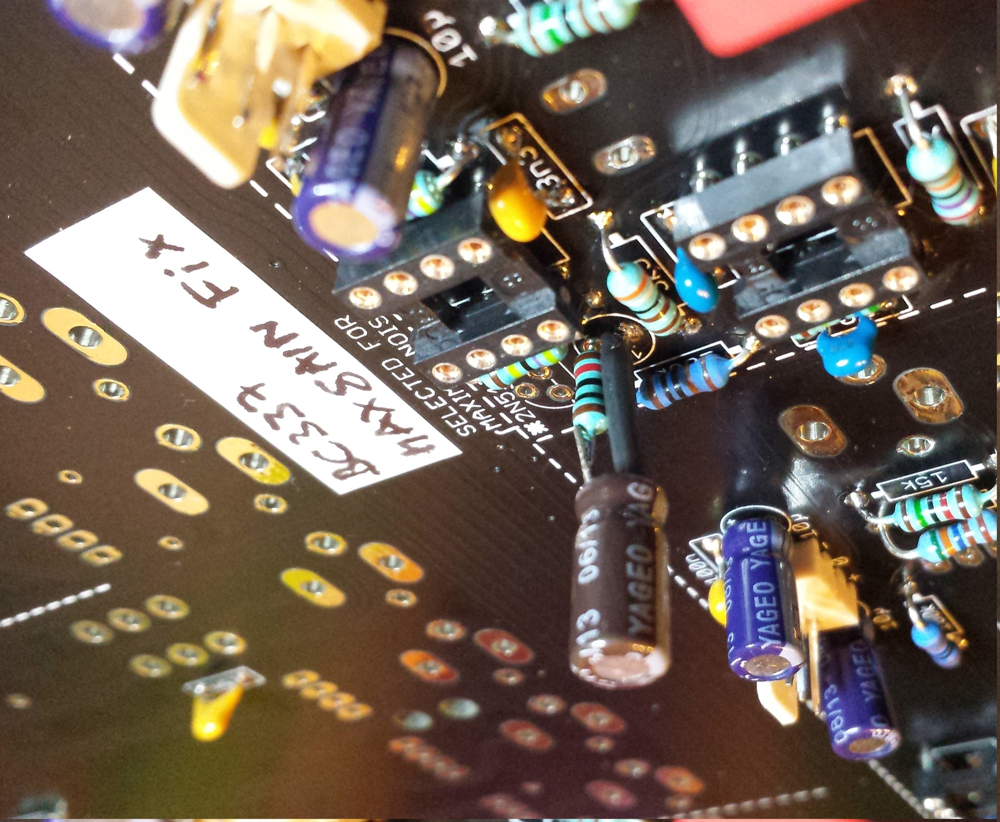

# TTSH Noise Mod

Option A: the easiest way is the usage of a BC337-16 with folllowed orientation, there´s no need for addional parts.

**Option B** (from nordcore)

Don´t use a 2N5172 - use a bc337-16 or BC337-25, - bend right leg to top, solder a 10K resistor in series to the 1uF cap.

see here to choose the correct BC337: [https://www.muffwiggler.com/forum/viewtopic.php?p=1558920&highlight=#1 558920](https://www.muffwiggler.com/forum/viewtopic.php?p=1558920&highlight=#1558920)

**Option C: (same like Option B)**

other working solution how-to connect a 10K resistor to the cap (after soldering, use shrinktube for cap and resistor housing )

