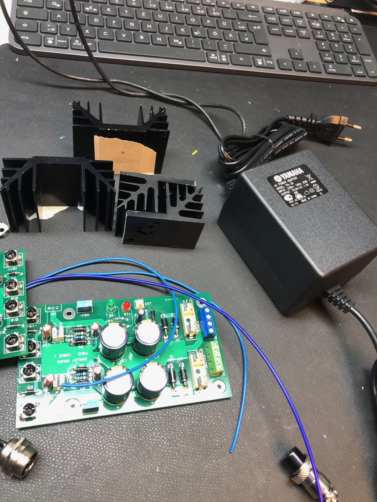

# TTSH PSU

**The better Solution with hum or switching noise problems:**

Oakleysound PSU2 plus Yamaha PA-30: around 100Euro

make sure to buy the PSU2 (not the RPSU) !!

[PSU2 issue 1 Builder's Guide.pdf](assets/PSU2-issue-1-Builder-s-Guide.pdf)

The Metal TTSH case is fine as heatsink - you have to isolate the LM337/LM317 as described in the Oakleysound PSU2 Buildguide

Install on the rearside of the Case a DPDT Switch to have an powerswitch.

the 3pole PSU Connector for the Yamaha PA30 is available on TME. FC684203

here are some part numbers (not all)

**TME:**

|   |   |
|---|---|
| EEUFC1V182S Kondensator:elektrolytisch;geringe Impedanz;THT;1800uF;35VDC Hersteller: PANASONIC Herstellersymbol: EEUFC1V182S RoHS - ja |   |
| KEYS7769-3 Verbinder:Schraubklemme;THT,Schraubklemme;schwarz;7,5x5mm Hersteller: KEYSTONE Herstellersymbol: 7769-3 RoHS - ja |   |
| BM91214 Ringkabelschuh;M4;1÷2,5mm2;Klemmverbindung;für Leitungen Hersteller: BM GROUP Herstellersymbol: BM 91214 RoHS - ja |   |
| 282836-4  Klemmleiste für Printmontage;mit 90°-Winkel;5mm;Wege:4;13,5A Hersteller: TE Connectivity Herstellersymbol: 282836-4 RoHS - ja |   |
| ETB11040B000Z  Klemmleiste für Printmontage;mit 90°-Winkel;5mm;Wege:4;8A Hersteller: ECE Herstellersymbol: ETB11040B000Z RoHS - ja |   |
| ZHL15  Buchse;zylindrische Sicherungen;Montage:THT;5x20mm;-30÷85°C Hersteller: Stelvio Kontek Herstellersymbol: PTF/15 RoHS - ja |   |
| RAD-A4240/50C Radiator:geprägt;U;schwarz;L:50mm;W:74mm;H:30mm;2,8K/W Hersteller: STONECOLD | optimal heatsink for wooden case |
| MICA-TO220 Wärmeleitende Auflage:Glimmer;TO220;1,2K/W;L:18mm;W:13mm Hersteller: NINIGI RoHS - ja |   |
| TFF-M3X10/DR123 Distanzmuffe mit Gewinde;Innengew:M3;10mm;sechskant;Stahl Hersteller: DREMEC Herstellersymbol: 123X10 RoHS - ja |   |
| FC684203 Buchse;für Mikrofone;männlich;PIN:3;für Frontplatten Hersteller: CLIFF Herstellersymbol: FC684203 RoHS - ja |   |
|   |   |

**Main AC Psu: (not preferred)**

PSU BOM for Altitudes external PSU

[Altitude's Bipolar Adjustable PSU BOM.pdf](assets/Altitude-s-Bipolar-Adjustable-PSU-BOM.pdf)

|   |   |   |   |   |   |   |   |   |   |
|---|---|---|---|---|---|---|---|---|---|
| Qty3 | Value | Device | Package | Parts | Description |   | Digikey | Price (USD) | Ext. Price |
| 1 |   | KK-156-2 | KK-156-2 | AC | 156 HEADER |   | A1971-ND | 0.19 | 0.19 |
| 1 |   | 2KBP | 2KBP | B1 | RECTIFIER |   | 2KBP10M-E4/51GI-ND | 0.78 | 0.78 |
|   |   |   |   |   |   |   |   |   |   |
| 6 | 3300 uF | CPOL-USE7.5-16 | E7,5-16 | C1, C3, C4, C5, C6, C7 | POLARIZED CAPACITOR |   | 565-2000-ND | 2.06 | 12.36 |
| 2 | 0.1 uF | C-US025-024X044 | C025-024X044 | C2, C10 | CAPACITOR Ceramic |   | BC1148CT-ND | 0.44 | 0.88 |
| 2 | 1 uF | CPOL-EUE2.5-6 | E2,5-6 | C8, C12 | POLARIZED CAPACITOR |   | 493-12827-1-ND | 0.25 | 0.5 |
| 2 | 10 uF | CPOL-EUE2.5-6 | E2,5-6 | C9, C11 | POLARIZED CAPACITOR |   | 493-1144-ND | 0.22 | 0.44 |
|   |   |   |   |   |   |   |   |   |   |
| 2 | 240R | R-US\_0204/7 | 7/1/0204 | R5, R7 | RESISTOR |   | 237XBK-ND | 0.1 | 0.2 |
| 2 | 1K | R-US\_0204/7 | 7/1/0204 | R4, R6 | RESISTOR |   | 1.00KXBK-ND | 0.1 | 0.2 |
| 2 | 10K | R-US\_0204/7 | 7/1/0204 | R3, R8 | RESISTOR |   | 10.0KXBK-ND | 0.1 | 0.2 |
| 2 | 2K | 3386-W | 3386W | R1, R2 | Timmer PV36W |   | 490-2880-ND | 1.51 | 3.02 |
|   |   |   |   |   |   |   |   |   |   |
| 4 | 1N4002 | DIODE-D-7.5 | D-7.5 | D1, D2, D5, D6 | DIODE |   | 1N4002-TPMSCT-ND | 0.11 | 0.44 |
| 2 | 2AMP | TR5 | TR5 | F1, F2 | FUSE |   | WK4257BK-ND | 0.7 | 1.4 |
| 1 |   | MTA04-156 |   | J1 | 156 4 pin Header |   | A1972-ND | 0.2 | 0.2 |
| 1 |   | MTA03-100 |   | J2 | 100 3 pin header |   | A19470-ND | 0.2 | 0.2 |
| 2 | 529XXXXXXXX | 529XXXXXXXX | 529XXXXXXXX | KK1, KK2 | HEATSINK TO-220/218 |   | HS350-ND | 1.43 | 2.86 |
| 2 |   | LED3MM | LED3MM | LED1, LED3 | LED |   | 160-1142-ND | 0.33 | 0.66 |
| 1 | L01-50VA | L01-50VA | L01-50VA | TR1 | TOROID TRANSFORMER |   | 1295-1014-ND | 39.58 | 39.58 |
| 1 | V80212MS02Q | V80212MS02Q | V80212MS02Q | U$5 | Voltage Select Switch |   | CKC3001-ND | 4.09 | 4.09 |
| 1 | LM317 | LM317TS | 317TS | U1 | VOLTAGE REGULATOR |   | LM317TFS-ND | 0.71 | 0.71 |
| 1 | LM337 | LM337TS | 337TS | U2 | VOLTAGE REGULATOR |   | LM337TFS-ND | 0.71 | 0.71 |
|   |   |   |   |   |   |   |   | Total | 68.91 |
