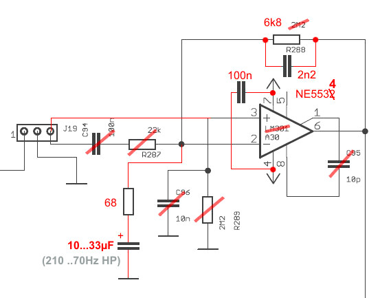

# TTSH Reverb Driver Mod

> **Project**
>
> ### Projecttitel:TTSH Reverb Driver Mod
>
> ### Status: `approved`
>
> ### Startdate: 2013
>
> ### Duedate: --
>
> ### Manufacture link:

Symtom:  reverb hum issue

Solution:  add a low noise IC

works in TTSH rev.1 and TTSH rev.2

copy from: [http://www.muffwiggler.com/forum/viewtopic.php?t=98954&postdays=0&postorder=asc&highlight=ne5534&start=1560](http://www.muffwiggler.com/forum/viewtopic.php?t=98954&postdays=0&postorder=asc&highlight=ne5534&start=1560)

thanks to nordcore

"Can be build on the board w/o cutting tracks.
 (Just swapping the op amp doesn't help anything, as the 22k is the main noise source. )

 If "stereo" is meant as "mono in, stereo out":
 The driver amp could drive 2 tranks, just add another 100Ohm (R281) for the second tanks drive coil.
 Add another recovery amp (as above).
 One supplies R212, one R213 (= Faders for reverb level left/right. )"
