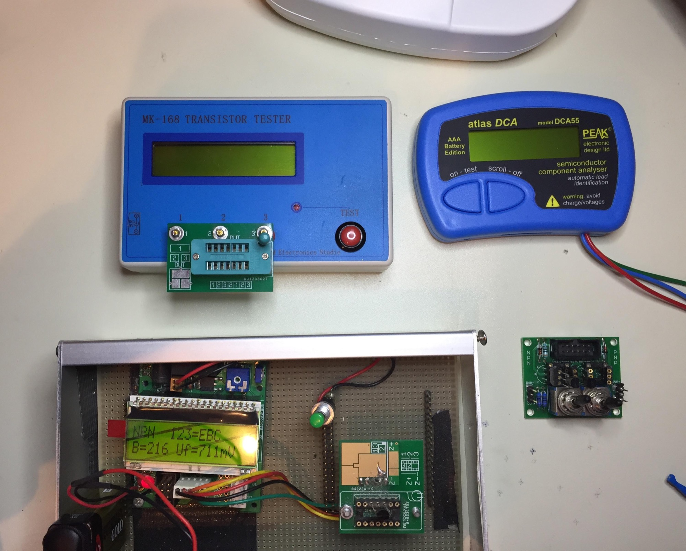

# TTSH Rare Partkit, Survival Kit

> **Achtung**
>
> This parts are not from my business (founded 08/2017)
>
> parts left from groupbuys and homestock- private sale
>
> this ist still valid in 2026 and available for Rev.1- Rev.4

**You find the most parts in my shop too:** [https://www.DIYSYNTH.de](https://www.DIYSYNTH.de)

Here are some parts for sale from **my privat home stock and left from last goupbuy as private/non commercial sale.**

as groupbuy sale like §§ 421 und 427 BGB  [http://www.juraindividuell.de/artikel/gesamtschuld-aufbau-und-pruefung/](http://www.juraindividuell.de/artikel/gesamtschuld-aufbau-und-pruefung/)

Its possible to order single parts/individual parts /kits.

Please contact me if you want a survival or part kit.

**all Tranistors are tested** with a Microcontroller based Transistortester and/or with other methods like IanFritz matcher.

## RARE PARTKIT

|   |   |   |
|---|---|---|
| **Description Part** | **Ammount** |   |
| 2N3906 matched pair x 5 (+2 for rev.3 rev.4 TTSH for free) | 5+2 matched pairs |   |
| 2N3904 matched pair x 9 | 9 matched pairs |   |
| 2N4870  rare | 1x |   |
| 2N3954 - ultrarare | 1x |   |
| 2N3958 - ultrarare | 2x |   |
| 2N4125 - rare | 3x |   |
| 2N5459 - rare | 6x |   |
| 2N5460 | 2x |   |
| CA3046 - for VCO   rare | 3x |   |
| **matched** 2N5087 for the 4072 Filter (only for rev.3 and 4) | 4 matched pairs |   |
| Tempco 1.87k | 4x for rev1+2 or 5x for rev3/rev4 |   |
| LM301 old stock | 32x |   |
| **included test of all rare transistors !** **included is a lot of help with my support pages and Email communication** |   |   |
| **TOTAL PRICE =** | **200€** |   |
| **plus shipping 7.50€ in EU worldwide with tracking** USA = 25€ Shipping (updated 01/2026) |   |   |

**if you need only matched transistors (1mV matched)**

**9 pair 2n3904 and 7x 2n3906   = 30€ plus shipping 6,80€ worldwide with tracking.**

**if you need only the  2N5087 matched pairs  = 10€ plus 3€ shipping worldwide**

## Survival kit:

|   |   |   |
|---|---|---|
| **Description Part** | **Ammount** | info |
| 2N5087 matched pair x1 | 1 pair | new listing |
| 2N3906 matched pair x 2 | 2 matched pairs |   |
| 2N3904 matched pair x 3 | 3 matched pairs |   |
| 2N4870  rare | 1x |   |
| 2N3954 - ultrarare | 1x |   |
| 2N3958 - ultrarare | 1x |   |
| 2N4125 rare | 1x |   |
| 2N5459 - rare | 2x |   |
| 2N5460 | 1x |   |
| 2N4392 | 1x |   |
| 2N5172 | 1x |   |
| Tempco\*1 3300ppm or 3500ppm | 1x |   |
| CA3046 - for VCO   rare | 1x |   |
| LM301 | 3x |   |
| BC558 | 2x |   |
| 1x TDA20230 and BD236/BD237 for rev.1 MJE172/MJE182 for rev.2+3 - please tell me which TTSH version you have | 1 of each version |   |
| Fader 100K lin | 2x |   |
| Fader 100K log | 2x |   |
| Fader 1M log | 1x |   |
| 3,5mm jacks | 5x |   |
|   |   |   |
| **TOTAL PRICE =** |   | **130€** |

**optional minus jacks or other parts you dont need..**

**\*² Tempco**:

3300ppm or 3500ppm makes no difference  (needed is in theory around 3350ppm)

in last time most modular modules/synths are build with SMD 3000/3300ppm tempcos and works stable.

Reference here:

[http://hem.bredband.net/bersyn/VCO/vco\_ministyle.html](http://hem.bredband.net/bersyn/VCO/vco_ministyle.html)

[http://home.comcast.net/~ijfritz/sy\_cir9.htm](http://home.comcast.net/~ijfritz/sy_cir9.htm)

[http://home.comcast.net/~ijfritz/sy\_cir7.htm](http://home.comcast.net/~ijfritz/sy_cir7.htm)

[http://www.sequencer.de/synthesizer/viewtopic.php?f=13&t=13497&start=25](http://www.sequencer.de/synthesizer/viewtopic.php?f=13&t=13497&start=25) -&gt; german

my 4 Transistor tester to match and test Transistors in different way.

the 6,5 digit Keithley2015 isn´t shown here.

please note: dont use the cheap chinese transistor tester for matching, they drift with each measurement with more than 5mV.

