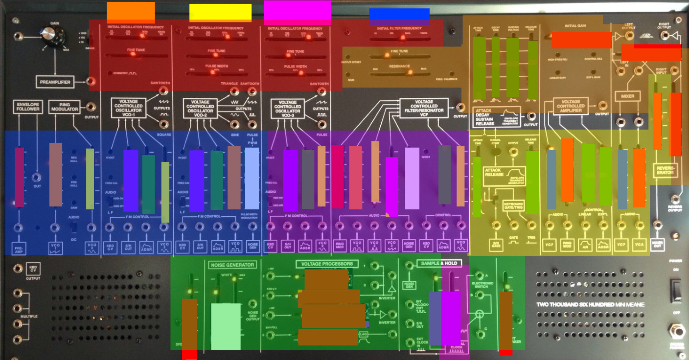
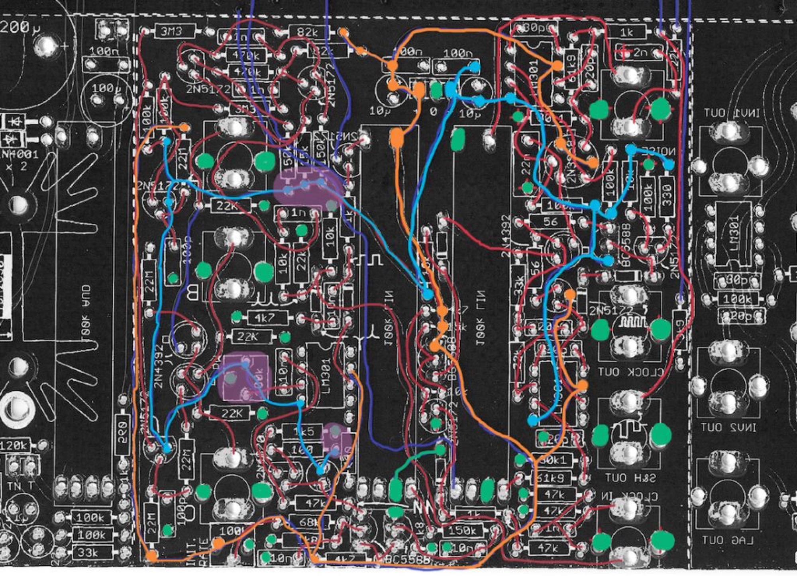

# useful Documentation for Troubleshooting

**LED drivers:**

for test:  change the 47kOhm (R9,R10,R11,R12, R13, R14,R1   to  4k7

LED drivers:

with kindful regards to [http://www.tauntek.com](http://www.tauntek.com/TTSHLEDs.pdf)

[TTSHLEDs.pdf](assets/TTSHLEDs.pdf)

LED Driver sections, in case you have trouble with the LED chains

**S/H section routing**

from rev.1 - routing sample/hold  - please remember rev.1 is different

