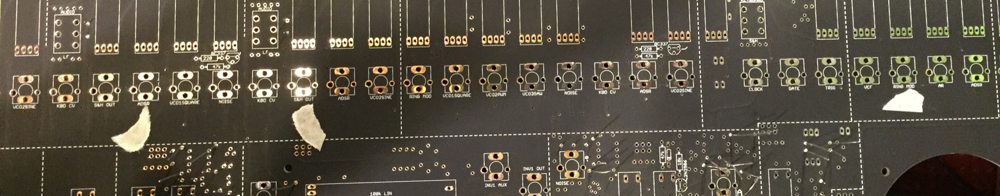
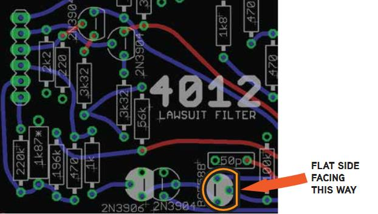
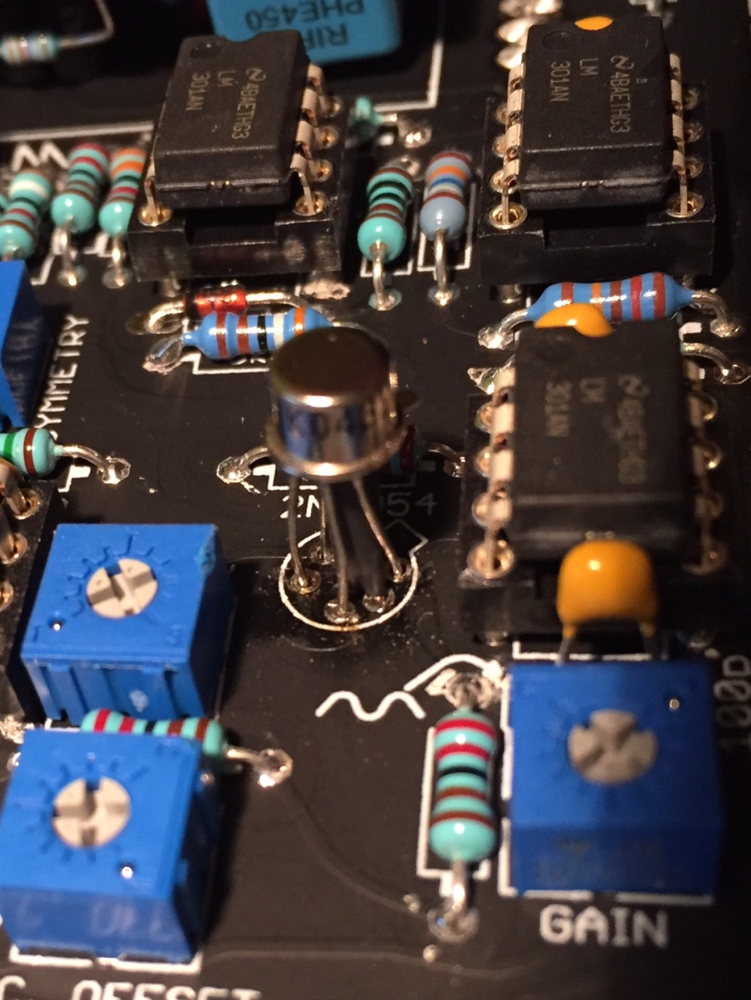
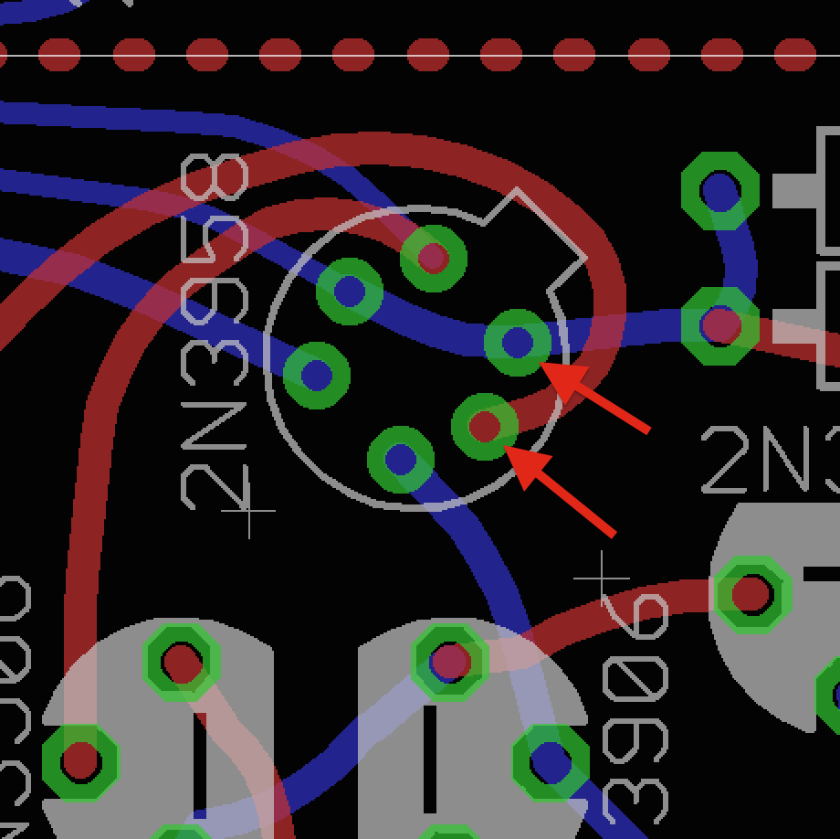
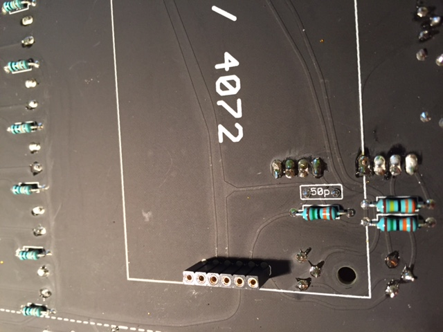
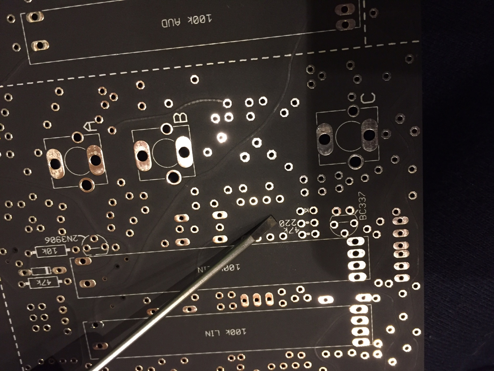

# TTSH Release rev.3

→ siehe

→ siehe

→ siehe

> **Achtung**
>
> as stated above, the project is NOT for beginners
>
> nearly all professional builders have standard resistor and capacitor values at home (if the BOM miss a few standard parts like a 100K resistor)

> **Tipp**
>
> [Synthcube left fullkits and partial kits](https://synthcube.com/cart/index.php?route=product/search&search=ttsh&description=true)

## **BOM as Excellist:**

**[BOM-list-TTSH REV8-v1.3.xlsx](../old-documentation/ttsh-rev3-build-guide/assets/BOM-list-TTSH-REV8-v1.3.xlsx)   (the lists includes all parts. (update 18.january 2017 approved section added)**

The shared mouser basket from thehumancomparator is wrong (22.Dec.2016)
(this Mouser basket was provided in the 'order' eMail)

~~[https://www.mouser.de/ProjectManager/ProjectDetail.aspx?AccessID=234c0 9ed60](https://www.mouser.de/ProjectManager/ProjectDetail.aspx?AccessID=234c09ed60)~~  old  link from Jon

[http://www.mouser.com/ProjectManager/ProjectDetail.aspx?AccessID=6CEDD31990](http://www.mouser.com/ProjectManager/ProjectDetail.aspx?AccessID=6CEDD31990)  new Mouser link from me, improved see notice field for quantity "order 10"

order the 100K resistors, 2N3906, 2N3904, 1N4148 from a local dealer to save money, make sure the 2N3904/2N3904 is from tape - for better transistor value matching.

dont miss to order the parts for the [gatebooster](../ttsh-mods/ttsh-gatebooster/index.md)too.

~~[ttshv2BOM.pdf](../old-documentation/ttsh-rev3-build-guide/assets/ttshv2BOM.pdf) (mainboard pcb)  - i update the list in next 2 days. (remove the above listed SMT chokes and replace with chokes from SecondFilter\_BOM)~~

~~[4027v2BOM.pdf](../old-documentation/ttsh-rev3-build-guide/assets/4027v2BOM.pdf) (vco boards)~~

~~[TTSHrev3\_SecondFilter\_BOMv1.1.pdf](../old-documentation/ttsh-rev3-build-guide/assets/TTSHrev3_SecondFilter_BOMv1.1.pdf) (filter board)~~ **please use matched pairs 4 pairs of 2N5087 and only matched pairs for 2N3906/2N3904 (exept the single trannys)**

> **Tipp**
>
> use 3x 20k or 25k multiturn trimmer [http://www.tme.eu/de/details/3339p-1-203lf/tht-potentiometer-mehrere-umdreh-516/bourns/](http://www.tme.eu/de/details/3339p-1-203lf/tht-potentiometer-mehrere-umdreh-516/bourns/) for V/OCT trimmer in the VCOs, this type works as a drop in replacement and gives you more room for a better calibration.
>
> (there´s no need to mount it from the component pcb side as standard multiturn trimmer due to issues with the sizing behind the panel and pcb)
>
> In TTSH V2 and V3, you can easily modify the LED system so as to trim the LEDs all the way of off. Replace the 3k3 resistor located next to the TL071 pads to a jumper.  Tested by fuzzbass - thank you.

**for the rare parts, please check [thonk.co.uk](http://thonk.co.uk) or my [own page](../ttsh-rare-partkit-survival-kit/index.md) ( i offer 2N5087 matched pairs too)**

if you need matched pair trannys or single tested trannys like 2N3954/8 or others, please contact me.

further i offer a [survival kit](../ttsh-rare-partkit-survival-kit/index.md)

**dont miss to order (if you only use the mouser basket)**

Speakers: Visaton SC8 ([reichelt.de](http://reichelt.de), tme.eu)

reverb tank [https://www.banzaimusic.com/Belton-RBL2AB3C1B.html](https://www.banzaimusic.com/Belton-RBL2AB3C1B.html)  see known issues for wiring 

RCA/Chinch cable 0,5m - 1m (double or triple isolated/shielded otherwise you gets hum issues)

DC Powersupply  12V DC/1,5A - 24V/1A DC works, middle pin is + (5,5mm/2,1mm size)

Cable for Power wiring and Speaker wiring (1mm² diameter for power, 0,5mm² for speaker)

13 x 12mm Spacer M3, black flat Screws for frontpanel, screws for speaker at the rear and spacermounting, washers, nuts, cable shrink, silicon for matched pairs or glue the trannys together

1 x 10mm spacer + washer for filtercard mounting (ignore the second hole for a spacer in VCF section)

 3x long spacers to mount the powersupply  (25mm-50mm preferred to minimize the risk of EMV issues )

## Known Issue rev.3

1. **Major Bug:** Description:  at the Frontpanel pcb side you find some "VIAs", at the VCO 3 section the jack S/H , VCO2 section the jack ADSR, VCA section the jack Ringmod, has a via with 15V, the metalframe of the jack are connected to ground and you run in a short between ground from the jack and 15V/-15V from the vias.

  check the pcb for VIAs before mounting the jacks. (the following jacks are known for this Bug) but you have to check all 86 jack positions.

  1. Audio input Ring Mod (norm: VCO2sine)
  2. FM input VCO2 (norm: ADSR)
  3. FM input VCO2 (norm: VCO1square)
  4. KBD CV input VCO3
  5. FM input VCO3 (norm: S&H)
  6. KBD CV input VCF
  7. FM input VCF (norm: ADSR)
  8. CLOCK jack in EG section
  9. GATE jack in EG section
  10. Audio input in VCA (norm: RingMod)
  11. Audio input in Final Mixer (norm: VCF) - signal trace runs under two corners

  **Solution:**  file down the jack at the position of the via (1mm is fine) or cut it down
  
   
  
2. **Improvement**: Powersupply Board - turn the 2pol MTA156 header if needed - otherwise the power input cable is above the powersupply.   ✅ confirmed, its not in every use case needed
3. **Minor Bug:**Main board – Missing trace from V- to header. (copyright of picture for [thehumancomparator.net](http://thehumancomparator.net) ) ✅ confirmed
  
4. **Minor Bug**: 4072 VCF missing trace pin 4 on LM1458 to -14V (use shrink tube for isolation) ✅ confirmed
  
5. **Minor Bug:** 4012 VCF Board — BC558 must be installed backwards, schematics show Ermitter to 23k2 resistor in rev.7.2 (v3) ✅ confirmed
  
6. **Minor Bug:** for all 2N3958 and 2N3954 change 2 pins like this,  cross the both pins - use shrink tubing for one pin for isolation. ✅ confirmed
  
  
7. **Improvement for build:** or the Filtercards use flat electrolyte capacitors, check the height of all parts - if needed use other headers, check this for both Filtercards before you solder the headers, if needed place the 47pf(50pf) MLCC capacitor (on the mainboard) on solderside of the pcb)
  on my first build i used a 10mm spacer but i prefer the usage of 12mm spacers,  (by usage of 2 spacers - its needed to cut on the VCF out jack at the bottom some metal and you need a flat screw,  in result one spacer is enough  😉 )
  
8. **Minor Bug:** by usage of the banzai reverb tank, run in the reverb tank a wire from ground to ground on the RCA connectors to ground output and input
9. **Minor Bug:** turn 180degrees on the mainboard the 5pol MTA156 power header, otherwise the power cable is to the wrong side and maybe you run in trouble with your case/cabinet size.
  the picture shows the correct mounting:
  
10. **Minor Bug/improvement:** use a BC337-16 instead 2N5172 in the noise section [more Details here](#) (you don't need further mods)
  ****

**11. Medium bug -**the Clock LED driver (BC337) becomes hot - affect the functionality in some cases.

change the LED driver resistor LED-R17 from 220R to 820R ( its located at the Solderside bottom right, near the Clock fader)

        

12. Minor Bug -  the RCA connectors silkscreen on Mainboard is labeled wrong,  turn Input and Output RCA connectors  (red and white or (black) in same color as your reverb RCA connector color.

→ siehe

thanks to @Autor for sharing the BOM and quick build guide

[V3 quick build bom.xlsx](../old-documentation/ttsh-rev3-build-guide/assets/V3-quick-build-bom.xlsx)  (right click to save - otherwise it opens in a unusable window due to too much rows/fomat)

or click in the next screen on top right corner on the download/arrow icon
