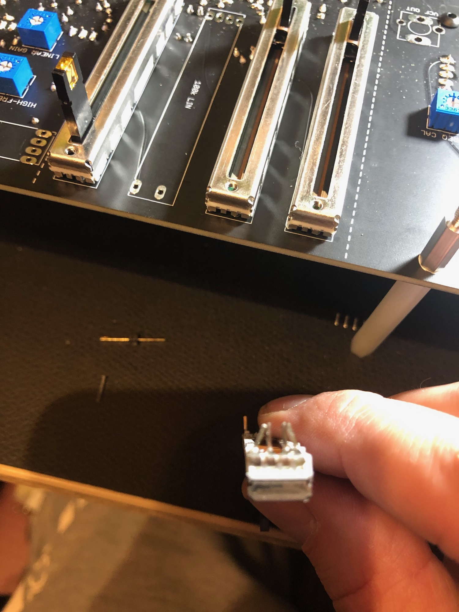
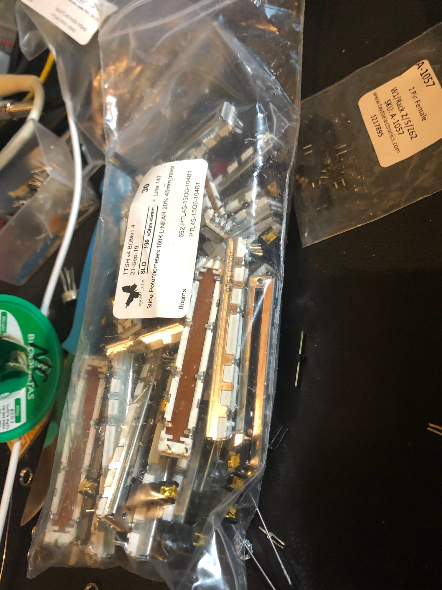

# TTSH Release rev.4

**the TTSH v4 is the same Version like TTSH rev.3 - but with bugfixes.**

The TTSH v4 is only available by synthcube - Kits, Fullkits, cases - mostly  everything you want.

[https://synthcube.com/cart/ttsh-v](https://synthcube.com/cart/ttsh-v4)4

If you're looking for an assembled TTSH or you want a modification, build, repair - Service- contact me

**Known Issues:**

the Pinout problem of the Dual JFET 2N3954 in the VCO2 section (mainboard) is still available.

> **Frontpanel - all holes must be enhanced by drilling. all slider cutouts must be reworked with a file 🙁**
>
> **that's not an issue, that's a problem for some users.**
>
> **Synthcube was informed but still send this panels to customers.**
>
> **In the Fullkits are many slider pins bend or the lever is broken or bend - you need replacements.**
>
> 
>
> 

Build Guide from Antony "Fuzzbass" v1.7 (update 29.dec.2019)

[https://drive.google.com/file/d/15LcVl6dmxVoriJ3EP7WcftJFTHrW5Kw-/view?fbclid=IwAR2Egjr7iOgwGv5dcD7pHh6iBK\_N2jCJF5T\_Xk8CpElvJ6oDoFBHxHXsSns](https://drive.google.com/file/d/15LcVl6dmxVoriJ3EP7WcftJFTHrW5Kw-/view?fbclid=IwAR2Egjr7iOgwGv5dcD7pHh6iBK_N2jCJF5T_Xk8CpElvJ6oDoFBHxHXsSns)

added Midi Interface guide in v1.7

failure in previous guide: (1.2) corrected in 1.3 guide and newer

there's a failure with the 4012 VCF card, the capacitors between the matched 2N3904 must be 4x 0,01uF (10nF)  C0G or polypropylene caps - 

better to organise 1% Polyprop caps, you can mount it from the rearside too.
